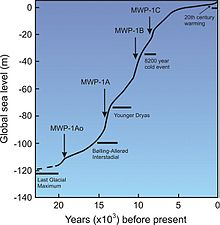
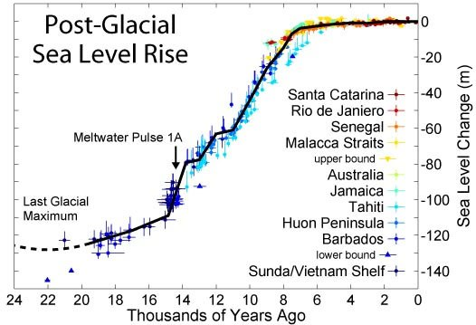
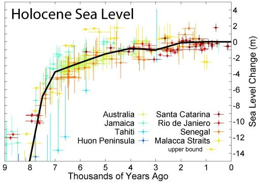
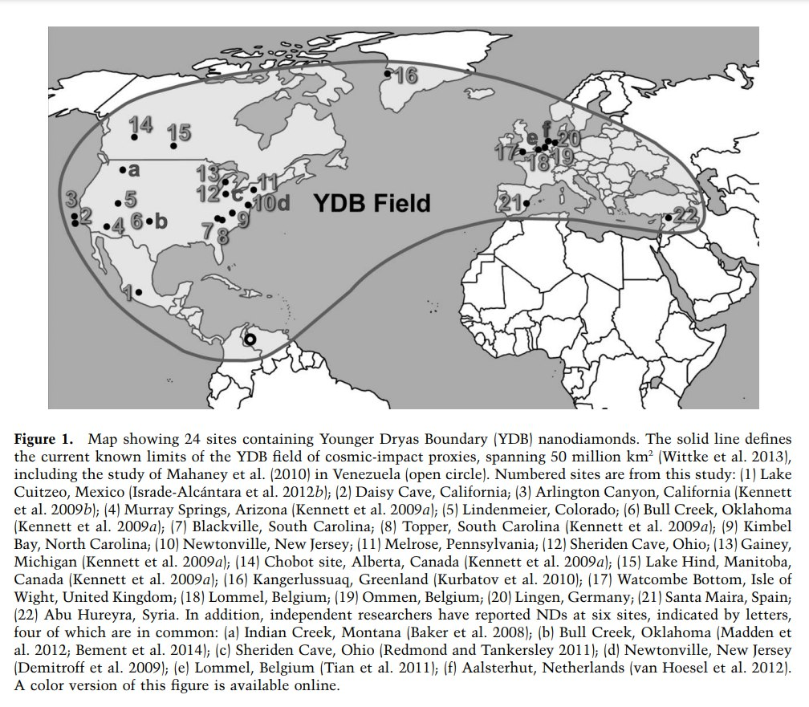
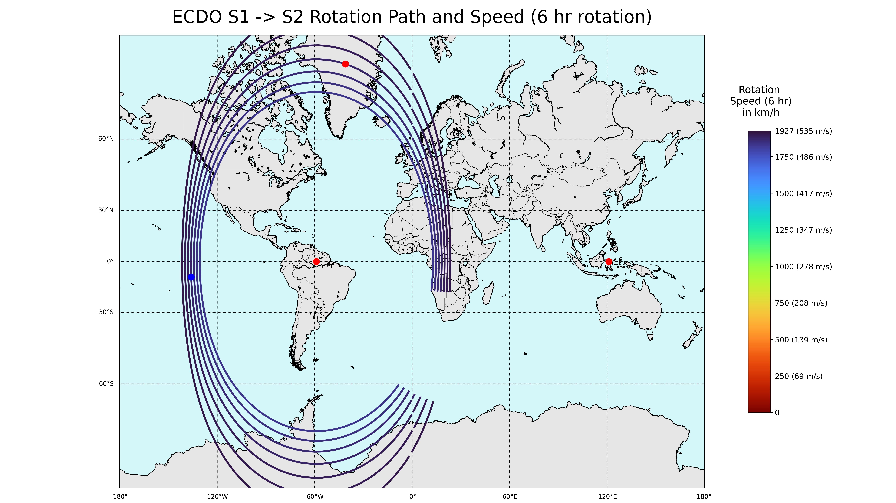
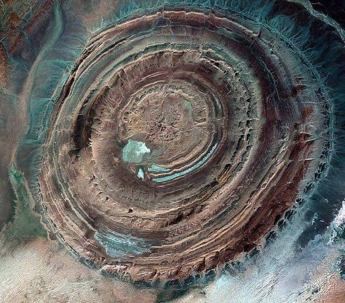
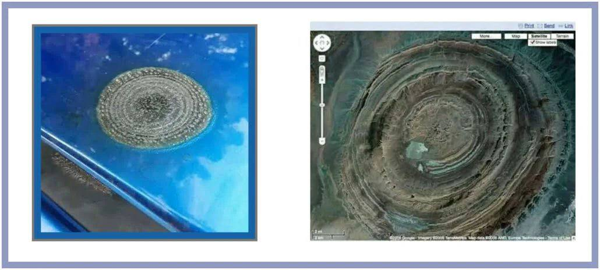

# Earth's Long-term History

Holocene:
- 11.7ka to present
- period of warming
- Black Sea deluge [5]
- Tollmann Bolide Hypothesis [4]
- global sea level rise

Younger Dryas and older:
- Younger Dryas Impact, Younger Dryas [1]
	- 12.9 - 11.7ka
	- period of cooling
	- Gothenberg Flip
- Bolling Allerod Interstadial [2]
	- 14.7 - 12.9ka
	- period of warming
- Oldest Dryas
	- 18 to 14.7ka
	- cooling period
- Last glacial maximum [3]
	- 33 to 19ka
- Laschamp excursion [6]

Other:
- Dansgaard-Oeschger events
- Heinrich events

## Holocene Sea Level Rise, Meltwater pulses [9,10,11]

"The early Holocene sea level rise (EHSLR) was a significant jump in sea level by about 60 m (197 ft) during the early Holocene, between about 12,000 and 7,000 years ago, spanning the Eurasian Mesolithic."

Understanding what exactly caused this undeniable massive sea level rise should surely be very relevant for the ECDO. The justification for these seems to be massive ice sheet melting. But that should raise the question, how was it that there were such massive ice sheets before the Younger Dryas, which then melted during the Holocene, and don't exist to such an extent now?

"During deglaciation since the Last Glacial Maximum, between about 20,000 to 7,000 years ago (20–7 ka), the sea level rose by a total of about 100 m (328 ft), at times at extremely high rates, due to the rapid melting of the British-Irish Sea, Fennoscandian, Laurentide, Barents-Kara, Patagonian, Innuitian and parts of the Antarctic ice sheets."

- "Meltwater pulse 1B between c. 11.4–11.1 ka, a 7.5 m (25 ft) rise over about 160 years centered at 11.1 ka, which includes the end of Younger Dryas interval of reduced sea level rise at about 6.0–9.9 mm (0.2–0.4 in)/yr;
- Meltwater pulse 1C between c. 8.2–7.6 ka, centered at 8.0 ka, a rise of 6.5 m (21 ft) in less than 140 years." 

## Younger Dryas - Undeniable ECDO event? [1]

This is the period preceding the Holocene.

"The Younger Dryas (YD) was a period in Earth's geologic history that occurred circa 12,900 to 11,700 years Before Present (BP).[2] It is primarily known for the sudden or "abrupt" cooling in the Northern Hemisphere, when the North Atlantic Ocean cooled and annual air temperatures decreased by ~3 °C (5.4 °F) over North America, 2–6 °C (3.6–10.8 °F) in Europe and up to 10 °C (18 °F) in Greenland, in a few decades.[3] Cooling in Greenland was particularly rapid, taking place over just 3 years or less.[1][4] At the same time, the Southern Hemisphere experienced warming.[3][5] This period ended as rapidly as it began, with dramatic warming over ~50 years, which transitioned the Earth from the glacial Pleistocene epoch into the current Holocene."

"During the preceding period, the Bølling–Allerød Interstadial, rapid warming in the Northern Hemisphere[9]: 677  was offset by the equivalent cooling in the Southern Hemisphere.[10][8] This "polar seesaw" pattern is consistent with changes in thermohaline circulation (particularly the Atlantic meridional overturning circulation or AMOC), which greatly affects how much heat is able to go from the Southern Hemisphere to the North. The Southern Hemisphere cools and the Northern Hemisphere warms when the AMOC is strong, and the opposite happens when it is weak.[10] The scientific consensus is that severe AMOC weakening explains the climatic effects of the Younger Dryas.[11]: 1148  It also explains why the Holocene warming had proceeded so rapidly once the AMOC change was no longer counteracting the increase in carbon dioxide levels."

### YDB Field

## Dansgaard-Oeschger event (pre-Holocene) [7] (hard copy in this folder)

I believe these clearly depict ECDO events - they are most clearly recorded in the Greenland ice cores, and thus interpreted as being global warming events. However, the Greenland ice sheets move right to the equator during the event, which would lead to a warming of the ice sheets. These would also have less of an effect in the Antarctic ice sheets, which is much larger. The dramatic heating events would occur during S2, and then the cooling would begin once back at the poles.

"Dansgaard–Oeschger events (often abbreviated D–O events), named after palaeoclimatologists Willi Dansgaard and Hans Oeschger, are rapid climate fluctuations that occurred 25 times during the last glacial period. Some scientists say that the events occur quasi-periodically with a recurrence time being a multiple of 1,470 years, but this is debated. The comparable climate cyclicity during the Holocene is referred to as Bond events."

"The best evidence for Dansgaard–Oeschger events remains in the Greenland ice cores, which only go back to the end of the last interglacial, the Eemian interglacial (about 115,000 years ago)."

"In the Northern Hemisphere, they take the form of rapid warming episodes, typically in a matter of decades, each followed by gradual cooling over a longer period. For example, about 11,500 years ago, averaged annual temperatures on the Greenland ice sheet increased by around 8 °C over 40 years, in three steps of five years,[3] where a 5 °C change over 30–40 years is more common.[4] Warming resulting from D-O events extended farther south into central North America as well, as indicated by speleothem oxygen isotope excursions chronologically corresponding to D-O events recorded in Greenland ice cores."

"The course of a D-O event sees a rapid warming, followed by a cool period lasting a few hundred years.[8] This cold period sees an expansion of the polar front, with ice floating further south across the North Atlantic Ocean."

"The events may be caused by an amplification of solar forcings, or by a cause internal to the earth system – either a "binge-purge" cycle of ice sheets accumulating so much mass they become unstable, as postulated for Heinrich events, or an oscillation in deep ocean currents (Maslin et al.. 2001, p25)."

"Rahmstorf suggests that the highly regular pattern would point more to an orbital cycle."

## Heinrich Event [8]

"A Heinrich event is a natural phenomenon in which large groups of icebergs break off from the Laurentide ice sheet and traverse the Hudson Strait into the North Atlantic.[2] First described by marine geologist Hartmut Heinrich,[3] they occurred during five of the last seven glacial periods over the past 640,000 years."

"The strict definition of Heinrich events is the climatic event causing the IRD layer observed in marine sediment cores from the North Atlantic: a massive collapse of northern hemisphere ice shelves and the consequent release of a prodigious volume of icebergs. By extension, the name "Heinrich event" can also refer to the associated climatic anomalies registered at other places around the globe, at approximately the same time periods. The events are rapid: they last probably less than a millennium, a duration varying from one event to the next, and their abrupt onset may occur in mere years.[7] Heinrich events are clearly observed in many North Atlantic marine sediment cores covering the last glacial period; the lower resolution of the sedimentary record before this point makes it more difficult to deduce whether they occurred during other glacial periods in the Earth's history. Some researchers identify the Younger Dryas event as a Heinrich event, which would make it event H0 (table, right)."

"Heinrich events appear related to some, but not all, of the cold periods preceding the rapid warming events known as Dansgaard–Oeschger (D-O) events, which are best recorded in the NGRIP Greenland ice core."

Heinrich events are often marked by the following changes:
- Increased δ18O of the northern (Nordic) seas and East Asian stalactites (speleothems), which by proxy suggests falling global temperature (or rising ice volume)[11]
- Decreased oceanic salinity, due to the influx of fresh water[12]
- Decreased sea surface temperature estimates off the West African coast through biochemical indicators known as alkenones (Sachs 2005)
- Warming of the subsurface ocean in the subpolar North Atlantic[13]
- Changes in sedimentary disturbance (bioturbation) caused by burrowing animals[14][2]
- Flux in planktonic isotopic make-up (changes in δ13C, decreased δ18O)
- Pollen indications of cold-loving pines replacing oaks on the North American mainland (Grimm et al. 1993)
- Decreased foraminiferal abundance – which due to the pristine nature of many samples cannot be attributed to preservational bias and has been related to reduced salinity[15]
- Increased terrigenous runoff from the continents, measured near the mouth of the Amazon River
- Increased grain size in wind-blown loess in China, suggesting stronger winds[16]
- Changes in relative Thorium-230 abundance, reflecting variations in ocean current velocity [citation needed]
- Increased deposition rates in the northern Atlantic, reflected by an increase in continentally derived sediments (lithics) relative to background sedimentation[3]
- Expansion of grass and shrubland across large areas of Europe[17]

## Bolling-Allerod

This was the period preceding the Younger Dryas.

"The Bølling–Allerød Interstadial (Danish: [ˈpøle̝ŋ ˈæləˌʁœðˀ]), also called the Late Glacial Interstadial (LGI), was an interstadial period which occurred from 14,690 to c. 12,890 years Before Present, during the final stages of the Last Glacial Period.[2] It was defined by abrupt warming in the Northern Hemisphere, and a corresponding cooling in the Southern Hemisphere,[3] as well as a period of major ice sheet collapse and corresponding sea level rise known as Meltwater pulse 1A.[4] This period was named after two sites in Denmark where paleoclimate evidence for it was first found, in the form of vegetation fossils that could have only survived during a comparatively warm period in Northern Europe.[3] It is also referred to as Interstadial 1 or Dansgaard–Oeschger event 1."

## Richat Structure

Was the ancient volcano underlying the Richat Structure the contact point for a discharge between the Earth and Encke’s progenitor 12,500 YBP, shattering the comet, strewing destruction across the northern hemisphere from Turkey to Alaska?

## Impact structures

https://en.m.wikipedia.org/wiki/List_of_impact_structures_on_Earth

## Missoula floods

https://en.m.wikipedia.org/wiki/Missoula_floods

The reason why the geologists think this process happened 40+ times is because of the strandlines found in Missoula:

https://youtu.be/7lGSAbZqQpk?si=JKVyAZ_-fu9n0KfA

## Citations

1. https://en.wikipedia.org/wiki/Younger_Dryas
2. https://en.wikipedia.org/wiki/B%C3%B8lling%E2%80%93Aller%C3%B8d_Interstadial
3. https://en.wikipedia.org/wiki/Last_Glacial_Maximum
4. https://en.wikipedia.org/wiki/Tollmann%27s_bolide_hypothesis#cite_note-Kristan-Tollmann_Tollman_1994-1
5. https://en.wikipedia.org/wiki/Black_Sea_deluge_hypothesis
6. https://en.wikipedia.org/wiki/Laschamp_event
7. https://en.wikipedia.org/wiki/Dansgaard%E2%80%93Oeschger_event
8. https://en.wikipedia.org/wiki/Heinrich_event
9. https://en.wikipedia.org/wiki/Early_Holocene_sea_level_rise
10. https://en.wikipedia.org/wiki/Meltwater_pulse_1B
11. https://klimaatgek.nl/wordpress/zeespiegel/
