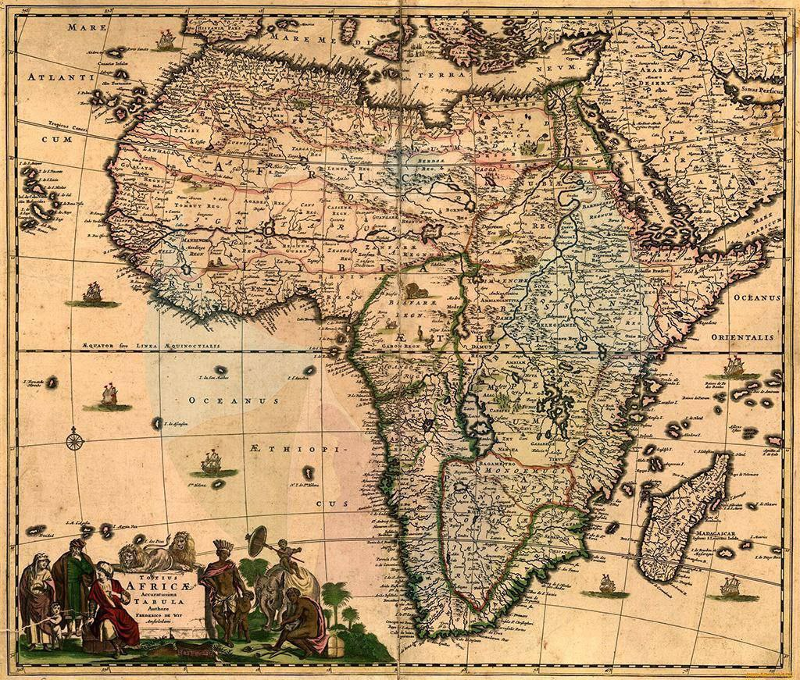
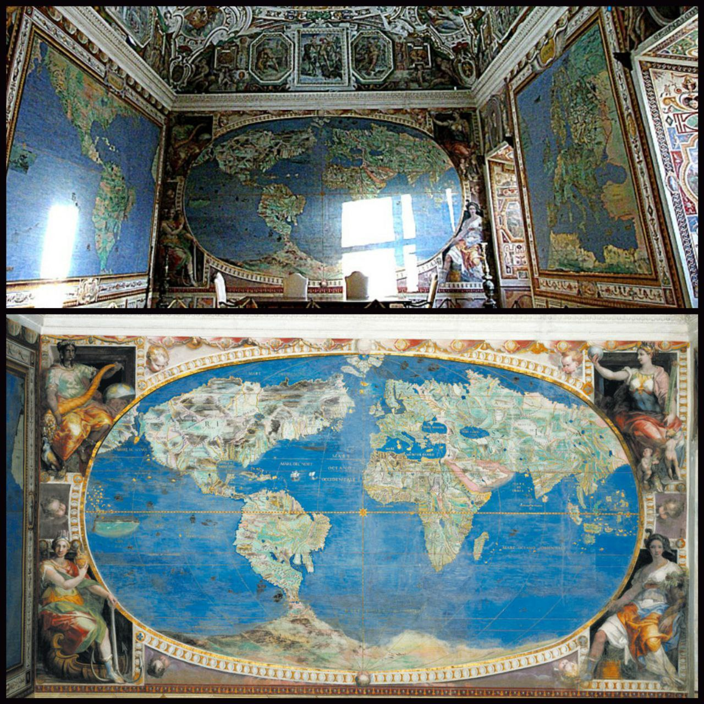
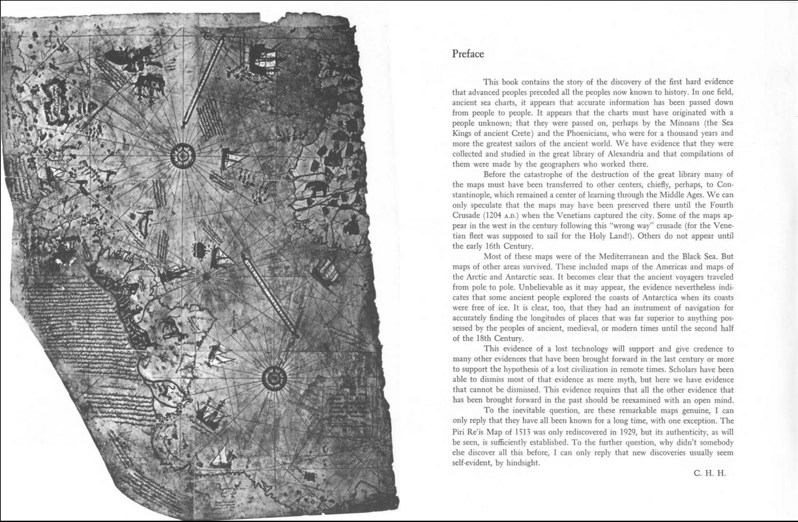

# Old Maps

## 1688 Africa Map

Map of 1688. Cities and rivers in place of the Sahara

The Gobi Desert and the Takla Makan are not on ancient maps either. Numerous cities and rivers are also marked in these areas. Archaeologists have found buried cities and mummies in the Gobi and other deserts - maps do not lie. But they hid their findings tens of thousands of years ago.

It turns out that the fertile lands were suddenly, or within a short period of time, covered with sand.

## 1530 World Map, Palazzo Farnese

The Palazzo Farnese in Rome was built around 1530. One of the decorations in the painted halls, besides the magnificent frescoes, was a detailed map of the world. The map is incredibly detailed, with riverbeds, cities, ports and landmarks.

It differs from what we are used to with Green Antarctica. on the map can everyone see? Well, Antarctica... A huge single continent made up of two Americas, where South America is connected to the flowering lands of Antarctica. And no Drake Strait!

## Maps of the Ancient Sea Kings

https://archive.org/details/HapgoodCharlesHutchinsMapsOfTheAncientSeaKings/page/n9/mode/2up