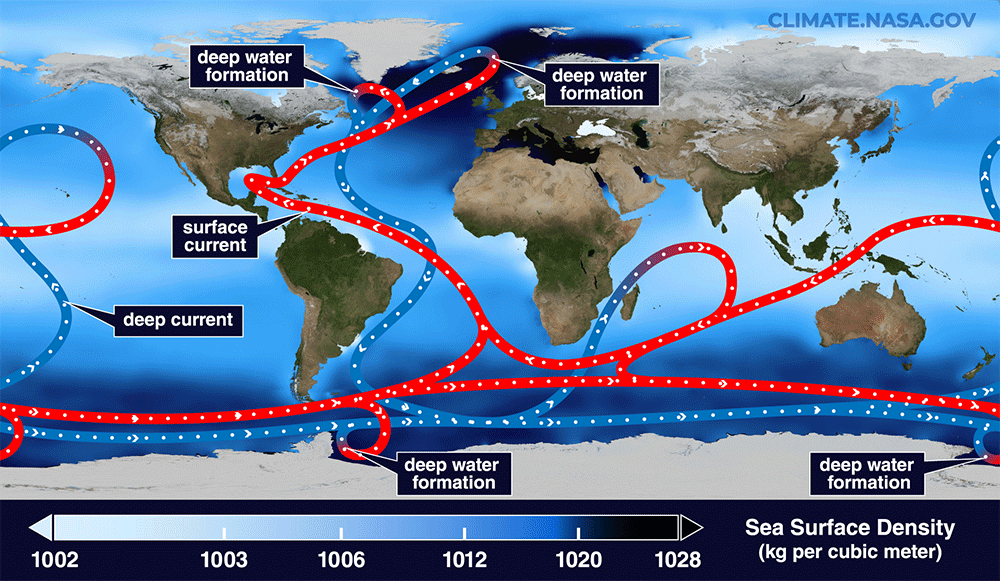
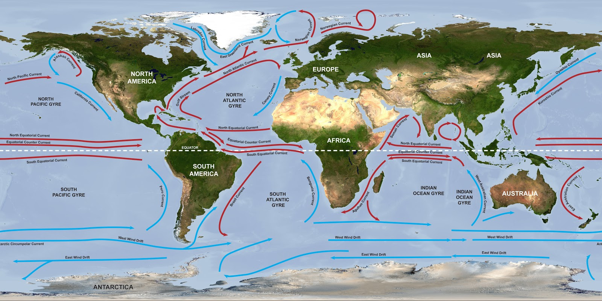

# Climate

## Atlantic Meridonial Overturning Circulation [1,2]

This seems to play a very big role in climate. Water gets cooled when it gets trapped near the poles, where it sinks, and gets heated when it gets trapped in the equator, where it rises.

If the Earth flipped, these would get disrupted, and form new patterns, which would contribute to shifting the climate.

For example, notice that the Pacific west coast is not humid, whereas East Asia is very humid, even though they are at similar latitudes. So, the weather is not solely determined by latitude. The local ocean and topography makes a large difference.

In S2, the Pacific ocean (huge body of water) gets displaced from being directly onto the equator to the south pole, being replaced by large continents. It could be that this results in much colder oceans during S2, also resulting in less humidity, which leads to the proposed drought effect. However, apparently the sunlight only heats the most shallowest (~200m) parts of the ocean, so this might not have such a big effect.

## Wind patterns [3]

Summary of Global Wind Directions:

- Trade Winds: East to West (0°-30° latitude)
- Westerlies: West to East (30°-60° latitude)
- Polar Easterlies: East to West (60° latitude to the poles)
- Jet Streams: West to East (high altitude)
- Monsoons: Seasonally shifting directions (ocean to land in summer, land to ocean in winter)

These wind patterns are the result of the Earth’s rotation (Coriolis effect), differential heating, and pressure systems, which together shape global and regional wind flows.

## Citations

1. https://insideclimatenews.org/news/09022024/climate-impacts-from-collapse-of-atlantic-meridional-overturning-current-could-be-worse-than-expected/
2. http://davidburchnavigation.blogspot.com/2013/01/ocean-currents.html
3. GPT