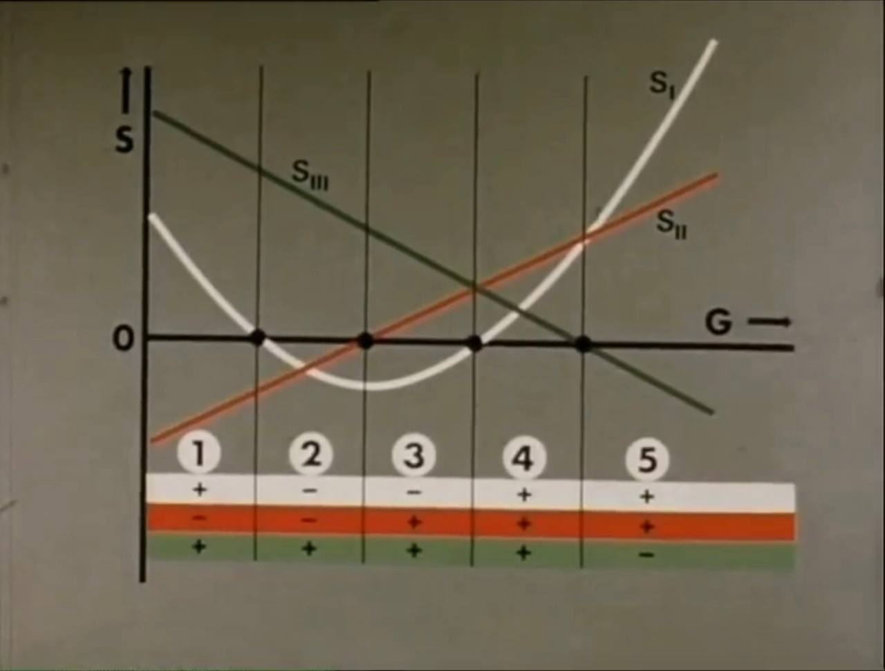

# Dzhanibehov Effect

This folder is for understanding the Dzhanibekov effect, which references the effect of a metal nut switching rotational position suddenly when spinning in zero gravity.

## Ethical Skeptic: Mediated Dzhanibekov Oscillation

*"While our theory references the Dzhanibekov Effect... Our model does not strictly adhere to the traditional Dzhanibekov Effect definition, where an object flips 180 degrees due solely to rotational instability around its intermediate axis (Exhibit C above). Instead, we explore how similar principles could influence Earth’s rotational dynamics under different conditions, specifically,"* [1]
1. *"a reduction in the geomagnetic coupling between the Earths’ core and its mantle as the core’s geomagnetic moment, which helps to keep the present polar rotational axis as priority, fades,"*
2. *"destabilization caused by the Earth’s hotter mantle versus less-dense Large Low-Velocity-Shear Provinces (LLVPs), and in particular the center of low-mass in the South Africa Cusp LLVP. This core material infusion can potentially polarize the Earth’s rotational momentum, leading to significant shifts in the planet’s rotation around its maximum axis (the remaining dense mantle), and"*
3. *"a gyroscopic 104 degrees (relative to the current polar axis, see Exhibits H and J) mediation of the Dzhanibekov effect—not the 0 to 180 degrees typically illustrated in simpler physical models (Exhibit C)."*

As far as conservation of angular momentum goes, this is Ethical Skeptic's explanation: *"The H-layer of the core accelerates its exothermic sloughing, and this material-shedding effect serves as a kind of ‘infinite lubricant’ between the core and the mantle, allowing the two bodies to rotate independently (as shown in Exhibits J and J2)."*

*"The reader should note that in this scenario, geomagnetic north has not moved; rather, it is the mantle, asthenosphere, and lithosphere (crust) that have undergone rotation. The sloughing of the H-layer acts as a lubricating mechanism between the core and the mantle, facilitating this process, much like applying duct tape to a ball of melting butter—it simply won’t adhere."*

As far as why the rotation is only 104 degrees, that is due to the mass distribution of the mantle, which has its least dense area in the South Africa LLVP. This would make the axis running through this point a third principal axis [see below physics explanation], on which the rotation of the mantle would become stable:

## Overview [2]

The Dzhanibekov Effect. "While he was busy unloading the transporter ship, Vladimir Dzhanibekov twisted his finger on one of the fastening tab nuts, which fastened ribbons holding containers for packing things sent to space. Usually, the tab nut was twisted from a double bolt and flew off, and Vladimir caught it and hid it in his pocket. However, one day the astronaut did not manage to catch the nut, therefore, to his great amazement, it flew about 40 centimetres, and then suddenly turned 180 degrees across the axis of its rotation and flew farther, rotating in the same direction, but by another pole, and after about 40 more centimetres the nut turned over again. This phenomenon was so interesting to the astronaut that he installed the nut back and again twisted it. The result was the same! 

After a bit of confusion in the academic circles, it became apparent that it was possible to explain the effect of Dzhanibekov with the help of classical mechanics. The essence of the phenomenon lies in the fact that a body that rotates freely in zero gravity has VARIOUS moments of inertia, impulses and initial speeds of rotation relative to different axes of rotation. The fact is that when you untwist the nut, it's hard to give it a strict rotation only on one axis. There will necessarily be a minimum momentum imparted to the body directed relative to the other axis. Gradually, this impulse accumulates and outweighs the axial rotation of the body (tab nut). Thus, the body first rotates around one axis; then this axis suddenly turns over in the opposite direction. There is a somersault, but the body continues to rotate in the same direction as before the overturn. After the same time, the axis again turns over, returning to its former position, and the body again rotates as in the beginning. This cycle can be repeated many times.

And here then unpleasant analogies come to mind with our Earth rotating in weightlessness. "But the effect of a regular cyclic reversal of poles in a body rotating in zero gravity only affects bodies with an unstable center of gravity, what does this have to do with our Earth?" -The Attentive Reader will ask. However, forgive me, what stable center of gravity can we speak of in our planet?"

1. https://youtu.be/dL6Pt1O_gSE
2. https://geocenter.info/en/article/kogda-solnce-vzojdjot-na-zapade-ili-jeffekt-dzhanibekova-i-klimat-zemli
3. https://youtu.be/NJLdW4DHRcA

## Dzhanibekov flip physics explanation basics

### Moment of inertia, angular momentum, and angular velocity

The moment of inertia around a rotational axis can be defined as the sum of the point masses, where point mass is defined as the mass of a point times the square of the radius from the axis of rotation.
- Unit: mass times length squared

Moment of Inertia Tensor: For a rotating rigid body, the moment of inertia is represented by a tensor I which relates angular momentum L to angular velocity w by:
- L = Iw
- Moment of inertia tensor units: 3x3, each value has unit mass times length squared
- Angular velocity unit: dimension of angle per unit time
	- Angular velocity unit about 3 axes: A 3x1 vector with components along each axis
- Angular momentum units: product of the two above units

The angular momentum remains constant; so I and w remain inversely proportional as they change. In other words, the angular velocity is inversely proportional to the moment of inertia tensor.

Angular velocity has dimension of angle per unit time.

### Principal axes and axis of rotation

Principal axes are essentially defined by the first and third principal axes. The first axis is the axis around which the moment of inertia tensor is smallest. The third, the biggest. The second is perpendicular to the previous two.

Essentially, unless an object is perfectly rotating around one of its 3 principal axes, it will be undergoing dzhanibekov rotation. Rotation is most stable on the third principal axis.

If you watch [this video](https://www.youtube.com/watch?v=Knpn0JBMif4) of spinning objects in space, you'll see that:
- 0:24 - Even during the "stable rotation", the object never perfectly spins along its principal axis. It gets close but is off. This only happens when the angular momentum is close to the principal axis
- 0:55 - When the angular momentum is not close to a principal axis (more so the first or third), it'll still dzhanibekovally rotate, but not with such a sharp "flipping" movement

https://github.com/user-attachments/assets/6bbc33a0-4caa-43a0-ac7b-76d9ce07aec5

Mathematically, the principal axes are the axes around which the moment of inertia tensor is diagonal. For a body with moments of inertia I1, I2, and I3, these axes are the eigenaxes of the inertia tensor.

See `img/dzhanibekov.mp4`.

### Relation between angular velocity and moment of inertia

Note that if the axis of rotation is a principal axis, the angular velocity remains constant, which means the moment of inertia also remains constant.

On the other hand, if the axis of rotation is not a principal axis, neither the angular velocity nor the moment of inertia will ever remain constant.

Here we have a way to understand the relationship between angular momentum and angular velocity. Let's say we have 3 principal axes.

If an object is spinning about its first principal axis, it will have:
- constant angular momentum (m, 0, 0)
- constant angular velocity (v, 0, 0)
- constant inertia tensor
	- (i11, 0, 0)
	- (0, i22, 0)
	- (0, 0, i33)

But if the Earth has angular momentum close to, but not quite, on its first principal axis, it will have:
- constant angular momentum (x, small, small)

From here on out, the inertia tensor and angular velocity will both be changing. We know:
- v1 (i11 + i12 + i13) = x
- v2 (i21 + i22 + i23) = small
- v3 (i31 + i32 + i33) = small

The next step is a bit harder. Let's imagine that the object starts out with angular velocity (y, small, small) and use the T-handle as an example. During the flip, v2 and v3 would increase, I presume, and v1 would decrease. In order to remain the constant values, we would need to see the sum of the first row of the inertia tensor increase, and the sum of the second and third rows decrease.

## Dzhanibekov Acceleration Rate

We can only guess. It would probably be parabolic with an intermediate steady state, as shown in this example, but we do not know the duration. So the best we can do is model a range of velocities over the low and high end of predicted rotation times.

https://www.researchgate.net/figure/Parabolic-acceleration-and-deceleration-curve_fig2_331877131

## Prandtl Rotations

Prandtl Rotations describe the motion of a gyroscope's rotor around its principal axes. A gyroscope's behavior is governed by the principles of angular momentum conservation, causing it to resist changes to its orientation. For a rotating gyroscope, stability along its axes is critical. Depending on the external influences (like additional weights, torques, or friction), these rotations can either remain stable (maintaining a steady motion) or become unstable, leading to wobbling or tumbling motions.

When rotating about one of its principal axes (with the highest or lowest moment of inertia), the gyroscope exhibits stable behavior. If additional forces or masses alter its inertia, the gyroscope may cross a critical stability threshold, leading to unstable rotations.

[1] https://youtu.be/oBjjdZcEA9U

The bands along the bottom of the chart shows where mass has been subtracted from the gyroscope in each case.

See `img/1841595827430502521-XPYGKXWoFKQIpcjh.mp4`.

## Citations

1. https://theethicalskeptic.com/2024/05/12/exothermic-core-mantle-decoupling-dzhanibekov-oscillation-ecdo-theory/
2. [Craig Stone](https://nobulart.com)

# TODO

do a physics breakdown of the 104 mediated dzhanibekov

do a simple physics breakdown of 180 dzhanibekov

possible assumption: rate of change starts at 0 advances to X then goes to 0, with 0 velocity at the poles (based on video of the rotation)

model the timeframe of tiny rotational digressions leading up to the big shift during dzhanibekov based on the fact that the major movement is 6-24 hours (anecdotally, on earth)

model the rotational velocity at various stages of the dzhanibekov (I assume its greatest at the halfway point)
