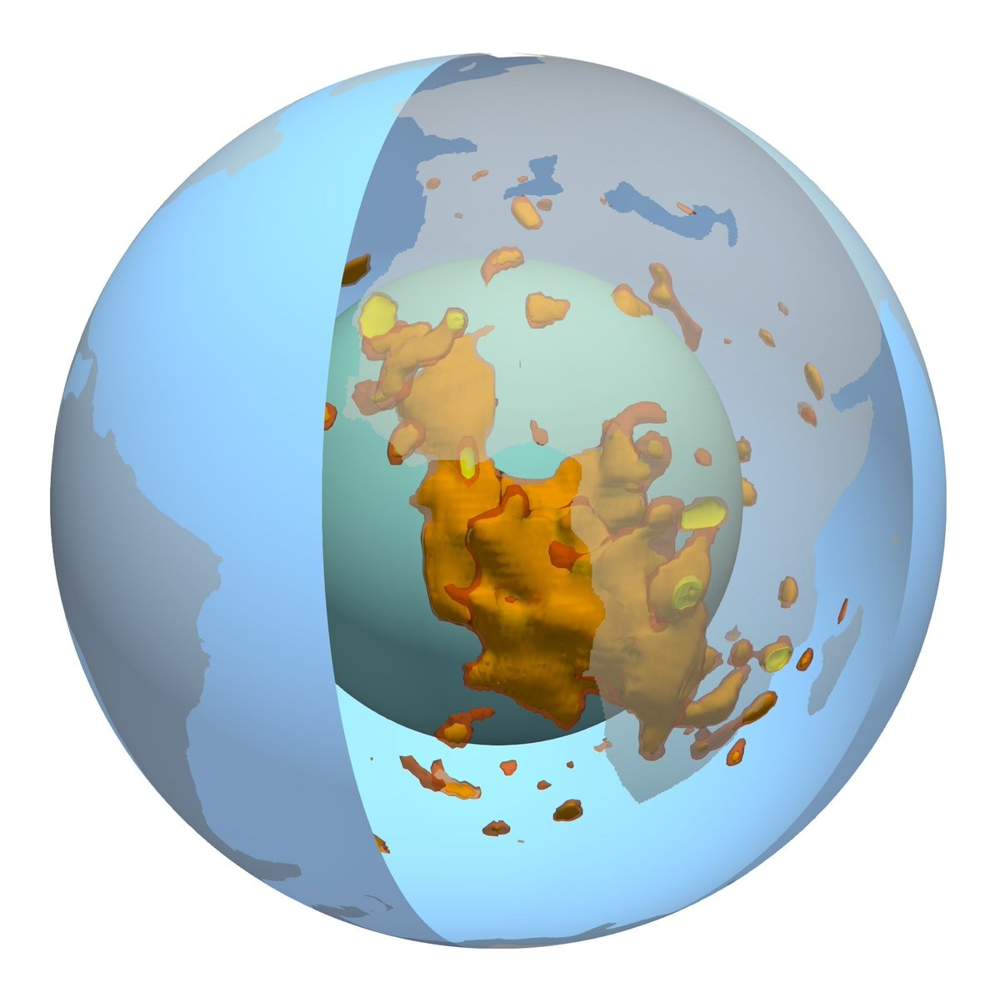
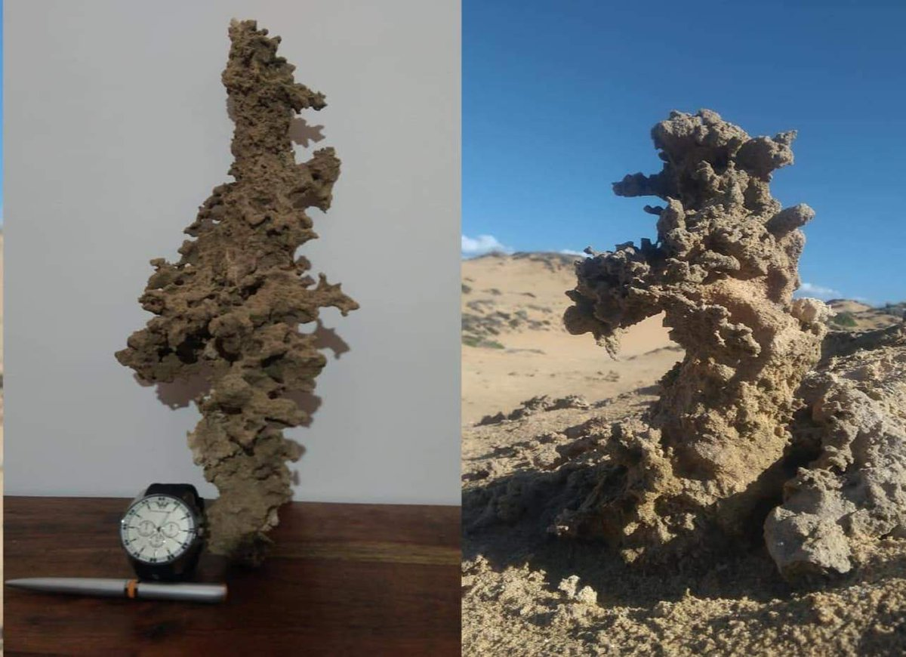
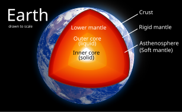
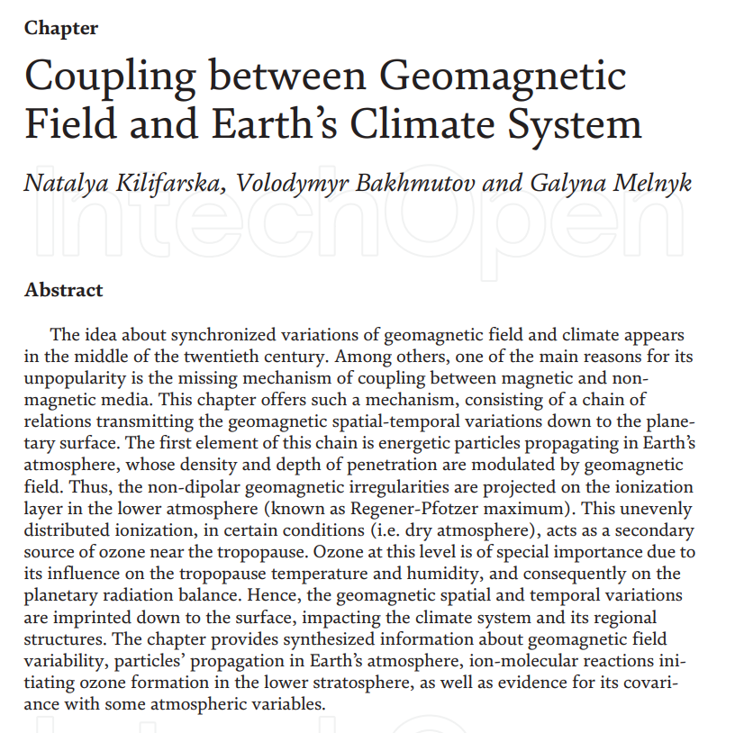
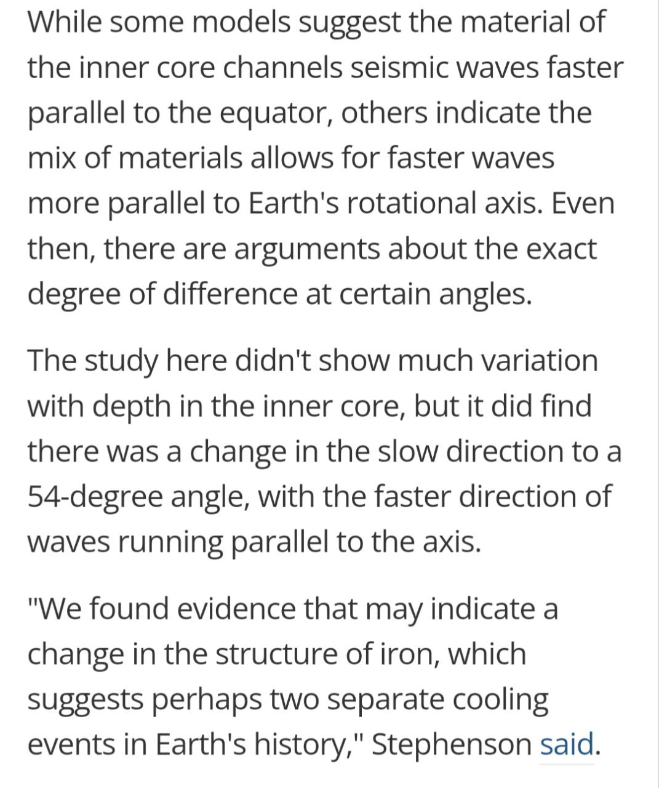
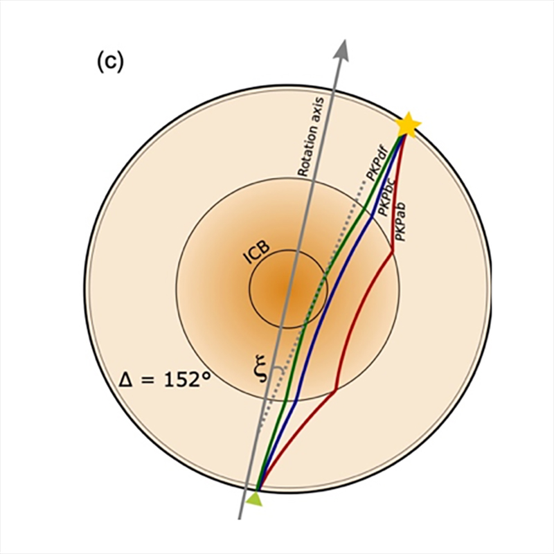

# Earth Inner Layers

The Earth's inner layers are at the centerpoint of the ECDO theory - not only does the core-mantle decoupling enable an ECDO rotation, the exothermic core leads to various climate change effects. Additionally, the South Africa LLVP in the mantle is what decides the specific angle and orientation of the rotation.

## ECDO: Exothermic Core, SAC LLVP

TES is very specific on the mechanics of the exothermic core:

*"The Earth’s core undergoes extreme exothermic change – sloughing high-latent-energy hexagonal closepack (HCP) iron from its H-layer and into the outer core where it converts to liquid face centered cubic (FCC/BCC) iron plus kinetic energy (latent heat of phase transition). Core magnetic permeability weakens and its geomagnetic dipole wanders. Earth’s rotation speeds up on a decadal basis from the loss in magnetic coupling from outer core to mantle. Earth’s rotational axial inclination also changes."* [3]

*"South Africa Cusp – Large Low-Velocity-Shear Province (SAC-LLVP) tomography structures (red) and centroid (yellow) at the southern tip of the African continent. The lighter axial centroid of the SAC-LLVP aligns precisely with the 31st East Meridian, which also passes through the Giza Plateau—positioned 104 degrees offset from the current North Pole... The LLVP formations in contrast (Exhibit E), serve as a minimum axis, with the rest of the mantle forming a hot 3-PIM maximum-axis set (Exhibit E2). When combined, these serve to gyroscopically compete with the magnetically coupled axis, as well as mitigate a pure 180 degree Dzhanibekov rotation departure from that geomagnetic axis."*

## Could the LLSVP's be fulgurites?...

Could the LLSVP's be fulgurites? [1] https://t.co/QOZm6ePJfl https://t.co/lgMKAKI7Kl https://t.co/dUbQUnSTKc

## Basics

Earth has several internal layers:

These layers are of differing density, rigidity, and thickness [1]:
- **Crust**, 2.7 - 3 g/cm^3 density, 5 - 35 km thickness (5 km oceanic crust, 35 km continental) [2]
- **Upper mantle**, 3.3 - 4.0 g/cm^3 density, 660 km thickness
	- **Uppermost rigid mantle**, 100 - 200 km thickness
	- ***Asthenosphere**, semi-fluid and ductile, facilitates plate tectonics, ~300 km thickness
	- **Transition zone**, 3.8 - 4.4 g/cm^3 density, 220 km thickness
- **Lower mantle**, solid but flowing, 4.4 - 5.6 g/cm^3 density, 2260 km thickness
- **Outer core**, liquid, 9.9 - 12.2 g/cm^3 density, 2180 km thickness
- **Inner core**, solid, 12.8 - 13.1 g/cm^3 density, 1220 km thickness

Total: 12.7k km

## Earth's core

The Earth's core is a ball of swirling hot metal at the centre of our planet, with a radius roughly one half of the Earth's radius. It is formed by two parts: a solid inner core, with a radius of 1221 km, surrounded by a shell of liquid which extends up to 3480 km from the centre. It is widely believe that the Earth's core is mainly formed by iron, or iron with up to 5 – 10% of nickel. It is also known that the core must contain a significant fraction of light impurities, in the region of 2 – 3% in the solid and 6 – 7% in the liquid. The nature of these light impurities is unknown. [6]

## Inner core

Earth's inner core is the innermost geologic layer of the planet Earth. It is primarily a solid ball with a radius of about 1,220 km (760 mi), which is about 20% of Earth’s radius or 70% of the Moon's radius. [5]

The temperature at the inner core's surface is estimated to be approximately 5,700 K (5,430 °C; 9,800 °F), which is about the temperature at the surface of the Sun. [5]

The pressure in the Earth's inner core is slightly higher than it is at the boundary between the outer and inner cores: It ranges from about 330 to 360 gigapascals (3,300,000 to 3,600,000 atm). [5]

## Core-Mantle Coupling Research Papers

This is recommended by Nobulart (massive 20 MB file, not putting in repo): https://annas-archive.org/md5/18c9a31311c4b4779d90bf955d4cbafe

There's also several PDFs of papers in `papers/`.

Paper on interior of the Earth: https://annas-archive.org/md5/17ca9353c3b84e99c28d13c255e1cd4c

### https://t.co/xfbFNqGvkb https://t.co/p0LgwkqzaD

https://t.co/xfbFNqGvkb https://t.co/p0LgwkqzaD

## Inner Core Iron Phase Change, Two Layers??

Earth's core might not be what they thought it was. 

TL;DR:

Core itself may have 2 layers.
Has ramifications.
Could rewrite a lot of things.

- Anyone else seen this ? 
- Comments ?
- Has it (or How could this) affect ECDO theories ?
- Could (or how could) this be manipulated externally, to affect how magnetic shifts happen ?

Links:

https://www.sciencealert.com/scientists-detected-signs-of-a-hidden-structure-inside-earths-core

Recent Journal Article:

https://agupubs.onlinelibrary.wiley.com/doi/10.1029/2020JB020545

Original Journal Article:

Evidence for the Innermost Inner Core: Robust Parameter Search for Radially Varying Anisotropy Using the Neighborhood Algorithm

J. Stephenson, H Tkalčić, M. Sambridge

First published:
07 December 2020
https://doi.org/10.1029/2020JB020545
Citations: 22

## Citations

1. Earth layers: https://en.wikipedia.org/wiki/Internal_structure_of_Earth
2. Earth crust thickness: https://www.geolsoc.org.uk/Geoscientist/Archive/August-2018/Roberts-Crust
3. https://theethicalskeptic.com/2020/02/16/the-climate-change-alternative-we-ignore-to-our-peril/
4. https://theethicalskeptic.com/2024/05/23/master-exothermic-core-mantle-decoupling-dzhanibekov-oscillation-theory/
5. https://en.wikipedia.org/wiki/Earth%27s_inner_core#Physical_properties
6. https://www.researchgate.net/publication/242102433_Temperature_and_composition_of_the_Earth's_core (hard copy in this folder)