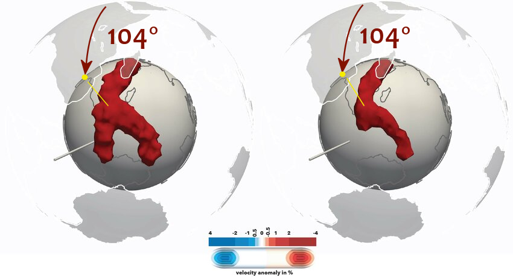

# Earth Inner Layers

The Earth's inner layers are at the centerpoint of the ECDO theory - not only does the core-mantle decoupling enable an ECDO rotation, the exothermic core leads to various climate change effects. Additionally, the South Africa LLVP in the mantle is what decides the specific angle and orientation of the rotation.

## ECDO: Exothermic Core, SAC LLVP

*"The Earth’s core undergoes extreme exothermic change – sloughing high-latent-energy hexagonal closepack (HCP) iron from its H-layer and into the outer core where it converts to liquid face centered cubic (FCC/BCC) iron plus kinetic energy (latent heat of phase transition). Core magnetic permeability weakens and its geomagnetic dipole wanders. Earth’s rotation speeds up on a decadal basis from the loss in magnetic coupling from outer core to mantle. Earth’s rotational axial inclination also changes."* [3]

*"South Africa Cusp – Large Low-Velocity-Shear Province (SAC-LLVP) tomography structures (red) and centroid (yellow) at the southern tip of the African continent. The lighter axial centroid of the SAC-LLVP aligns precisely with the 31st East Meridian, which also passes through the Giza Plateau—positioned 104 degrees offset from the current North Pole... The LLVP formations in contrast (Exhibit E), serve as a minimum axis, with the rest of the mantle forming a hot 3-PIM maximum-axis set (Exhibit E2). When combined, these serve to gyroscopically compete with the magnetically coupled axis, as well as mitigate a pure 180 degree Dzhanibekov rotation departure from that geomagnetic axis."*

## Basics

Earth has several internal layers:

These layers are of differing density, rigidity, and thickness [1]:
- **Crust**, 2.7 - 3 g/cm^3 density, 5 - 35 km thickness (5 km oceanic crust, 35 km continental) [2]
- **Upper mantle**, 3.3 - 4.0 g/cm^3 density, 660 km thickness
	- **Uppermost rigid mantle**, 100 - 200 km thickness
	- ***Asthenosphere**, semi-fluid and ductile, facilitates plate tectonics, ~300 km thickness
	- **Transition zone**, 3.8 - 4.4 g/cm^3 density, 220 km thickness
- **Lower mantle**, solid but flowing, 4.4 - 5.6 g/cm^3 density, 2260 km thickness
- **Outer core**, liquid, 9.9 - 12.2 g/cm^3 density, 2180 km thickness
- **Inner core**, solid, 12.8 - 13.1 g/cm^3 density, 1220 km thickness

Total: 12.7k km

## Core-Mantle Coupling Research Papers

This is recommended by Nobulart: https://annas-archive.org/md5/18c9a31311c4b4779d90bf955d4cbafe

There's also several PDFs of papers in `papers/`.

Paper on interior of the Earth: https://annas-archive.org/md5/17ca9353c3b84e99c28d13c255e1cd4c

## Citations

1. Earth layers: https://en.wikipedia.org/wiki/Internal_structure_of_Earth
2. Earth crust thickness: https://www.geolsoc.org.uk/Geoscientist/Archive/August-2018/Roberts-Crust
3. https://theethicalskeptic.com/2020/02/16/the-climate-change-alternative-we-ignore-to-our-peril/
4. https://theethicalskeptic.com/2024/05/23/master-exothermic-core-mantle-decoupling-dzhanibekov-oscillation-theory/