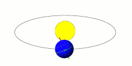
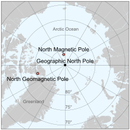
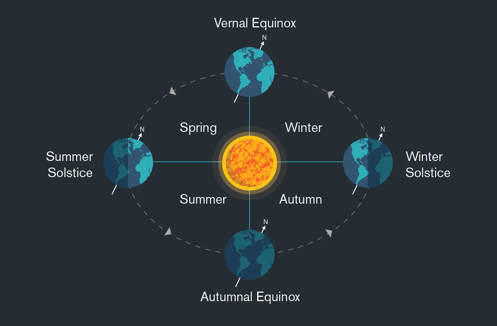

# Earth's Orbit

This page covers some basic knowledge regarding the Earth's rotation - axial tilt and north poles.

## Axial Tilt

Axial tilt is the angle between an object's rotational axis (spinning) and its orbital axis (orbit), which is the line perpendicular to its orbital plane, which is the plane along which, for Earth, it rotates around the Sun. The Earth's axial tilt is about 23.4 degrees. depicted by the red line in the below gif which does not point straight upwards.

## Polar Nutation [1]

Nutation, in a broader sense, is the periodic wobbling or nodding of the Earth’s axis around its mean position. The Earth’s axis doesn't stay perfectly fixed in space; instead, it exhibits a slow precession, and superimposed on this motion is nutation.

The term "polar nutation" specifically refers to these small changes in the orientation of the Earth's rotational axis relative to its poles. It can be seen as oscillations in the motion of the Earth’s pole of rotation (the point on Earth’s surface around which the planet rotates) in relation to the celestial poles.

## North Poles

There are 3:
- The **geographic north pole** is the northern Earth surface point intersecting with Earth's axis of rotation. It's where lines of longitude meet at the top of the Earth.
- The **north magnetic pole** is the point on the north surface of the Earth where the planet's magnetic field points directly downward. Presumably, this is found through measurement
- Finally, the **geomagnetic north pole**, which would be the north pole in an approximate dipole model of the Earth's magnetic field

Currently, none of the 3 are the exact same point.

## Axial Tilt and Seasonal Sunlight Variation [1]

The Earth is tilted on its axis by about 23.5°. This tilt is what causes the seasons and affects how much sunlight different regions of the Earth receive throughout the year.

The Antarctic Polar Circle, also known as the Antarctic Circle, is an imaginary line located at approximately 66.5° south latitude. This circle marks the boundary within which, for at least one day each year, there is a 24-hour period of either complete daylight (known as the Midnight Sun) or complete darkness (known as Polar Night).

1. Summer in the Northern Hemisphere (around June 21)
	- The Northern Hemisphere is tilted towards the Sun.
	- Regions above the Arctic Circle (66.5° N) experience 24 hours of daylight.
	- The Antarctic Circle receives less sunlight, and areas inside it may have 24 hours of darkness.
2. Winter in the Northern Hemisphere (around December 21)
	- The Northern Hemisphere is tilted away from the Sun.
	- Regions above the Arctic Circle experience 24 hours of darkness.
	- The Antarctic Circle receives more sunlight, and areas inside it may have 24 hours of daylight.
3. Equinoxes (around March 21 and September 21)
	- The Earth’s tilt is such that the Sun is directly over the equator.
	- Day and night are approximately equal (12 hours each) across the entire planet.

## Equinox and Solstices [1]

Equinox: Occurs twice a year, around March 21 (spring or vernal equinox) and September 23 (autumnal equinox), when day and night are nearly equal in length because the Earth's axis is not tilted toward or away from the Sun.

Solstice: Also occurs twice a year, around June 21 (summer solstice) and December 21 (winter solstice). These are the times when the Earth's axial tilt is most inclined toward or away from the Sun, resulting in the longest day (summer solstice) or the longest night (winter solstice) of the year.

## Chandler Wobble

"The Chandler wobble or Chandler variation of latitude is a small deviation in the Earth's axis of rotation relative to the solid earth,[1] which was discovered by and named after American astronomer Seth Carlo Chandler in 1891. It amounts to change of about 9 metres (30 ft) in the point at which the axis intersects the Earth's surface and has a period of 433 days.[2][3] This wobble, which is an astronomical nutation, combines with another wobble with a period of six years, so that the total polar motion varies with a period of about 7 years." [2]

## Citations

1. ChatGPT
2. https://en.wikipedia.org/wiki/Chandler_wobble

# TODO

Milankovitch cycles