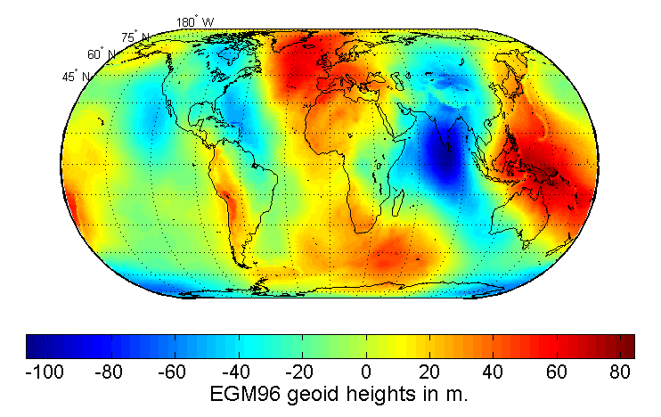

Earth is an oblate spheroid, but more specifically, it's a geoid.

This is a gravitational model. Not sure if it's a perfect proxy for what I'm looking for which is really the exact difference from an oblate spheroid shape.

Might this have something to do with geomagnetic anomalies?