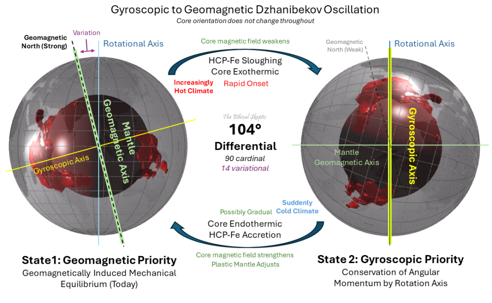

# Cause(s) of the ECDO

## Exothermic and Endothermic Core Cycle [1]

TES's basic ECDO timeline is as follows:

1. *"Weakening of the core-mantle magnetic coupling (Earth’s geomagnetic moment) and North Pole (Np) priority."*
2. *"Contribution of exothermic kinetic energy (heat) into the Earth’s mantle (see Exhibit E2), excluding the axially-located Large Low-Velocity-Shear Provinces (LLVP – see Exhibit E) – which become relatively lower in density as compared to the surrounding core-fed mantle."*
3. *"Causing dramatic ocean SST and northern hemisphere tundra warming, along with a resulting forced carbon dioxide and methane release."*
4. *"Once past a specific threshold of reduced magnetic moment, the core-mantle magnetic coupling gives way to a gyroscopically mediated form of Dzhanibekov rotation from Np to Np‘ (104º along 31º E longitude – the same meridian as the Khufu Pyramid). The H-layer of the core accelerates its exothermic sloughing, and this material-shedding effect serves as a kind of ‘infinite lubricant’ between the core and the mantle, allowing the two bodies to rotate independently."*

Regarding the shift from S2 back to S1, TES leaves that mostly open, although he does say this: "We speculate that the process of moving from State 2, Gyroscopic Priority, back to State 1, Geomagnetic Priority, may involve a viscoelastic-mantle tectonic height readjustment and gradual settle-in process, however involving a relatively sudden cooling event at the point where the core recaptures its HCP-Fe lattice integrity."

## Exothermic core instabilities caused by equatorial high rotational speed?

"Detailed observations of sunspots have been obtained by the Royal Greenwich Observatory since 1874. These observations include information on the sizes and positions of sunspots as well as their numbers. These data show that sunspots do not appear at random over the surface of the sun but are concentrated in two latitude bands on either side of the equator. A butterfly diagram (142 kb GIF image) (184 kb pdf-file) (updated monthly) showing the positions of the spots for each rotation of the sun since May 1874 shows that these bands first form at mid-latitudes, widen, and then move toward the equator as each cycle progresses." [2]

Does this happen for the same reason that the LLVPs seem to be centered around the equator?

Note this visualization of equatorial cross-sectional heat flows from the core through the mantle. This slice of the core will be spining the fastest.

The basic idea is that higher rotational speed around the equator causes instability in the core around the equator, leading to the phase change TES talks about in the inner core, and mass/heat being expelled unevenly from the outer core into the mantle, and over long periods, creating areas of higher and lower density (LLVPs). This causes a weakening of magnetic alignment in the mantle, due to higher temperatures causing lower magnetic permeability, along with a new gyroscopic moment of the mantle, eventually leading to decoupling and a mediated gyroscopic rotation of the mantle, which has developed a new third principal axis of rotation through the LLVPs.

The return to S1 would presumably involve some kind of straightforward reversal of this process. If we entertain this theory further, we might imagine that after the flip, a reversal of the LLVP creation process occurs. Once situated at the poles, the lighter LLVPs, no longer maintained by higher rotational speeds and localized exothermic core processes, quickly begin to compress and shrink, restoring mantle uniformity. The outer core experiences compression, as it no longer has immediate equatorial outlets (LLVPs) to expel heat and mass. Accordingly, the inner core also faces compression, and this leads to pressure-induced crystallization, which captures heat. This potentially occurs quickly past a certain boundary point of pressure, causing a quick chain-reaction of crystallization.

Somehow, this process would need to directly cause a rotation back to S1. It may be that as the LLVPs quickly shrink, the third principal axis shifts again back to the S1 poles, due to the preexisting mantle equatorial bulge still maintaining some of its shape. This could occur in a non-instantaneous fashion as the crystallization process and corresponding LLVP reduction occurs over some period of time, leading to the "gradual settle-in process" TES mentions. Then, S2 would last only as long as is required for the LLVPs to shrink to an extent that returns the third principal axis of rotation back to the S1 poles.

### By extension - conflagration by fire

Is it unreasonable to assume that, if the mantle is capable of decoupling from the core and performing a mediated gyroscopic rotation, that the core may also be capable of doing the same thing, where the mantle maintains its rotation but the core rotates inside?

This may explain conflagrations of fire, where the magnetic field is weakened, but the mantle does not rotate, causing solar burning but not oceanic displacement.

Alternatively, a slow rotation from S2 back to S1, not fast enough to cause oceanic displacement, but fast enough to cause a significant magnetic field weakening, could cause a conflagration by fire.

## Ice Accumulation unevenly on South Pole [2]

What if the rotational instability is caused by uneven accumulation of ice mass around the rotational axis? My only gripe with this is that the mass of the ice cores relative to the mantle is **extremely** small. The glaciers are also supposed to be melting, although mainly at equatorial high-altitude glaciers.

Some more detail - the ice caps might cause full 180 flips if the core/mantle didn't uncouple. But if the Earth's core has been heating up on a macro timescale, perhaps the core/mantle decouplings only started recently, leading to partial flips.

### Nobulart quotes

You don't think that that continuous accumulation of condensed polar ice might be sufficient to disrupt the regular equatorial center of mass established by the LLSVP's? 30 million gigatonnes of offcenter spinning mass must extert some centrifugal force, enough it seems to be affecting the Earth's axis of rotation directly.

Antarctica’s mass has been seeing a net accumulation over thousands of years as indicated by core samples. If the ball is spinning then it seems pretty obvious that 14 million square km of 2km thick ice which is clearly off center must have some weight in the game. Other concerns would be accounting for the degree of erosion seen at Giza, Delos, Turkey and elsewhere around the Med if the inundations are only momentary. We’d need a lot of those to rack up 50 years worth of karst erosion. The account from Crete of two events a few decades apart. The theory wasn’t Einstein’s, but rather that of Laplace, Cuvier and Hapgood (Im not aware of Darwin suggesting this). If anything, Einstein was an interested detractor, saying he thought the ice mass was insufficient to break a crust/mantle coupling. Another thought is that the current destabilization appears to have begun at least 50 years ago - it take time for the flip to accumulate the angular momentum (seen in the TPW westerly drift) prior to the critical point when the decoupling occurs. It would seem to me that the same would be true of the reverse motion. Can these various factors be satisfactorily explained by a momentary reversal?

I've been looking at it as a kinetic event, along this line: The accumulating ice wants to get to the equator. When the core-mantle environment decouples, that's where its heading. On the way there, a vast quantity of ice is going to be loosened by quakes, and shed to fast moving wind and water, but possibly not enough to reverse the imbalance. It will attain cetrifugal dominance at the equator until the additional sunlight has melted enough for the LLSVP's to initiate the return. I think the decoupled state will persist for the extent of State 2 - core will be hot for a while - allowing the ice to maintain the orientation for that period. I  think the polar mass anomaly will be a major contributor to the moment of inertia and to the S2 orientation, and that the delayed return is similarly regulated by the elimination of some of that mass in S2.

I think the "natural" axis of rotation of the mantle and crust (with less, or maybe even no ice) is very close to what we have right now (S1). As the ice accumulates over centuries this becomes increasingly perturbed, adding a growing centrifugal component to the axis of rotation. This must surely be transferred to the core as well - the additional force. Maybe it even has a role to play in the exothermic behavior.

30 million gigatonnes of ice in play in the Antarctic. No one knows what the LLSVP's are, nor their mass. There isn't even agreement on whether they're more or less dense than the surrounding material.

### Mass Calculation of LLVP to Ice Caps

So the LLVPs make up about 8% of mantle volume, and 6% of Earth's volume.

The volume of the Earth is about 1.083 * 10^12 km cubed. 6% of that is 6.5 * 10^12 km cubed.

Now if we take the density of the mantle, about 4 g per cubic cm, that becomes 4 * 10^15 kg per cubic km.

Finally the LLVP is about 5% density difference (literature says its denser though...) so let's take 5% which is 2 * 10^14 kg per cubic km difference.

Now we multiply that by volume to get the mass difference: 13 * 10^26 kg.

The total mass of the ice caps is about 2.67 * 10^19 kg per GPT.

Clearly, the mass of the ice caps is microscopic in comparison to the resulting mass difference from a 5% density anomaly in the LLVPs.

## Nobulart - Electromagnetic Solar/Planetary Perturbation [2]

Nobulart proposes that electromagnetic perturbations inside the Earth are caused by solar and planetary interactions, which I imagine as a form of electromagnetic induction caused by traversing changing magnetic fields.

*"Core-mantle coupling is considered to be a product of electromagnetic, viscous and topographic effects. My working theory is that the EM component is cyclically perturbed by interplanetary and solar interactions which cascade as heating and a lowering of viscosities"*.

## Neutrinos - exothermic core instigator?

The phase state change of hexagonal close packed iron in the core into the mantle may be driven by solar proton storms (From CMEs) into the core via the poles by slamming positively charged protons into a solid mass of Fe+ causing mantle heating and density changes. As we see the magnetic field deteriorate are we seeing this process accelerate exponentially taking us to the TAU point TES describes? Are they trying to slow this down by seeding the atmosphere with negatively ions?

A neutrino storm could significantly raise the number of interactions which occur internally. Each neutrino interaction is potentially a nuclear fission or fusion heating event.

https://www.britannica.com/science/neutrino

## Dzhanibekov Rotation 180 to 104 transition? [2]

Theory that as the Earth heated up, it went from doing full Dzhanibekovs to mediated ones. And that's what allowed life to develop.

## Citations

1. https://theethicalskeptic.com/2024/05/23/master-exothermic-core-mantle-decoupling-dzhanibekov-oscillation-theory/
2. [Craig Stone](https://nobulart.com)
