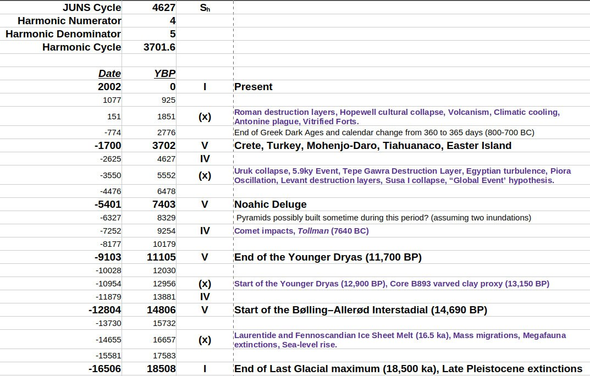
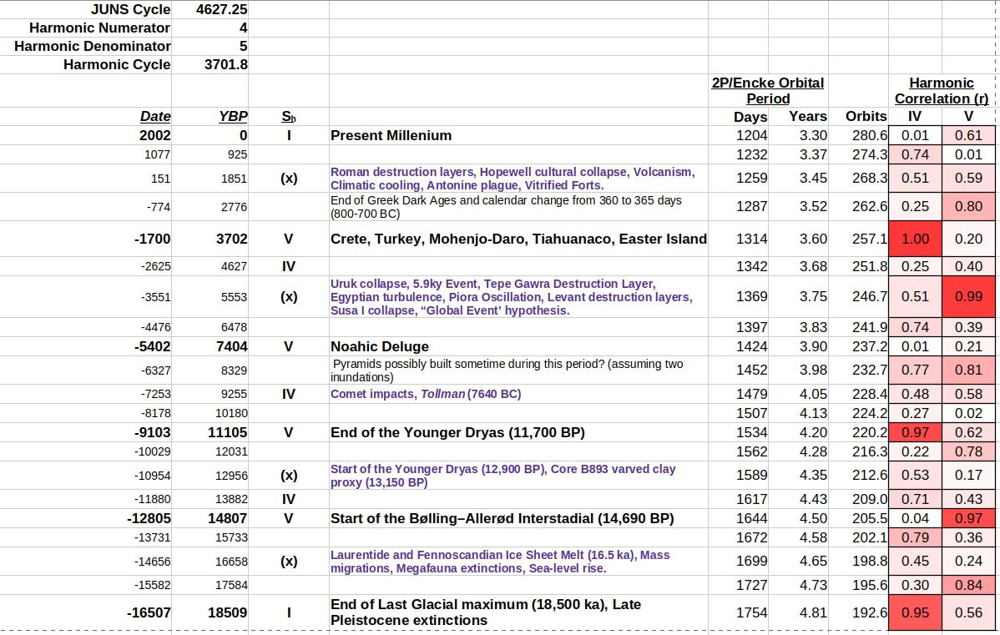
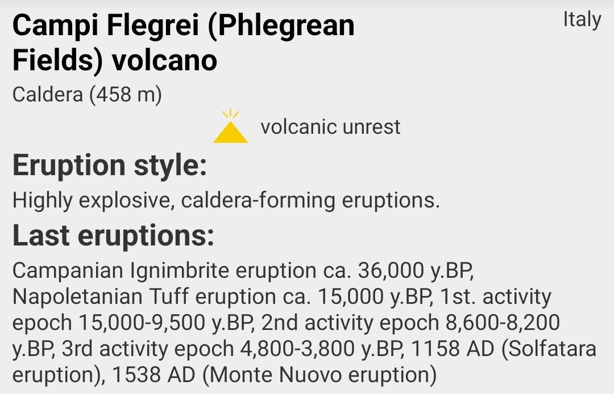

# Frequency of ECDO event

Goal: Predict how frequent the ECDO event is.

## Contents

- `date-anomalies`: Dating anomalies and calendar changes.

# Overview

The two leading hypotheses we have are:
1. ~6000 years
2. ~3700 years

There's also a possibility that it occurs every 1800 years.

## Hypothesis 1: ~6000 years

*"Thus in the period of eleven thousand three hundred and forty years they said that there had arisen no god in human form; nor even before that time or afterwards among the remaining kings who arose in Egypt, did they report that anything of that kind had come to pass. In this time they said that the sun had moved four times from his accustomed place of rising, and where he now sets he had thence twice had his rising, and in the place from whence he now rises he had twice had his setting;[127] and in the meantime nothing in Egypt had been changed from its usual state, neither that which comes from the earth nor that which comes to them from the river nor that which concerns diseases or deaths."* [2]

- Herodotus, An Account of Egypt, 440 BCE

This is the hypothesis endorsed by Ethical Skeptic and mentioned in his thesis.

## Hypothesis 2: ~3700 years

1700 BC (~3700 years ago) appears to be a very historically significant time:
- Many records of a "natural disaster" event - from India (Manu), China (Gun-Yu), Crete (Minoan), Turkey, Pakistan (Mohenjo-Daro), Tiahuanaco, Easter Island (`cataclysm-stories`)
- Late Bronze Age Collapse
	- Evidence of destruction of many cities in the Middle East around this time (`civilization-history/human-built-structures`)
		- Canaanite palace swallowed by a fissure 3700 years ago (`civilization-history`)
		- Tall el-Hammam city melted by extreme temperature ~3700 years ago (`civilization-history/human-built-structures`)
	- Records of immigration in the Mediterranean area coinciding with the Greek Dark Ages (`civilization-history`)
- Mammoths mutating 3700 years ago (`flood-remnants/animal-remains`)

If we go back 3700 more years to 5400 BC, there is evidence as well:
- Noahic deluge potentially in 5200 BC, Book of Genesis (`bible`)
- Chichancanab lake filled with saltwater about 7800 years ago in 5800 BC (`flood-remnants/animal-remains`)
- Sinking of city Dwarka in 5525 BCE

Going back another 3700 years to 9100 BC:
- End of the Younger Dryas
- Plato's account of a story about Atlantis sinking in approximately 9600 BC (`cataclysm-stories`)

Finally you also have a harmonic of the gas giant grand cycle which aligns with these dates (`solar-system`).

## Alternate hypothesis: 10th harmonic (twice as frequent as 3700 years) [1]

Is this perhaps a comet locked in the tenth harmonic (The harmonics are all expressed relative to the 18.5ka I)?

https://chatgpt.com/share/0e3c3803-5dd3-401d-b75f-7c29e513707e

See `EVIDENCE/solar-system/encke-comet` for a full analysis.

## Flegrei Volcano Dates

## Grep searching notable dates

To see what info is in the repo on notable dates, run a grep search: `grep -nr 3700 --include="*.md" .`

Sometimes the dates are just slightly off (ex: 3650). You'd have to be more thorough with grep to find those.

## Citations

1. [Craig Stone](https://nobulart.com)
2. https://lexundria.com/hdt/2.142/mcly#:~:text=Thus%20in%20the%20period%20of,kind%20had%20come%20to%20pass.

# TODO

There's some data from Earth core/soil data showing evidence of past geomagnetic excursions. That would be good to investigate and put in here.

Bond cycle, which indicates massive ice-melt events every 1000-1500 years, many of them coincident with known megaflood accounts.

Ben (Suspicious Observers) also endorses the 6000 year cycle view. See `LITERATURE-MEDIA/ben-davidson` for more.