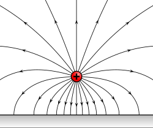
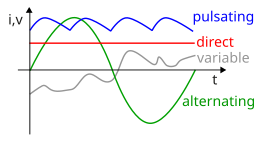
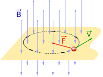

# Electromagnetism

## Electric Fields [1]

*"An electric field (sometimes called E-field[1]) is the physical field that surrounds electrically charged particles. Charged particles exert attractive forces on each other when their charges are opposite, and repulse each other when their charges are the same. Because these forces are exerted mutually, two charges must be present for the forces to take place. The electric field of a single charge (or group of charges) describes their capacity to exert such forces on another charged object. These forces are described by Coulomb's law, which says that the greater the magnitude of the charges, the greater the force, and the greater the distance between them, the weaker the force."*

Image below: *"Electric field of a positive point electric charge suspended over an infinite sheet of conducting material. The field is depicted by electric field lines, lines which follow the direction of the electric field in space. The induced charge distribution in the sheet is not shown."*

### Alternating current vs direct current

*"Alternating current (AC) is an electric current that periodically reverses direction and changes its magnitude continuously with time, in contrast to direct current (DC), which flows only in one direction."* [4]

## Magnetic Fields [2]

*"A magnetic field (sometimes called B-field[1]) is a physical field that describes the magnetic influence on moving electric charges, electric currents,[2]: ch1 [3] and magnetic materials. A moving charge in a magnetic field experiences a force perpendicular to its own velocity and to the magnetic field.[2]: ch13 [4]: 278  A permanent magnet's magnetic field pulls on ferromagnetic materials such as iron, and attracts or repels other magnets."*

*"Magnetic fields surround magnetized materials, electric currents, and electric fields varying in time. Since both strength and direction of a magnetic field may vary with location, it is described mathematically by a function assigning a vector to each point of space, called a vector field (more precisely, a pseudovector field)."*

*"A charged particle that is moving with velocity v in a magnetic field B will feel a magnetic force F. Since the magnetic force always pulls sideways to the direction of motion, the particle moves in a circle."*

### What makes objects magnetic?

*"A magnetic domain is a region within a magnetic material in which the magnetization is in a uniform direction. This means that the individual magnetic moments of the atoms are aligned with one another and they point in the same direction... Magnetic domains form in materials which have magnetic ordering; that is, their dipoles spontaneously align due to the exchange interaction."* [5]

Exchange interaction can be likened to a pigeonhole principle for quantum particles: *"In quantum mechanics, the Pauli exclusion principle states that two or more identical particles with half-integer spins (i.e. fermions) cannot simultaneously occupy the same quantum state within a system that obeys the laws of quantum mechanics."* [6]

Materials can be classified into several categories based on how they react to magnetic fields: *"Magnetic domains form in... ferromagnetic, ferrimagnetic and antiferromagnetic materials. Paramagnetic and diamagnetic materials, in which the dipoles align in response to an external field but do not spontaneously align, do not have magnetic domains."*
- Ferromagnetic: *"Ferromagnetism is a property of certain materials (such as iron) that results in a significant, observable magnetic permeability, and in many cases, a significant magnetic coercivity, allowing the material to form a permanent magnet. Ferromagnetic materials are noticeably attracted to a magnet, which is a consequence of their substantial magnetic permeability. Magnetic permeability describes the induced magnetization of a material due to the presence of an external magnetic field."* [7]
- Ferrimagnetic: *"A ferrimagnetic material is a material that has populations of atoms with opposing magnetic moments, as in antiferromagnetism, but these moments are unequal in magnitude, so a spontaneous magnetization remains.[1] This can for example occur when the populations consist of different atoms or ions (such as Fe2+ and Fe3+). Like ferromagnetic substances, ferrimagnetic substances are attracted by magnets and can be magnetized to make permanent magnets."* [8]
- Antiferromagnetism: *"In materials that exhibit antiferromagnetism, the magnetic moments of atoms or molecules, usually related to the spins of electrons, align in a regular pattern with neighboring spins (on different sublattices) pointing in opposite directions. This is, like ferromagnetism and ferrimagnetism, a manifestation of ordered magnetism."* [9]
- Paramagnetism: *"Paramagnetism is a form of magnetism whereby some materials are weakly attracted by an externally applied magnetic field, and form internal, induced magnetic fields in the direction of the applied magnetic field... Paramagnetism is due to the presence of unpaired electrons in the material, so most atoms with incompletely filled atomic orbitals are paramagnetic, although exceptions such as copper exist. Due to their spin, unpaired electrons have a magnetic dipole moment and act like tiny magnets. An external magnetic field causes the electrons' spins to align parallel to the field, causing a net attraction."* [10]
- Diamagnetism: *"Diamagnetism is the property of materials that are repelled by a magnetic field; an applied magnetic field creates an induced magnetic field in them in the opposite direction, causing a repulsive force... A simple rule of thumb is used in chemistry to determine whether a particle (atom, ion, or molecule) is paramagnetic or diamagnetic:[4] If all electrons in the particle are paired, then the substance made of this particle is diamagnetic; If it has unpaired electrons, then the substance is paramagnetic."* [11]

Cool ferromagnetism video here from Wikipedia: https://en.wikipedia.org/wiki/File:Magnetic_orders.webm

## Electromagnetic Fields [3]

*"An electromagnetic field (also EM field) is a physical field, mathematical functions of position and time, representing the influences on and due to electric charges.[1] The field at any point in space and time can be regarded as a combination of an electric field and a magnetic field. Because of the interrelationship between the fields, a disturbance in the electric field can create a disturbance in the magnetic field which in turn affects the electric field, leading to an oscillation that propagates through space, known as an electromagnetic wave."*

## Citations

1. https://en.wikipedia.org/wiki/Electric_field
2. https://en.wikipedia.org/wiki/Magnetic_field
3. https://en.wikipedia.org/wiki/Electromagnetic_field
4. https://en.wikipedia.org/wiki/Alternating_current
5. https://en.wikipedia.org/wiki/Magnetic_domain
6. https://en.wikipedia.org/wiki/Pauli_exclusion_principle
7. https://en.wikipedia.org/wiki/Ferromagnetism
8. https://en.wikipedia.org/wiki/Ferrimagnetism
9. https://en.wikipedia.org/wiki/Antiferromagnetism
10. https://en.wikipedia.org/wiki/Paramagnetism
11. https://en.wikipedia.org/wiki/Diamagnetism

# TODO

Apparently ferromagnetic materials have the individual magnetic moments align at lower Earth temperatures, whereas at higher temperatures, they are spinning around faster, and affecting each other in reflexive feedback loops

Is this related to the ECDO? Does the Earth's core undergo periodic warming, messing up its magnetic alignment, until it reaches some tipping point, at which it cools down, regains its magnetic uniformity, and then restarts the cycle?

Now could this also be related to the Sun, potentially in another reflexive feedback loop?

## Orbits caused by gravity?

Do electro/magnetic fields cause orbits, rather than gravity? Is gravity just a human sales repackaging of other forces interacting?