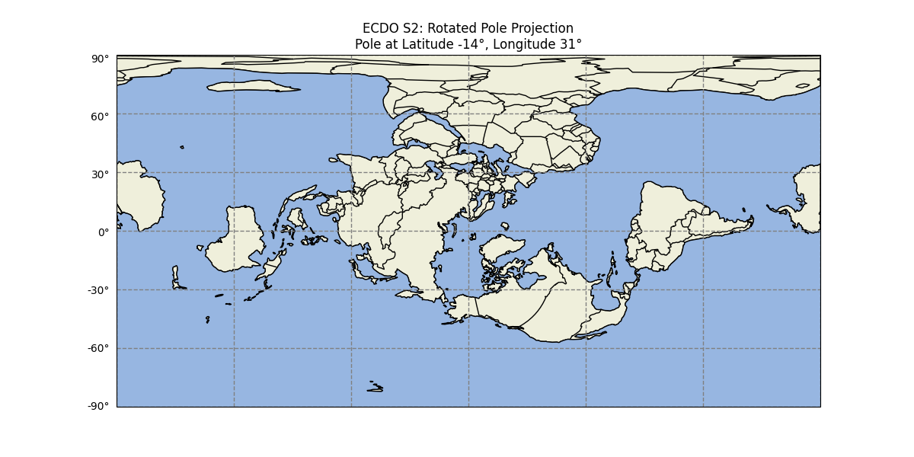

# Equatorial Bulge

Exploring how Earth's equatorial bulge may interplay with the ECDO. Speculative hypothesis.

## Contents

- `kml-files`: Equator and bulge quadrant KML files.

# Analysis

Earth is an oblate spheroid due to its rotation. Earth has an equatorial bulge of 43 km.

Earth also has several internal layers:

These layers will likely react to the Earth changing its axis of rotation due to the equatorial bulge. For example, read this analogy about the plastic nature of the Earth's mantle: *"The memory effect in the Earth’s mantle is akin to that occurring in cold honey after a spoon creates a depression in its surface, and the honey subsequently returns to a flat surface under gravity driven viscous flow. It may take the honey as much as a half an hour to return to being flat, depending on how cold it is."* [2]

Also note this comment from Ethical Skeptic (`LITERATURE-MEDIA/ethical-skeptic`): *"We don’t know the plastic dynamics of the mantle, asthenosphere, and lithosphere, except to note that they are all indeed plastic at 932 to 4000 degrees C. They would deform immediately. during the days of the shift. Probably not a pleasant thing, even if one was up above the flood-wash."*

While it's not clear exactly how it will play out, it's possible that:
- The more flowing, less dense layers that are further from the center and spinning faster will deform and adjust more quickly
- The denser layers that are closer to the center of the Earth and spinning slower will deform slower

## Basic Crust Bulge Changes after S1 -> S2

How might the equatorial bulge react to the ECDO rotation?

Simply, I hypothesize that locations previously on the equator that move closer to the poles will move closer to the Earth's core, and those moving from the poles to the equator will move further away.

## Oceanic Equatorial Bulge

The ocean also bulges due to the equatorial bulge - see this quote from Ethical Skeptic: *"The difference between ocean heights globally is about 680 ft, as compared to a perfect sphere. When the Earth changes orientation, the oceans take on a different set of positions and ‘bulges’ if you will, still in that 680 fit differential from lowest to highest. So dry land appears where ocean once was, and some land gets submerged, until the Earth rights itself back into position 10 to 50 years later."*

We will have to take this into account in our analysis.

## Comparing Earth's crust in S1 and S2 - Raw data

Here's where we put it all together.

First check out this map of the Earth in S1. Check the equator line, which runs through the top of South America and the bottom of South Africa.

Now, take a look at the equator in S2:

Note that there are now huge swaths of land on the equator - Eurasia, the Arctic, the full length of South America, Antarctica, Australia, and the shallow area around Indonesia. In fact, the only significant stretches of ocean are a slice of the Atlantic between North and South America and slices of the Pacific around Antarctica. This is in stark contrast to now, where the equator only runs through the top of South America, South Africa, and Indonesia, and a huge swath of the Pacific lies on the equator.

## Zones of increasing and decreasing latitude

Taking this analysis further, we can actually draw quadrants of the Earth's surface that will move towards or away from the equator, based on boundary lines on the surface which maintain the same distance from the equator during the rotation.

These boundary lines extend between the pivots, and run perpendicular to each other at the pivots. From the eastern pivot, they run at bearings of:
- 38 degrees
- 128 degrees
- 218 degrees
- 318 degrees

These four lines divide the Earth into 4 "strips", touching both pivots, that alternate between moving closer and further away from the equator. I've divided up each strip into two halves, resulting in 8 quadrants, which I display below (KML files in `kml-files`).

Here are the two quadrants connected to the eastern pivot which move closer to the equator:

Here are the two quadrants connected to the eastern pivot which move away from the equator:

Here are the two quadrants connected to the western pivot which move closer to the equator:

Here are the two quadrants connected to the western pivot which move away from the equator:

The markers have different colors:
- Green markers are pivots
- Red markers are points on the S2 equator that remain the same distance from the equator
- Purple markers are points on the S2 equator that move the most either towards or from the equator
- Yellow markers simply help visualize the line between the pivots and the red markers

The lines visualized by the yellow markers that connect the pivots to the red points are the boundary lines that don't change in latitude before and after the rotation.

Visualizing the exact degree of equatorial bulge proximity change looks like this:

## My initial conclusion

As points on the Earth rotate closer or further away from the equator, they will rise or fall. However, tectonic plates also need to be taken into account.

I believe that changes in position on the spheroid will interact together with the tectonic plate structures to produce the final result; each location will need to be analyzed on a case-by-case basis based on the structure of the surrounding tectonic plates. Interestingly, the areas of greatest tectonic plate fracture are both located near the pivots.

My analysis for the major plates follows [1]:

The entire Eurasian plate is essentially contained within a slice that will move closer to the equator. In fact, the equator will run smack dab across the Eurasian plate. Therefore, I predict that the Eurasian plate will rise in elevation, particularly in the Arctic region.

The North American plate currently does not lie on the equator. After the rotation, the equator will run through the east side of this plate, crossing through the north. Therefore I predict the North American Plate, at least the northern and eastern parts, will rise in elevation.

The equator currently runs through the northern part of the South American plate. In S2, the equator will run the full length of the South American plate, on the west side. Therefore I predict that the South American plate will rise, elevating the southern tip of South America.

This is a very interesting region. The equator currently runs through the dotted red line in the Indo-Australian plate. In S2, the equator will run through Australia in the lower right piece of the Indo-Australian plate. I believe the lower piece of the Indo-Australian plate will rise, perhaps only slightly.

The Africa plate would fall as it is centered in a slice that moves away from the equator. As such, we would expect it to fall.

## Shallow seas - evidence of receding coastlines?

What's interesting about the predictions of areas that may rise in elevation is that many of them have shallow oceans in the same areas. For example, the Arctic region, east North America, and South America all have areas of shallow ocean. It's possible that these areas will rise above the water level in S2.

## Taking the oceanic equatorial bulge into account

One interesting data point to take into account is China's Great Gun-Yu flood, during which east China's coastline rose about 65 m for 22 years. See `EVIDENCE/cataclysm-stories/asia/china` for details.

China is in a strip that is expected to rise in elevation. So what could explain its prolonged coastline rise?

Currently I see two possible explanations for this:
- greater oceanic bulge at the equator resulting in rising coastline (although this would be counteracted by the rise in the continental crust)
- displacement of large swaths of ocean from the equator causing a global sea level rise

## Minor analysis sections

### Volcanoes

Following the ECDO rotation, as the inner layers of the Earth begin to deform to fit the new equatorial bulge, we'll likely see every volcano that moves closer to the equator erupt as the upper mantle below them expands.

We may also see new volcanoes form if there are any locations where there is no other way for the pressure to resolve, although I see this as less likely because volcanoes probably formed from past ECDO events to release the pressure.

### Boundaries for latitude change direction

The following are the boundaries for latitude change on the 31 meridian and 149 meridian west, which are the longitude lines of greatest rotation, after the S1 -> S2 rotation:
- 31 meridian 52 S to 38 N: Greater latitude
- 31 meridian 38 N to 149 meridian west 52 N: Lower latitude
- 149 meridian west 52 N to 38 S: Greater latitude
- 149 meridian west 38 S to 31 meridian 52 S: Lower latitude

The points of greatest latitude change are halfway between these boundaries:
- 31 meridian 7 S
- 31 meridian 83 N
- 149 meridian 7 N
- 149 meridian 83 S

## Citations

1. Tectonic plate maps: https://earthhow.com/category/geology/plate-tectonics/
2. https://grace.jpl.nasa.gov/data/get-data/gia-trends/

# TODO things to look into

This is still an incomplete and simplistic model. Rather than eyeballing it, you could graph the equatorial bulge as a spectrum for each point and then compare areas before/after the rotation together with plate boundaries. This could give you a much better picture of what might happen.

More S2 coastline data points to refine the model (Ex: Kumari Kandam).

The oceanic bulge's interaction with the ECDO rotation is still not entirely clear. Does the ocean bulge more or less than the continental crust? Do plates that move away from the equator sink to have a deeper sea, taking in water, or do they shave their equatorial ocean bulge off, letting off water?

How fast will the equatorial bulge shift? What if its immediate, responding in its softest layers, with perhaps a slight bounce back as the other more solid layers take time to adjust?

These graphics are lacking, get a mapping library up and running.

You could potentially incorporate data about plates moving in certain directions, and how they meet at their boundaries (divergent/convergent), to get better predictions here.
