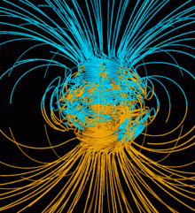
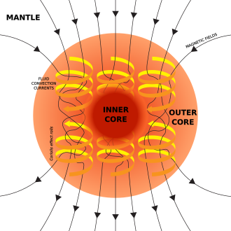
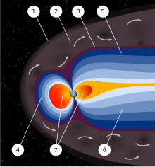
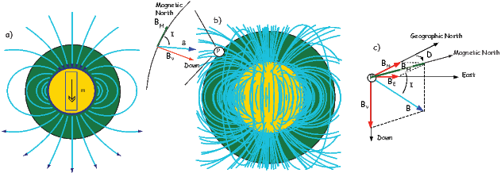
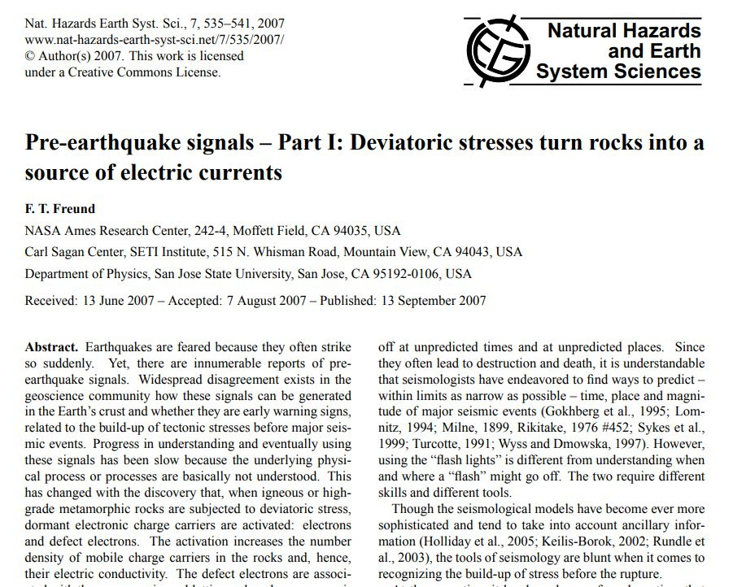
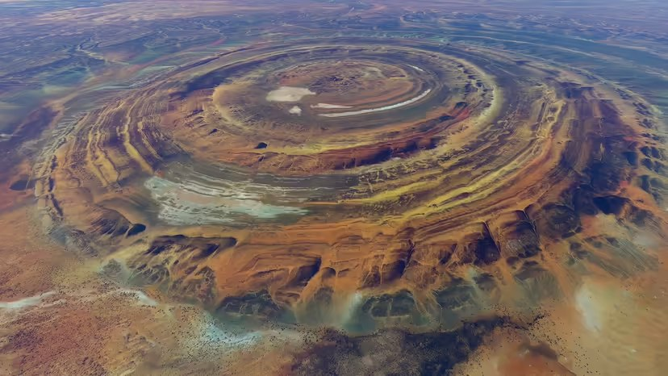
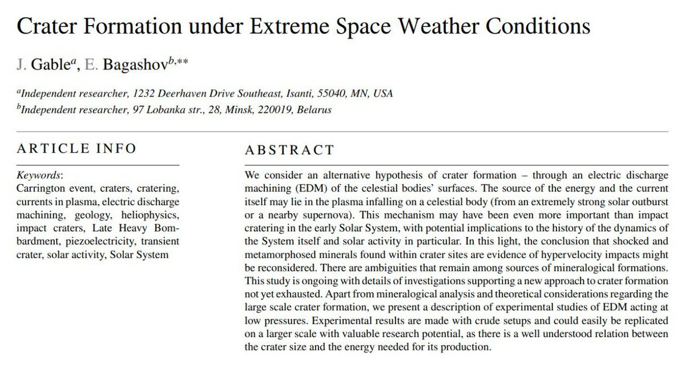
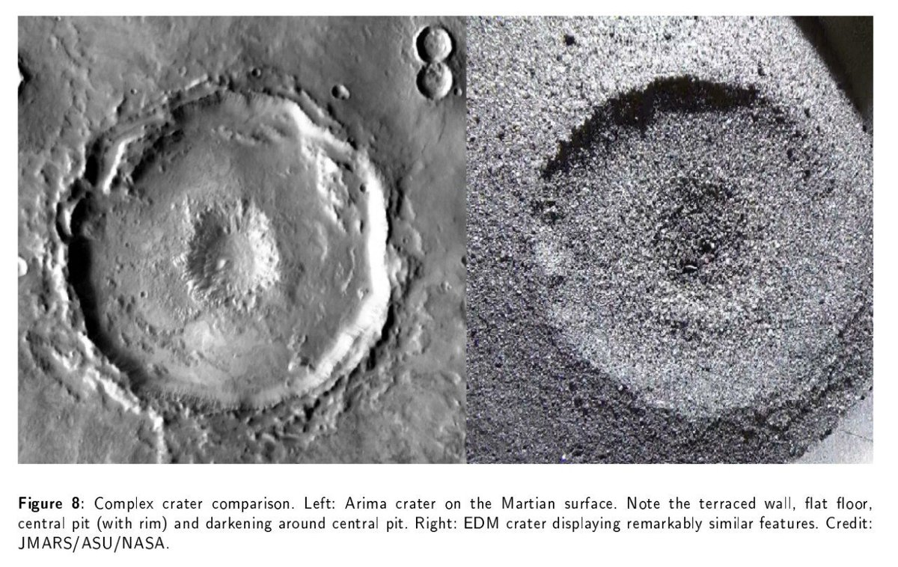
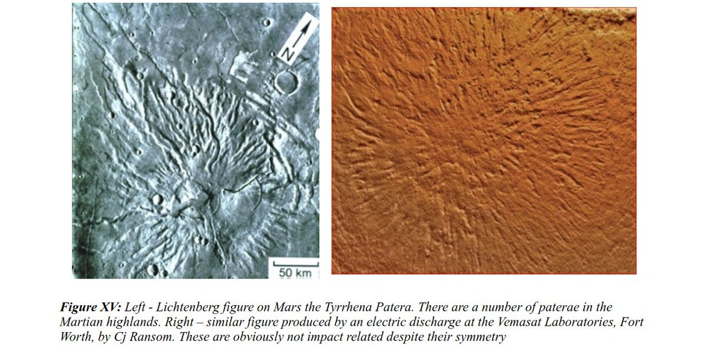
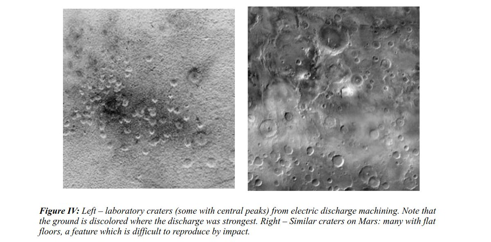

# Geomagnetism

## Geomagnetic Field

*"Earth's magnetic field, also known as the geomagnetic field, is the magnetic field that extends from Earth's interior out into space, where it interacts with the solar wind, a stream of charged particles emanating from the Sun. The magnetic field is generated by electric currents due to the motion of convection currents of a mixture of molten iron and nickel in Earth's outer core: these convection currents are caused by heat escaping from the core, a natural process called a geodynamo... A dynamo is thought to be the source of the Earth's magnetic field and the magnetic fields of Mercury and the Jovian planets."* [1,3]

*"Illustration of the dynamo mechanism that generates the Earth's magnetic field: convection currents of fluid metal in the Earth's outer core, driven by heat flow from the inner core, organized into rolls by the Coriolis force, generate circulating electric currents, which supports the magnetic field."* [3]

*"There are three requisites for a dynamo to operate:"*
- *"An electrically conductive fluid medium"*
- *"Kinetic energy provided by planetary rotation"*
- *"An internal energy source to drive convective motions within the fluid."*

### Dynamo Convection Currents [5]

Convection currents driving geodynamos are created through a combination of basic convection and the rotation of the Earth.

Upward Convection: Hot, buoyant fluid near the inner core boundary rises toward the outer core boundary.

Downward Convection: Cooler, denser fluid near the outer core boundary sinks back down toward the inner core boundary.

Near the equator, convection currents have a more horizontal component, while near the poles, the movement is more vertical due to the geometry of the spherical shell.

### Dynamo

*"A dynamo is an electrical generator that creates direct current using a commutator."* [4]

*"A dynamo is essentially a generator that produces direct current (DC) electricity. The basic working principle relies on Faraday's Law of Electromagnetic Induction, which states that a changing magnetic field can induce an electromotive force (EMF) in a conductor."* [5]

### Faraday's Law, Electromagnetic induction

*"Faraday's law of induction (or simply Faraday's law) is a law of electromagnetism predicting how a magnetic field will interact with an electric circuit to produce an electromotive force (emf). This phenomenon, known as electromagnetic induction, is the fundamental operating principle of transformers, inductors, and many types of electric motors, generators and solenoids."* [6]

## Magnetosphere [2]

*"In astronomy and planetary science, a magnetosphere is a region of space surrounding an astronomical object in which charged particles are affected by that object's magnetic field.[1][2] It is created by a celestial body with an active interior dynamo."*

*"In the space environment close to a planetary body with a dipole magnetic field such as Earth, the field lines resemble a simple magnetic dipole. Farther out, field lines can be significantly distorted by the flow of electrically conducting plasma, as emitted from the Sun (i.e., the solar wind) or a nearby star."*

*"An artist's rendering of the structure of a magnetosphere. 1) Bow shock. 2) Magnetosheath. 3) Magnetopause. 4) Magnetosphere. 5) Northern tail lobe. 6) Southern tail lobe. 7) Plasmasphere."*

## Paleomagnetic Calculations

Figure 2.1: a) Lines of flux produced by a geocentric axial dipole. b) Lines of flux of the geomagnetic field of 2005. At point P the horizontal component of the field BH, is directed toward the magnetic north. The vertical component BV is directed down and the field makes an angle I with the horizontal, known as the inclination. c) Components of the geomagnetic field vector B. The angle between the horizontal component (directed toward magnetic north and geographic north is the declination D.) [Modified from Ben-Yosef et al., 2008b.]

See section 2.1: https://earthref.org/MagIC/books/Tauxe/Essentials/#x1-236000C

Inclination in paleomagnetic data refers to the angle between the Earth's magnetic field and the horizontal plane at a specific location.

Measurement: Inclination is measured in degrees, ranging from -90° to +90°. A positive inclination indicates that the magnetic field was directed downward into the Earth (like at the magnetic north pole), while a negative inclination indicates an upward direction (like at the magnetic south pole).

## Piezoelectric Effect

The piezoelectric effect is a source of significant electric current generation in igneous and high-grade metamorphic rock masses during earthquakes. The current flows generated by granite monoliths such as found in the Rocky Mountains could easily run into billions of amps during major seismic activity. These current flows are a fitting explanation for "earthquake lights", and possibly other geological phenomena, such as Richat (which has a gabbro interior): "How much current can be delivered per unit rock volume? In the case of gabbro .. the steady-state outflow currents were found to increase to 50,000 A/km^3, plus an initial spike that can rise to 100,000 A/km^3."

1. https://nhess.copernicus.org/articles/7/535/2007/nhess-7-535-2007.pdf
2. https://en.wikipedia.org/wiki/Richat_Structure

## Telluric Currents and Earthquake Lights

See `img/japan-telluric.mp4`.

Video: Sendai, Fukushima (2022)
"Different theories have been proposed to explain the electrification of the Earth’s surface by earthquakes, but the actual process in the crust of the Earth remained unknown until Akihiro Takeuchi, at an underground mine in Japan, observed electrification on the floor of a gallery at the arrival of seismic waves. He discovered, that the arrival of S waves is synchronized with an electric pulse, that flows across the internal resistance of a voltmeter.

The electromagnetic emission in the atmosphere is produced if at any point of the Earth’s surface a limit of the electrical potential is reached at which a sudden electrical discharge through the atmosphere occurs."
- Electric Displacement by Earthquakes, Lira & Heraud (2012)

1. https://en.wikipedia.org/wiki/Telluric_current
2. https://cdn.intechopen.com/pdfs/26246/InTech-Electric_displacement_by_earthquakes.pdf

## Africa electrically charged rocks

https://www.jordanthrilla.com/post/is-vibranium-real-electrically-charged-rocks-found-in-congo-africa-could-change-the-world/

## GPT gives a very rough...

GPT gives a very rough estimate that the volume of the Richat gabbro region could be in excess of 6,000km^3, representing a potential peak current of 600 million amps. That much current could generate some impressive discharges. Earthshapers. [1] https://t.co/ipNFbisEFv

## Craters formed by electrical discharges...

Craters formed by electrical discharges in the laboratory are remarkably similar to those seen throughout the solar system. https://t.co/I4Ics2DwIb https://t.co/5G9FlNsSm7

## The Keystone Pattern
https://t.co/ys30hg3xaG

The Keystone Pattern https://t.co/ys30hg3xaG

## Citations

1. https://en.wikipedia.org/wiki/Earth%27s_magnetic_field
2. https://en.wikipedia.org/wiki/Magnetosphere
3. https://en.wikipedia.org/wiki/Dynamo_theory
4. https://en.wikipedia.org/wiki/Dynamo
5. ChatGPT
6. https://en.wikipedia.org/wiki/Faraday%27s_law_of_induction

# TODO

- dynamo = commutator
- Schumann resonances
