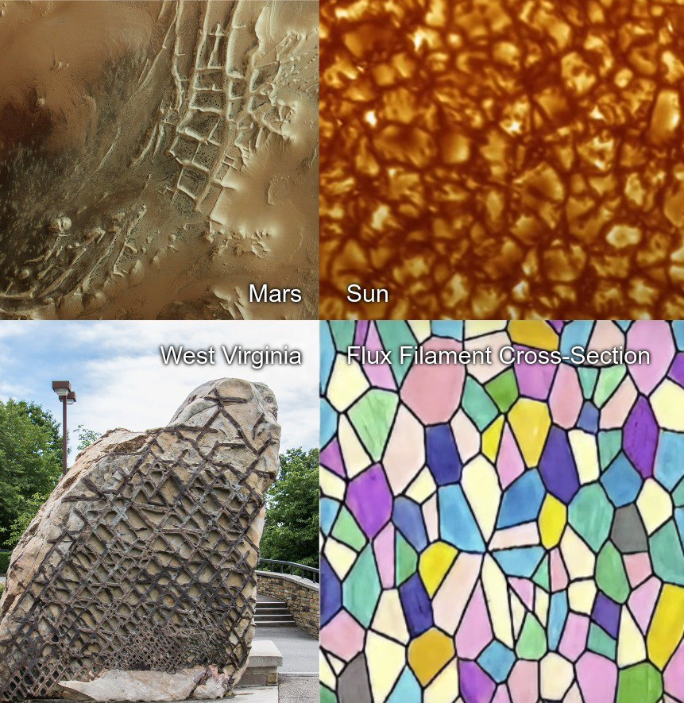
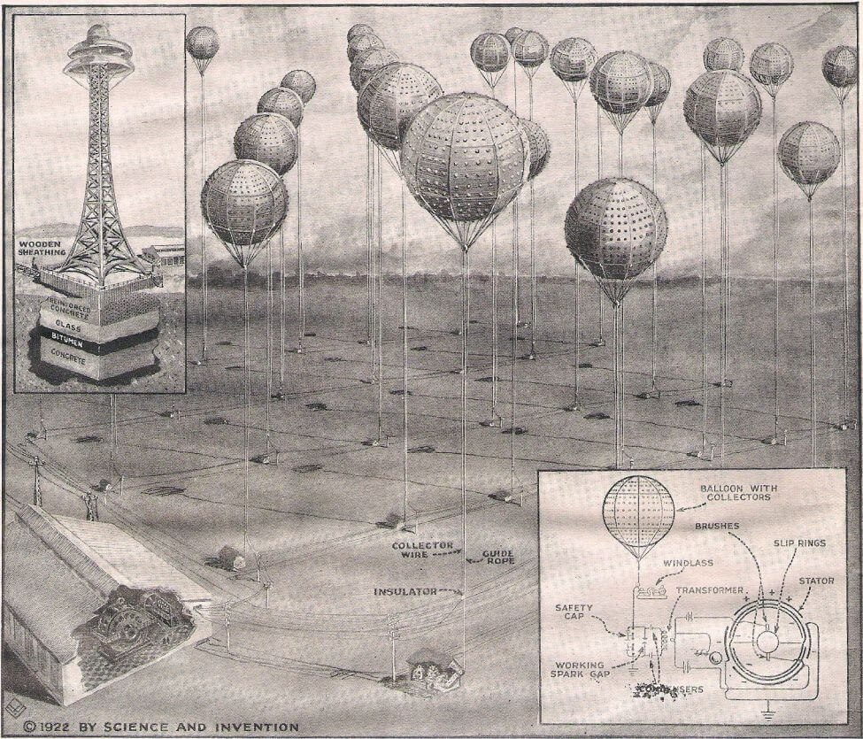
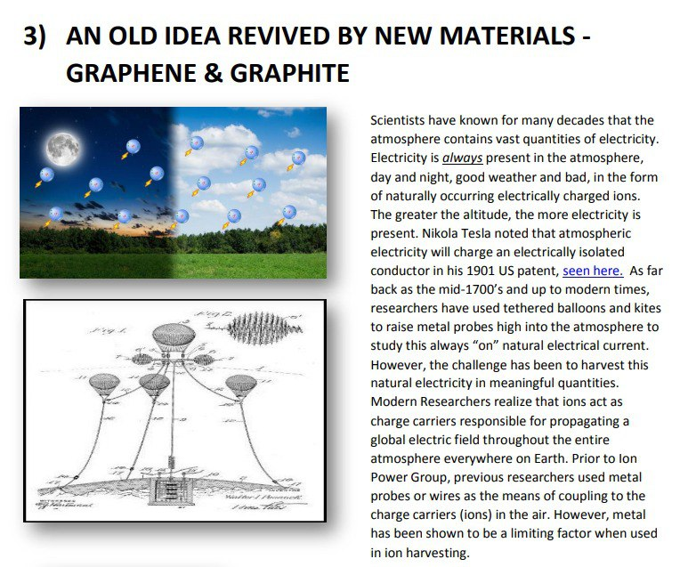

# Electric Universe Theory

## Electric Universe, Mega landscape electricity fractal

https://youtu.be/FTHINDwcLCg

## Nobulart excerpt

Bearing in mind that both the earth and atmosphere are always 'charged' - the only thing that changes is the relative difference in charge between the two, I'd venture that all of humanity doesn't produce enough electrical power to artificially spike voltages 10,000 times higher than the usual between earth and the atmosphere across such a vast area. 

To give an idea, a perfectly insulated conductor with one end grounded and the other elevated will (under ideal conditions) measure 100 volts per meter of elevation of the other end. That's 10,000 volts at 100m. This is the principle upon which Tesla's Wardenclyffe Tower was built. There is a LOT of energy right around us, untapped, all the time.

## German idea to harvest this energy

This technology was being investigated by quite a number of individuals before the Rockefeller oil cartel put them all to rest. This is an idea out of Germany circa. 1922
https://www.nuenergy.org/power-from-the-air-follow-up/

## Presentation on this (hard copy here)

https://ionpowergroup.com/wp-content/uploads/2016/08/Ion-Power-Group-Presentation-July-update.pdf

## Videos

https://youtu.be/6JA38XKOVpA

https://www.youtube.com/watch?v=2HBiX9BT9ME

Donald E. Scott: Indeed, Our Sun is Electric!
https://www.youtube.com/watch?v=t1LwYbPruyw

## Citations

1. [Craig Stone](https://nobulart.com)