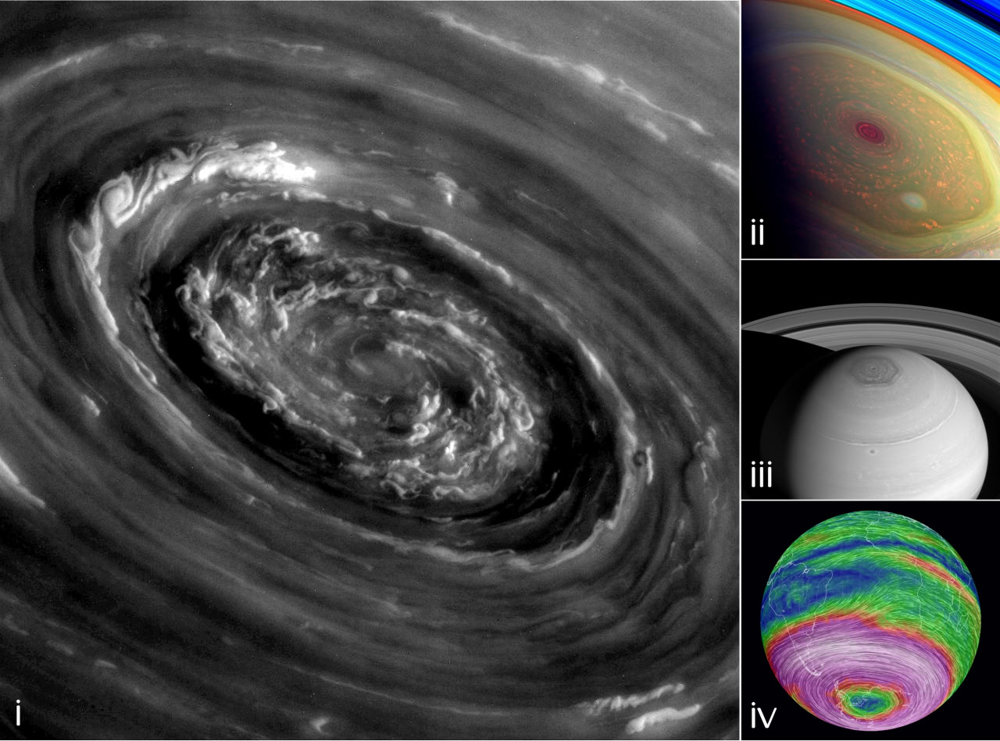
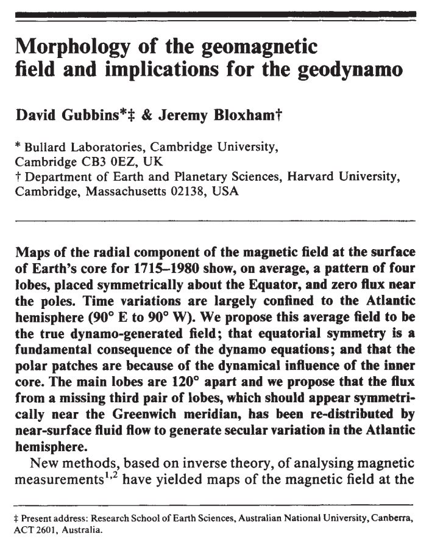
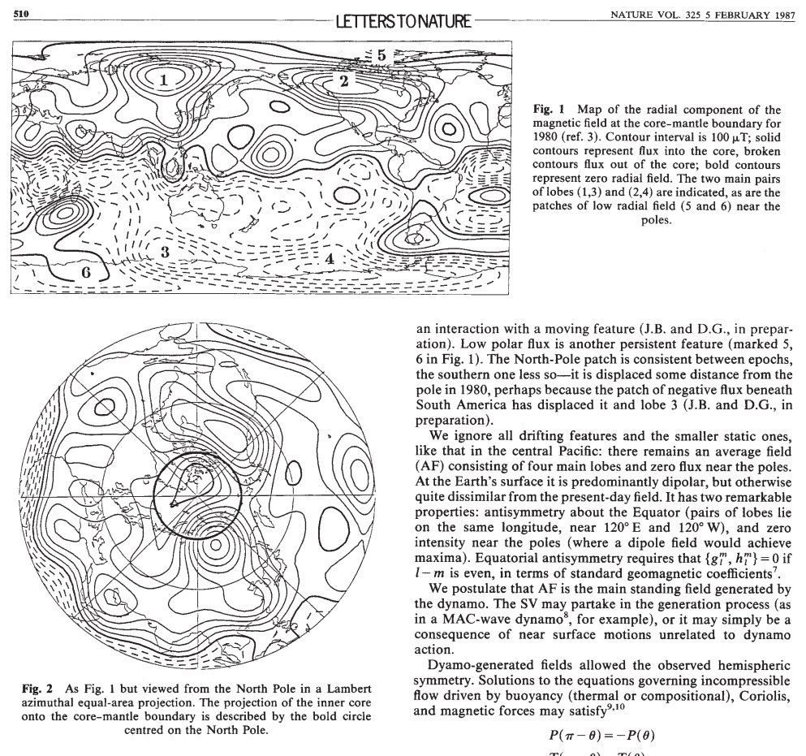
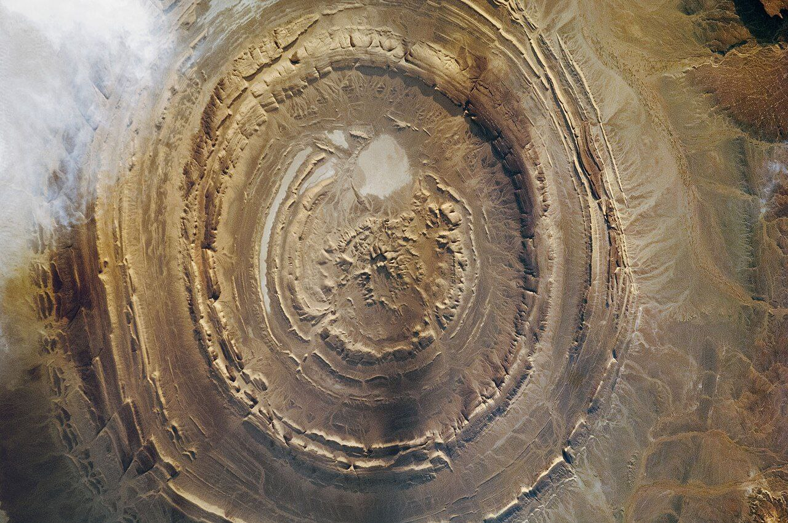

# Hexagon Geomagnetic Forces

Gubbins & Bloxham observed a persistent six-lobed component of the Earth's magnetic field spaced symmetrically around the equator (1987)[1]. Earth isn't the only planet: “Birkeland currents power Saturn’s hexagonal shaped polar magnetic vortex (i, ii and iii). Plasma double layers are visible, and are responsible for accelerating charged particles near the speed of light. Plasma Alfven waves are seen radiating at the intersecting corners of the hexagonal plasmoid structure, where the electrical charged filaments twist and pinch plasma together into magnetic flux tube ropes. The hexagon shaped radiation waves remain an unexplained mystery to gravity astronomers with outdated beliefs in cosmology.”[2] Earth and Saturn appear to be the only bodies in our system which express persistent hexagonal field components.[3]

1. https://sci-hub.ru/10.1038/325509a0
2. https://holographicgalaxy.blogspot.com/2014/10/saturns-polar-hexagonal-vortex-is.html
3. https://chatgpt.com/share/673f2956-2588-8005-aecc-73a631607793

(i) looks familiar...

