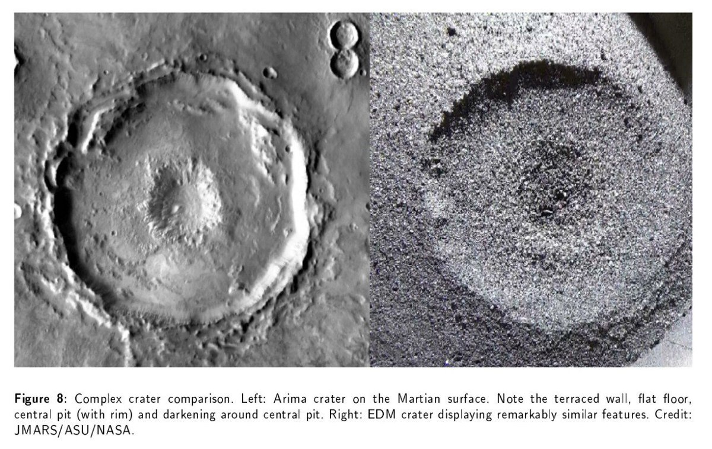

# Lightning, Geo-Lightning

## Piezoelectric Effect

The piezoelectric effect is a source of significant electric current generation in igneous and high-grade metamorphic rock masses during earthquakes. The current flows generated by granite monoliths such as found in the Rocky Mountains could easily run into billions of amps during major seismic activity. These current flows are a fitting explanation for "earthquake lights", and possibly other geological phenomena, such as Richat (which has a gabbro interior): "How much current can be delivered per unit rock volume? In the case of gabbro .. the steady-state outflow currents were found to increase to 50,000 A/km^3, plus an initial spike that can rise to 100,000 A/km^3."

1. https://nhess.copernicus.org/articles/7/535/2007/nhess-7-535-2007.pdf
2. https://en.wikipedia.org/wiki/Richat_Structure

## Some more examples from this...

Some more examples from this paper. https://t.co/8bz0LqCdMF

### Electric arc crater formation reproduced...

Electric arc crater formation reproduced in the laboratory. https://t.co/MYiRIWNTZU https://t.co/v2FTefjuIX

See img/1798634076943094052-hCEFdIxBF460J0LM.mp4.

See img/1798634076943094052-y3ZF10MwqtmR8gVf.mp4.

## Electrical phenomena are seemingly infinitely...

Electrical phenomena are seemingly infinitely scale-able, from the atomic level to the cosmic. Left: A rare lightning strike to a car off its wheels. Right: The Richat structure in the Sahara desert. https://t.co/u2iRgZADed

## Telluric Currents and Earthquake Lights

See `img/japan-telluric.mp4`.

Video: Sendai, Fukushima (2022)
"Different theories have been proposed to explain the electrification of the Earth’s surface by earthquakes, but the actual process in the crust of the Earth remained unknown until Akihiro Takeuchi, at an underground mine in Japan, observed electrification on the floor of a gallery at the arrival of seismic waves. He discovered, that the arrival of S waves is synchronized with an electric pulse, that flows across the internal resistance of a voltmeter.

The electromagnetic emission in the atmosphere is produced if at any point of the Earth’s surface a limit of the electrical potential is reached at which a sudden electrical discharge through the atmosphere occurs."
- Electric Displacement by Earthquakes, Lira & Heraud (2012)

1. https://en.wikipedia.org/wiki/Telluric_current
2. https://cdn.intechopen.com/pdfs/26246/InTech-Electric_displacement_by_earthquakes.pdf

## Transient Luminous Events
https://t.co/lRpKsuYRnF https://t.co/RvUhZppnXf

Transient Luminous Events https://t.co/lRpKsuYRnF https://t.co/RvUhZppnXf

## Craters formed by electrical discharges...

Craters formed by electrical discharges in the laboratory are remarkably similar to those seen throughout the solar system. https://t.co/I4Ics2DwIb https://t.co/5G9FlNsSm7

