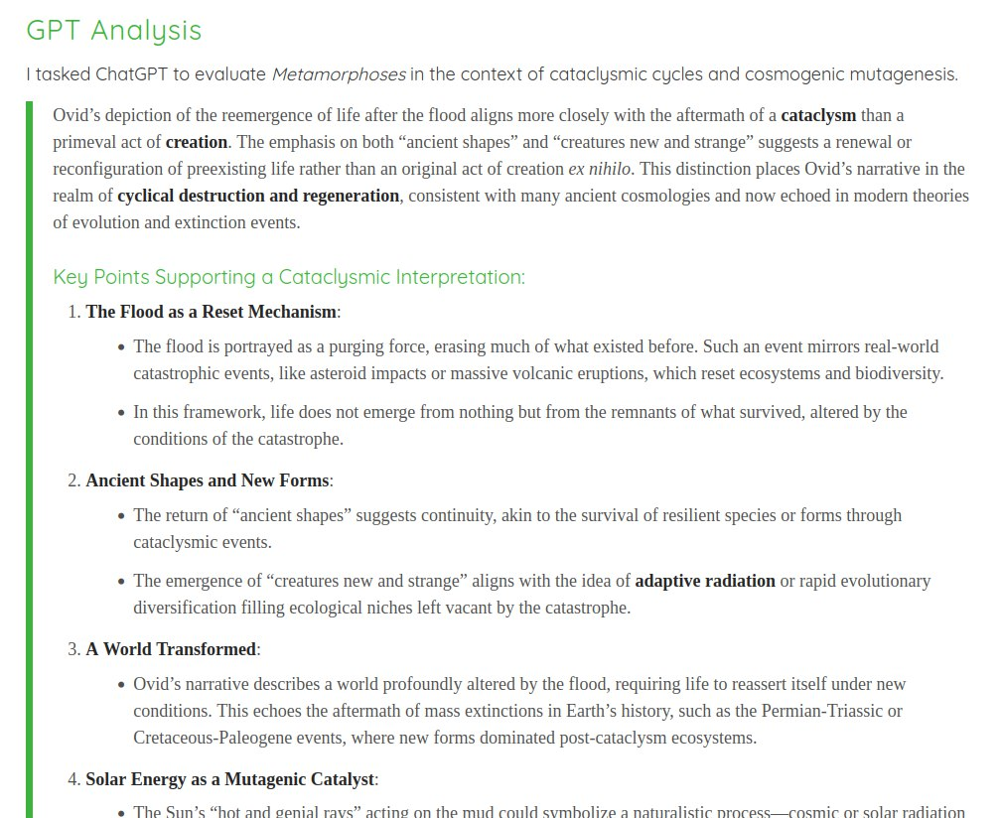

# Heliobiology [1]

Epidemics have been observed in historical records going back many millennia. Extrapolation from these records reveal that a portion of them were pandemics. Chizhevsky noted that localisation (ie. epidemics) appeared to be related to localised geomagnetic field anomalies which are observed (ie. the magnetic field may even be reversed in one location whilst maintaining 'normal' polarity in neighbouring regions). These anomalies open small holes in the magnetic field which allow larger doses of ionizing radiation in from above, this seeming to only affect people in a particular region at the time.

To use a representative metaphor - if we have 100 people and we place 50 of them near an unprotected reactor core for a few minutes - those 50 are all likely to develop symptoms of acute radiation sickness within hours of exposure, whilst the control group will remain in good health. Of the sick, their symptoms will be varied, but many will appear to have similar pathology. This is an extreme case for illustrative purposes, but I think you'll agree that the cause would likely be attributed to a viral or bacterial 'pathogen' by modern science if none were aware that they had been exposed to a high dose of radiation.

## 63 million death records across...

63 million death records across 34 years reveal a striking relationship between average lifespan and sunspot numbers at birth: those born in months with SSN≤90 live, on average, 8-10 years (around 11%-15%) longer than those born in months with an SSN&gt;90. https://t.co/6kub09JFf0 https://t.co/iRydvT3DUs

## Relation to human lifespan

A study of 63 million death records spanning 34 years revealed a clear relationship between average lifespan and sunspot numbers (SSN) at the time of birth. People born in months with sunspot numbers below 90 live, on average, 8-10 years (around 11%-15%) longer than those born in months with an SSN above 90.

"There is a statistically significant inverse relationship between exposure to solar energy at birth and average human lifespan. Solar energy by some mechanism alters the epigenome at birth, but the effect of higher solar energy becomes apparent after the age of natural selection."

https://www.sciencedirect.com/science/article/abs/pii/S1011134418305505

## ORDINAL NUMBERS OF YEARS OF SOLAR CYCLES (1960-2022) AND GROSS WORLD PRODUCT WITH A LAG OF 1 YEAR (1961-2023): EVIDENCE OF VERY STRONG CORRELATIONS

Hard copy here.

## Cataclysmic Evolution (https://nobulart.com/cataclysmic-evolution/)

“When, therefore, the earth, covered with mud from the recent flood, became heated up by the hot and genial rays of the sun, she brought forth innumerable forms of life, in part of ancient shapes, and – in part creatures new and strange.” – Ovid, Metamorphoses
https://nobulart.com/cataclysmic-evolution/

I was looking for a paper I shared a while back linking the step function of evolutionary phases to solar micronova events (Ben shared it)... but I can't find it.

Here is a closely related idea I came across in my search:

https://news.stanford.edu/stories/2024/07/revisiting-the-cambrian-explosion-s-spark

Found it!

https://www.youtube.com/watch?app=desktop&v=IQyvxqrAZVE

https://nobulart.com/cataclysmic-evolution/#gpt

## Citations

1. [Craig Stone](https://nobulart.com)