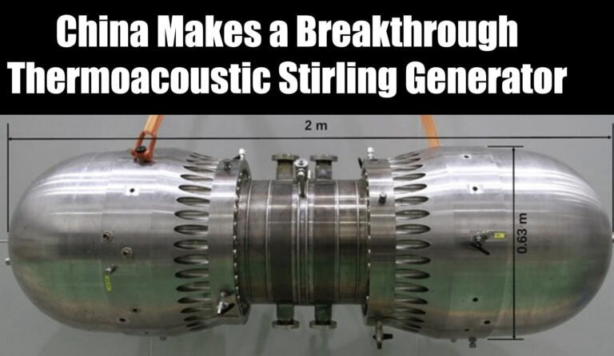

# Humanity

## Global Elevation &amp; Population Density...

Global Elevation &amp; Population Density source: NOAA:ETOPO1+JRC:GHSL https://t.co/du12NisDy6

## Khufu - Stirling Generator?

Evolution of the Stirling Engine. Ultrasonic waves are generated through the application of heat to a thermoacoustic material. The resonant wavefront drives a piston or vibrates a tellurically active material (possibly quartz) in a resonant chamber. The vibration generates electricity. This is similar to the principal behind the formation of "earthquake lights". With few or no moving parts, these run silently. Any heat source may be used with most designs. They are highly scalable, require little or no maintenance and will run reliably for decades. China's working design produces 102 kilowatts of power from a temperature gradient of 530 degrees Celsius [1]. NASA have been working on a couple of similar projects (at the patent tender stage).[2][3]

1. https://www.nextbigfuture.com/2023/11/breakthrough-thermoacoustic-stirling-generator-converts-to-energy-with-no-moving-parts.html
2. https://technology.nasa.gov/patent/LEW-TOPS-80
3. https://technology.nasa.gov/patent/LEW-TOPS-106
4. https://t.me/nobulart/2497