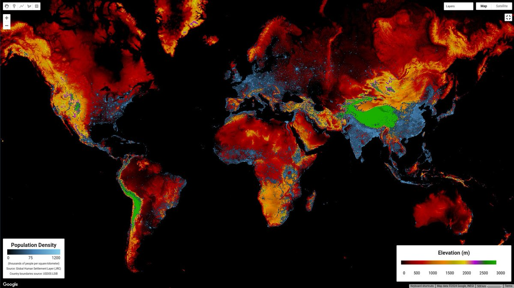
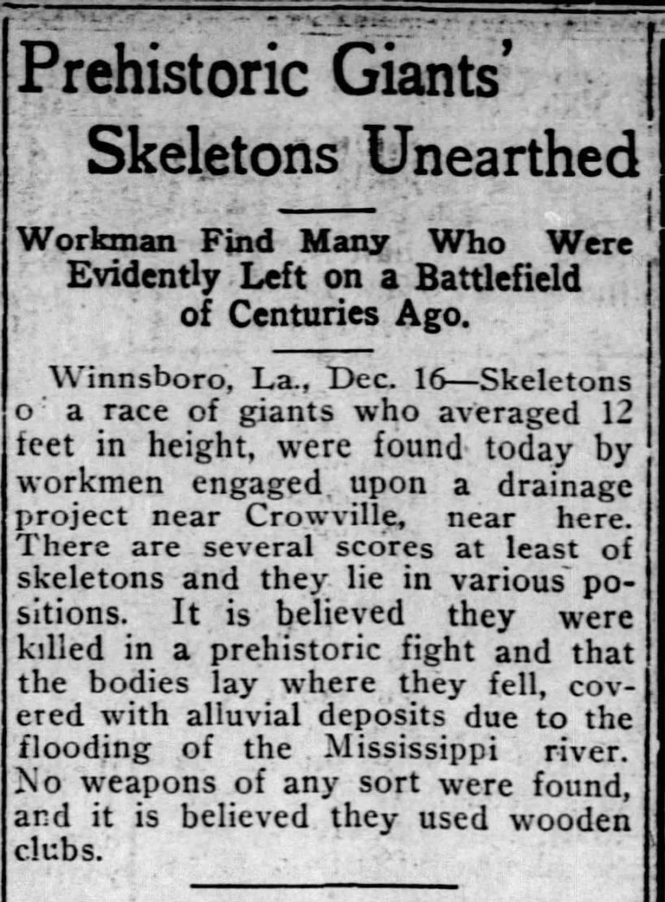
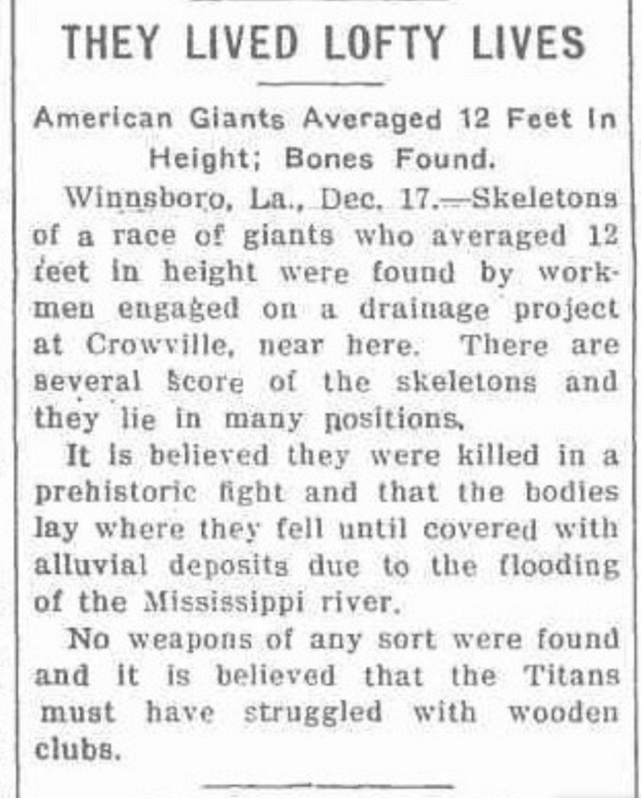
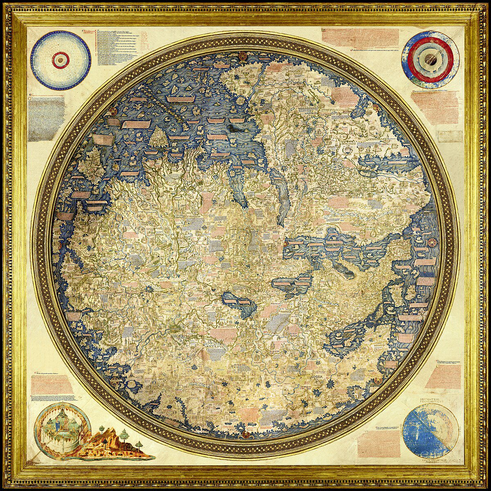

# Humanity

## Global Elevation &amp; Population Density...

Global Elevation &amp; Population Density source: NOAA:ETOPO1+JRC:GHSL https://t.co/du12NisDy6

## 12 Foot Giants

12 Foot Giants found during a project know as The Little River Drainage District. 

Clippings from The Hutchinson Gazette published in Hutchinson, Kansas on 12/17/1913 and Monroe County Mail, 18th December 1913.
X
https://x.com/HeistingHistory/status/1851275184793096508?t=xP1-AO1GEhJRAwxhgbEgjw&s=19

## Fra Mauro Map

FRom about 600 years ago. Shows a lot of detail.

