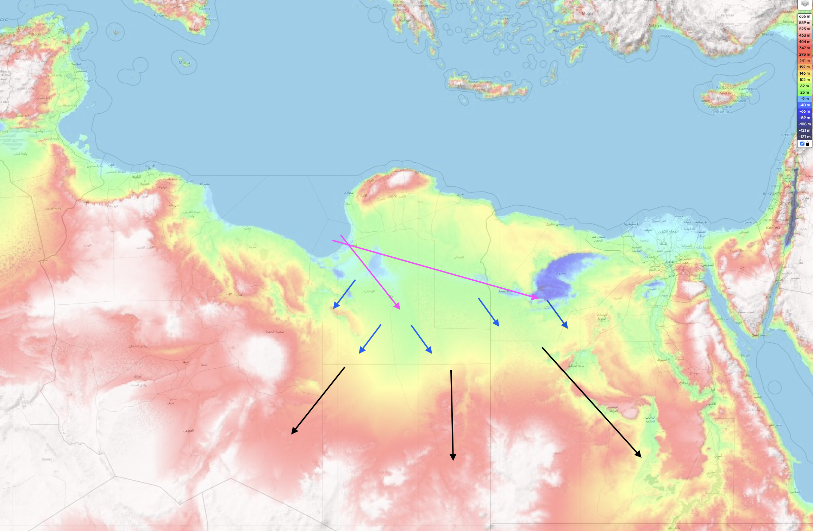

# Oceanic Displacement

This document is for predicting the height and extent of temporary oceanic displacement during the rotation. These factors will be key for evaluating safe locations.

In short, it is a very complex, large-scale fluid dynamics problem. Every location will be unique and must be evaluated on a case-by-case basis.

## A framework for modeling ocean displacement

For me, currently, the key concepts are:
1. *Concave terrain chokepoints*, both underwater and above-ground, where water will get trapped as it flows in, making it tend to flow *over* rather than *around*.
2. *Topography*, as water will be redirected to the lowest elevation areas after an initial upwards reaction
3. *Water surge volume*, which when combined with surface area covered by the surge, determines *water surge height*
4. *Water surge speed*, which when combined with *water surge height and volume*, determines how high the water surge will reach when it encounters obstacles

Evidence of past inundation will be extremely helpful in fine-tuning the analysis.

## Part 1: Concave terrain chokepoints

Chokepoints are areas with concave terrain in which water will get trapped if it flows into, forcing the water to go *around* or *over*. For example, most bays and basins form de facto chokepoints.

In contrast, terrain that forms a convex shape has more of a likelihood to streamline through the water, letting the water move around. However, this comes after an initial upward reaction of the water. If you have ever stood in the tides of the ocean as they flow out to sea, you'll know that when flowing water encounters obstacles, even if it moves around, it will first react in an upward fashion, with strength proportional to the speed of the water, without exception.

The earliest chokepoints are all at or under the water. These underwater and water-level chokepoints will be the first to drive the water above sea level, from which the water will continue to move to other chokepoints. For example, note these massive underwater chokepoints to the east of Japan:

Precisely mapping the inundation will be a question of determining the cumulative progression of water from chokepoint(s) to chokepoint(s), and making judicious use of contour/elevation maps.

## Part 2: Topography

Topography will play a major rule in how the water moves as after an initial upwards reaction, water will be redirected to the lowest elevation areas, and only rise higher if forced to.

The initial water reaction height will depend on the slope of the terrain and speed of the water. Together, these factors will determine the total height that water travels up the slope until gravity forces it back down. When you consider that water could be traveling at supersonic speeds, this will definitely be a factor to consider.

After the initial reaction, water will be redirected by gravity to lower elevation areas, expanding radially when it can, since it is a fluid.

As an example, see this diagram of predicted water flow starting from one coastal chokepoint in north Africa. It might not be gradual since north Africa rotates at the highest speed:

## Part 3: Total volume and height of water surge

Generally, the total volume of water surge depends on the total amount of ocean that the location rotates through during S1 -> S2. From there, the water surge passes through a cumulative series of chokepoints in a progressive manner. Since water spreads *radially*, the water that moves through any given chokepoint will often spread to multiple subsequent chokepoints, splitting up the water flow.

Determining the exact inundation at any given chokepoint depends on the total volumetric input and output rate of water flows into the chokepoint. The water will rise until the cross sectional volume of the chokepoint pass-through channel which allows water to leave the chokepoint is sufficient to accomodate the water inflow.

The speed is also key here, because of gravity. Without sufficient *water inflow speed*, water will not be able to pass over obstacles.

The height of the water flow is directly proportional to the total volume and inversely proportional to the total surface area of the water surge.

## Part 4: Speed of water surge

This is the simplest part; the speed of water surge will be directly proportional to the speed of rotation. See `FOUNDATION-THEORY/s1-to-s2/rotation-speed`.

## Best Examples of Location Oceanic Displacement Analysis

`LOCATION-ANALYSIS` is where all the location-specific flood analysis is located. Some good examples are:
- East Asia, chokepoints
- Turkey (Urgup Cones), 1025m above sea level
- North Africa, 1200m height 600m above sea level

## Factors that are difficult to predict

The exact amount of time it takes for the S1 -> S2 rotation will affect the speed and result of oceanic displacement.

## Citations

Authors: [Sovrynn](https://sovrynn.github.io)
