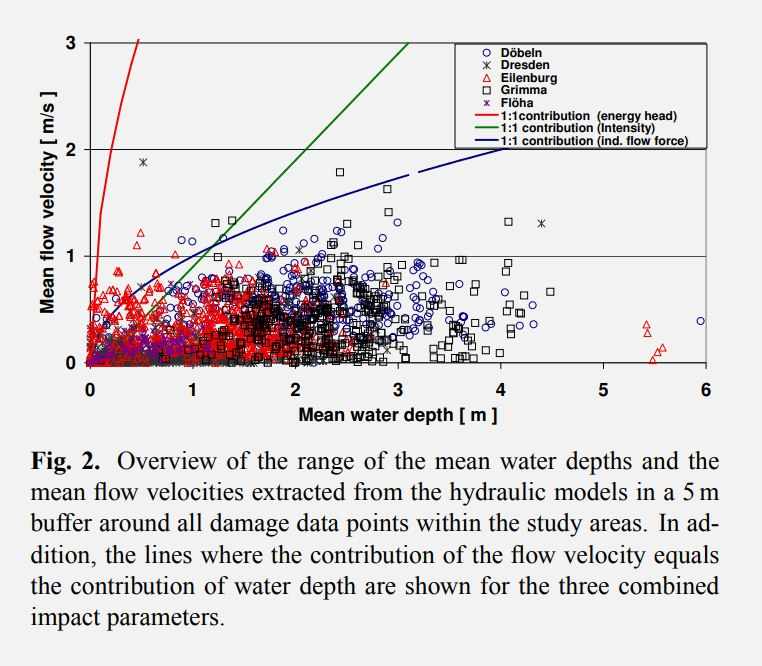

# Oceanic Displacement

This document is for predicting the height and extent of temporary oceanic displacement during the rotation. In short, it is a very complex, large-scale fluid dynamics problem. Every location will be unique and must be evaluated on a case-by-case basis.

## A framework for modeling ocean displacement fluid dynamics

Fluid dynamics can be divided into two categories - obstacles and fluid. Based on this, I define the following concepts:

1. Obstacles consist of *topographic structures* that water must traverse. The most notable of these are *concave terrain chokepoints*, both underwater and above-ground, where water will get trapped as it flows in, making it tend to flow *over* rather than *around*, causing a *water surge*, where *water surge* is defined as the temporary water in excess of sea level.
2. Fluid parameters consist of:
	1. *Water flow speed*, which when combined with the *topography*, determines the ratio of water that is forced to go *over* rather than *around*
	2. *Water flow volume*, which when combined with the above factors, determines the *water surge volume and height*

Evidence of past inundation will be extremely helpful in fine-tuning the analysis.

## Part 1: Obstacles

We can evaluate topographic structures using several binary categories:
1. Concave chokepoints vs concave streamlines
2. Gradual vs steep slopes

### 1.1 Chokepoints vs streamlines

Concave chokepoints are areas in which water will get trapped if it flows into, and potentially force the water to rise until it can go *over*. For example, most bays and basins form de facto chokepoints.

In contrast, terrain that forms a convex shape has more of a likelihood to streamline through the water, letting the water move around to other areas. But note that terrain doesn't need to be concave to force the water to go over - if water is traveling fast enough, it will be forced to go over even flat or convex obstacles. During a fast ECDO rotation, water would get displaced over many flat or even streamlined structures.

The earliest chokepoints are all at sea level, or underwater. These underwater and water-level chokepoints will be the first to drive the water above sea level, from which the water will continue to move to other chokepoints. For example, note these maps showing underwater and sea-level chokepoint flows in Asia and a small bay in North Africa:

### 1.2 Gradual vs steep slopes

The spectrum between gradual and steep slopes is deeply interleaved with the concept of chokepoints and streamlines. All structures, whether chokepoint or streamline, will have a certain *shape* and *slope*, which when combined with the speed of rotation, will determine the exact ratio between water flowing *over* rather than *around* the structure.

## Part 2: Fluid parameters

Fluid parameters consist of *water speed* and *water volume*.

### 2.1 Speed

The speed of the water flow will be determined by the rotation path:

Speed is a significant variable because it determines the ratio of water that will go *over* rather than *around* obstacles, whether chokepoint or streamline. Without sufficient speed, due to its fluid nature, water will simply move around obstacles.

### 2.2 Volume

The volume of the water flow is determined by the total quantity of ocean in the rotation path.

For locations inland, it's more complicated. The volume must be ascertained through determining the cumulative progression of water flow through various areas that lead inland. Approximating it manually will require incorporating all the above factors and making judicious use of contour/elevation maps.

## Other water flow factors

Once you know the amount of water that will be forced to flow over a chokepoint, you can predict the height by raising the water level until the cross-sectional area of the water leaving the chokepoint accomodates all the input flow.

Water flow will also fall in height as it spreads over a greater surface.

## Notes

### Best Examples of Location Oceanic Displacement Analysis

`LOCATION-ANALYSIS` is where all the location-specific flood analysis is located. Some good examples are:
- North Africa, desert ripple analysis
- France, ripple analysis
- Gulf of California (`north-america/great-basin`) chokepoint analysis
- Turkey (Urgup Cones), Black Sea water surge level (1025 m)

### Factors that are difficult to predict

The exact amount of time it takes for the S1 -> S2 rotation will significantly affect the speed and result of oceanic displacement.

## Standard flood modelling maximum velocities

Maximum velocities in standard flood modelling are considered to be no more than 0.5-1 m/s (some outliers near 2m/s). How on earth could 60m/s be achieved unless that earth was moving relative to the water inertia?

https://nhess.copernicus.org/articles/9/1679/2009/nhess-9-1679-2009.pdf

Even the low end of the megaflood flow models are "orders of magnitude" greater than anything we observe in dam failures and the largest rivers.

https://www.sciencedirect.com/science/article/abs/pii/S0012825219305641

Here's a comparable figure. 35 m/s.

https://physics.stackexchange.com/questions/730879/what-is-the-fastest-speed-that-water-burst-from-a-dam-can-travel

# TODO

Tsunami flood sim: https://m.youtube.com/watch?v=aHljDIDf6js&pp=ygUXb2NlYW4gdHN1bmFtaSBmbHVpZCBzaW0%3D