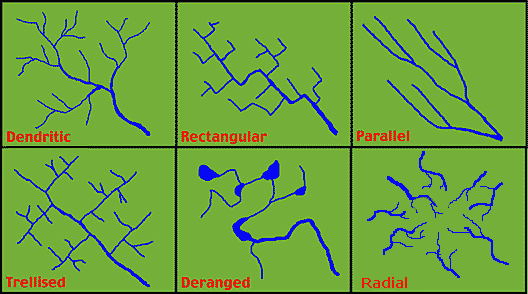

# Water Flow Traces

What kind of traces does water flow leave?

## Overview

- ripples
- erosion
- erratic stones
- sediment deposits
- drainage patterns

### Ripples

Giant current ripples: https://en.wikipedia.org/wiki/Giant_current_ripples

*"Aeolian dunes tend to form extremely long parallel formations in large deserts. This occurs with water flows, but only typically where they are restricted through bottlenecks and the flow accelerates - these form parallel to the flow, not transverse. The transverse current ripples we're more used to seeing always exhibit some degree of disturbance in the pattern. Never long parallel bands."* [3]

## Erosion

Water flow leaves erosion. See `EVIDENCE/cataclysm-remnants/erosion`.

## Erratic Stones

Large stones in strange places. See `EVIDENCE/cataclysm-remnants/large-rocks`.

What may be of greatest importance is rocks that seem to have come from other locations.

## Sediment Deposits

Alluval fans (fan-shaped sediment deposits).

## Drainage Patterns

See `hard-copies/Drainage-Patterns.pdf`. [2]

Drainage patterns [1]:

## Citations

1. https://laulima.hawaii.edu/access/content/group/dbd544e4-dcdd-4631-b8ad-3304985e1be2/book/chapter11/patterns.htm
2. https://www.wvca.us/envirothon/pdf/Drainage%20Patterns.pdf
3. [Craig Stone](https://nobulart.com)