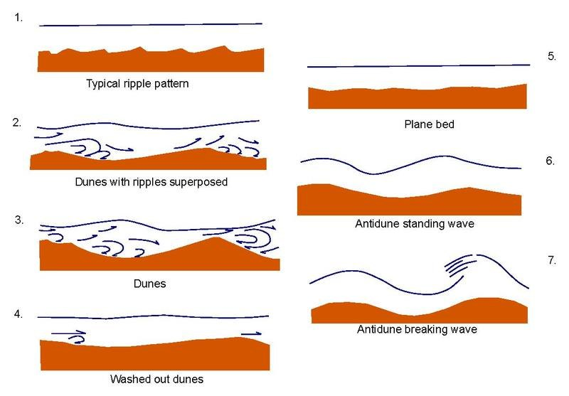

# Water Flow Traces

What kind of traces does water flow leave?

## Overview

- ripples
- drainage patterns
- erosion
- sediment deposits

### Ripples

## Drainage Patterns

See `hard-copies/Drainage-Patterns.pdf`. [2]

Drainage patterns [1]:

## Erosion

An absolute banger: https://www.istockphoto.com/photos/wind-erosion
- Bolnuevo, Spain
- slot canyons
- wave rock west virginia
- arches national park

I've put a bunch of photos into `img/`.

## Citations

1. https://laulima.hawaii.edu/access/content/group/dbd544e4-dcdd-4631-b8ad-3304985e1be2/book/chapter11/patterns.htm
2. https://www.wvca.us/envirothon/pdf/Drainage%20Patterns.pdf