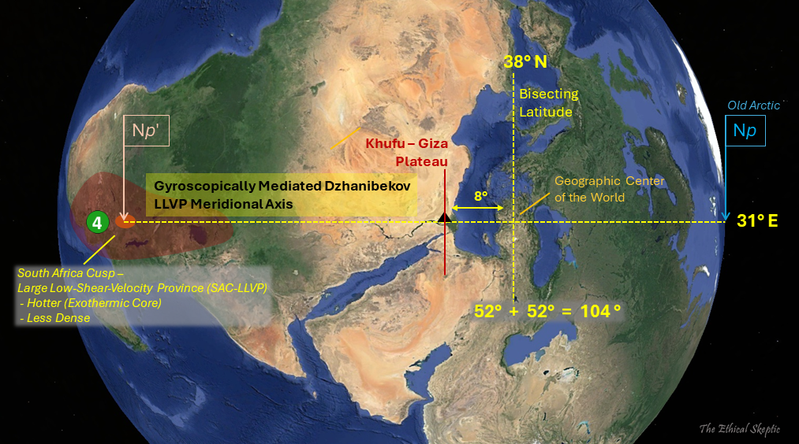

# ECDO S1 to S2 Rotation

This folder is for analyzing aspects specific to the S1 to S2 rotation.

## Contents

- `duration`: Information relating to the duration of the S1 to S2 rotation.
- `rotation-speed`: Formula for calculating the speed of rotation of a point during S1 to S2.

# Basic Description of Rotation

## Prerequisite Knowledge - axial tilt and north poles

To start off we will cover some basic knowledge regarding the Earth's rotation.

### Axial Tilt

Axial tilt is the angle between an object's rotational axis (spinning) and its orbital axis (orbit), which is the line perpendicular to its orbital plane, which is the plane along which, for Earth, it rotates around the Sun. The Earth's axial tilt is about 23.4 degrees. depicted by the red line in the below gif which does not point straight upwards. However, we don't need to concern ourselves with this number just yet. The rest of the explanation will all be done whilst factoring out the axial tilt.

### North Poles

Next I'll cover the North Poles. There are 3:
- The geographic north pole is the northern Earth surface point intersecting with Earth's axis of rotation. It's where lines of longitude meet at the top of the Earth.
- The north magnetic pole is the point on the north surface of the Earth where the planet's magnetic field points directly downward. Presumably, this is found through measurement
- Finally, the geomagnetic north pole, which would be the north pole in an approximate dipole model of the Earth's magnetic field

Currently, none of the 3 are the exact same point.

The one I will reference in this page is the geographic north pole.

## How does the Earth rotate during S1 -> S2?

So, during S1, the Earth is rotating along its rotational axis:

The rotation during S1 -> S2 can be thought of as occuring independently of this rotation. During S1 -> S2, a new Earth surface point in South Africa is brought to the geographic North pole, which looks like this, cross-sectionally:

The exact dimensions are a 104 degree rotation north along the 31 E meridian.

As the South Africa LLVP rotates to the geographic north pole, the Earth continues to spin around its rotational axis, and thus the South Africa LLVP will follow an arcing path like this:

Then, the new poles would be:
- New north pole: (-14, 31), South Africa
- New south pole: (14, -149), Pacific Ocean

## Western and eastern pivot points

These are the two points on the Earth's surface which don't have their rotation affected during S1 -> S2 (they continue to rotate along the normal 24-hour Earth rotational path). They are both on the equator, and lie on a single line that also goes through the center of the Earth.

The coordinates of these points in lat/long degree format are:
- Western pivot, Venezuela: (0.0, -59.0)
- Eastern pivot, Indonesia: (0.0, 121.0)

During S1 -> S2, Earth rotates counterclockwise around the western pivot (looking down onto Earth) and clockwise around the eastern pivot. The arrow around the western pivot here shows how the Earth will rotate, while the long yellow arrows at the extremities show the direction of water movement.

Here's the eastern pivot:

Putting it all together, the paths of rotation will look like this (Khafre pyramid travels from the red dot, past the north pole to the blue dot):

## S2 Equator Points

The equator in S2 runs through the two pivots. It also runs through the points:
- (83 N, 31) on 31 meridian
- (83 S, -149) on 149 meridian west

## Citations

- https://en.wikipedia.org/wiki/Axial_tilt
- https://en.wikipedia.org/wiki/North_magnetic_pole
- https://theethicalskeptic.com/2024/05/12/exothermic-core-mantle-decoupling-dzhanibekov-oscillation-ecdo-theory/
