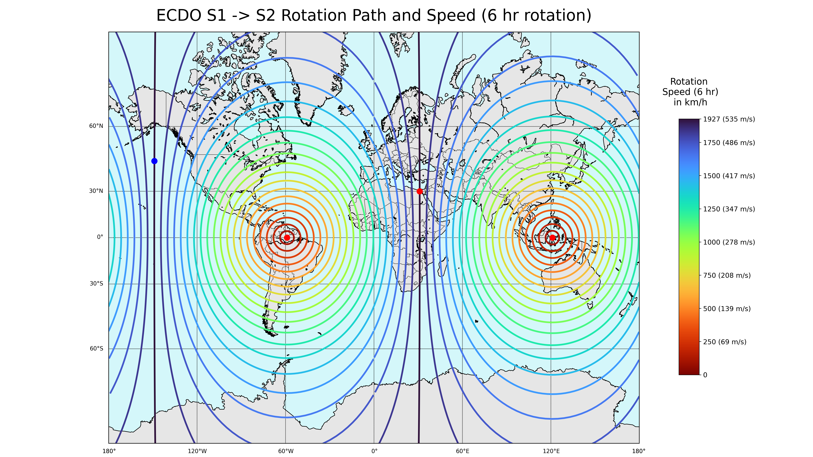

# Rotation Speed

The purpose of this document is to help calculate what speed the rotation will be, at any point on the surface of the Earth, during S1 -> S2.

Average rotation speeds during a 6 hour rotation are clearly visible in this diagram:

It can be difficult to imagine hourly speeds. Just use m/s instead and you'll get a better idea - 1200 km/h becomes 333m per second. Almost a track lap per second. This [Mach 1 flight sim](https://youtube.com/shorts/BiA87M8UmTM?si=_scmestjKtV22TJ0) (approximately 1200 km/h) helps visualize how fast the water would move at that speed.

What follows is the methodology used to calculate the average rotation speeds.

## Calculating rotational speed - trigonometry

Calculating the speed of rotation depends on how far away said point is from the pivots. The closer the point is to either of the pivots, the less rotational speed it will endure, and the farther away from the pivots, the greater.

We can use basic trigonometry and a simplifying assumption (that Earth is a sphere) to calculate rotational speed.

If:
- theta is the angle between a point and the closest pivot
- r_earth is the radius of the Earth (~6371 km)
- t is the number of hours it takes to go from S1 -> S2

Then:
- Radius of rotation of the point: `r = r_earth * sin(theta)`
- Average rotational speed = `rotational circumference * (104/360) / t` = `2 * pi * r * (104/360) / t`

The resulting formula is: `11564 * sin(theta) / t km/h`.

## Alternate trig formula if you only know the surface distance to the pivot

If you only know the surface distance (km) to the pivot, we can just calculate the angle using the circumference of Earth:
- Angle = `distance / earth_circumference * 360` = `distance / 111.2` degrees

Plugging it into the original formula, you would get: `11564 * sin(distance / 111.2) / t km/h`, using km and hours.

## Rotation speed examples - Singapore, Tokyo, Dubai

Using our formula, we can calculate the predicted average rotational speed at each city rotating around the eastern Indonesia pivot, assuming a 6 hour rotation:
- Singapore: 2808 km from pivot, ~822 km/h
- Tokyo: 4430 km from pivot, ~1235 km/h
- Dubai: 7585 km from pivot, ~1790 km/h
