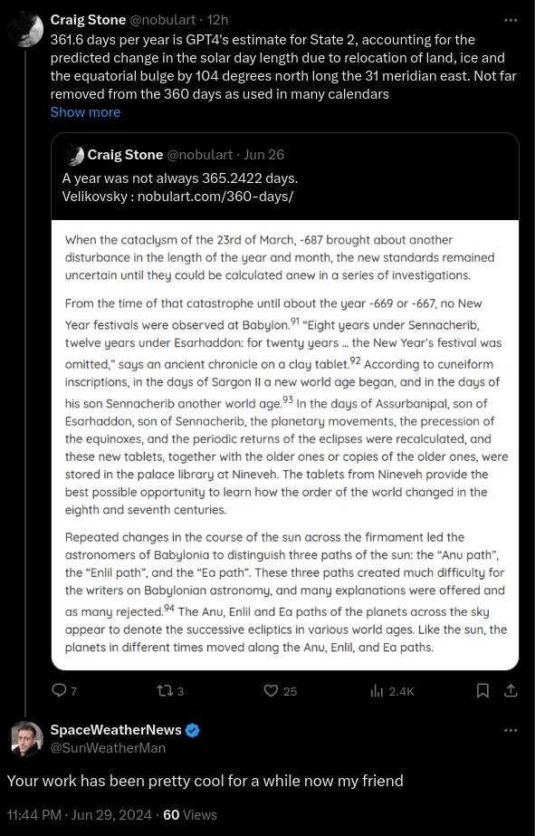

# S2

This folder is for understanding S2, which is the state of the Earth after the first ECDO rotation.

The key factor here IMO, aside from the obvious issue of figuring out S2's orientation, is deducing the length of S2 through evidence and theory.

## Contents

- `coastline-changes`: Predicting coastline changes in S2.

# Basics of S2

## Duration

The evidence for potential S2 events seems to point to *shorter* rather than *longer* extent - anywhere from a few decades to few centuries.

The Great Gun-Yu flood of China, around 1900 BC, was said to have lasted 22 years. See `EVIDENCE/cataclysm-chronology/asia/china`.

Dansgaard-Oeschger events are reported to have consisted of rapid warming periods that lasted a "matter of decades".

Climate events of 6200 and 2200 BC estimated to have lasted anywhere from 1-4 centuries.

On the ostrich egg (`EVIDENCE/civilization-remnants/important-artifacts`) there's indication of a special 200-year phase.

The lack of precedent for ice buildup on the S2 poles (South Africa) may point to an S2 that is shorter than S1 - not long enough for significant ice to accumulate, at least to the extent that it exists on the poles right now.

The duration between Exodus and Joshua is about 40 years.

### Speculative

"Moreover, during a short Khafre-styled reversal of say 10 to 50 bitter cold, dark, and wet years, we might not be able to detect such a Dzhanibekov rotation at all, even in ice cores." [2]

"I don't think that S2 is more than 20-30 years [due to] total apparent karst erosion/number of inundations." [1]

## Weather

The 2200 BC and 6200 BC drought events seem to propose temporary periods of *dry* and *cold* weather... Is this what we may see during S2? However, these studies seem to be localized to Africa and Middle East, which rotate to the north pole, so this may be a slightly biased prediction. The Arctic will likely see *warming* and *humidification*, to the extent allowed within the scope of the weaker magnetic field.

The disruption of existing ocean circulation currents and monsoon patterns will also create localized variation.

There is also dust to consider from extreme, global, and likely prolonged volcanic activity.

## New Geographic Pole Locations

New north pole:
- Present day location: South-Africa
- Lat/long: (-14. 31)
- Below the equator

New south pole:
- Present day location: Pacific Ocean
- Lat/long: (14, -149)
- Above the equator

## Volcanic ash

As the inner layers of the Earth, including the upper mantle which lies beneath the crust, deforms immediately to accomodate the new equatorial bulge following the rotation, we will likely see extreme volcanic activity all around the world. This would result in incredible amounts of ash (`FOUNDATION-THEORY/volcanoes`) being deposited into the atmosphere. It's not clear how long this ash would remain in the air, but the ash from the St. Helens eruption spread around the globe in two weeks, although it eventually settled down soon after.

Velikovsky mentions a twenty-five year gloom from American sources, and a 9-month darkness after Ogyges.

The fact that Mesoamerican myths of 2000 BC indicate that the Sun rose from the east after a long period of darkness (S2) while other periods experienced light and burning during S2 (China, Mesopotamia) make me think that volcanic ash induced clouds will be localized rather than global - the concept of the entire Earth being covered in a cloud would then be incorrect.

## Solar burning

"Wildfire is also recorded as blowing the great rivers out of their beds, as the oral histories of the Indians of California and the traditions in the Near East around the Euphrates record. The Aborigines in southern Australia gave an account of the horrible heat descending from a red-hot sky. The heat was so extreme that people could not endure it, and the men killed their children and wives, and finally themselves (Walk, 1931, p. 76)." - Tollmann

I think that there will be a period in which it is unbearable, but then a quick shift back to elevated, but survivable, conditions. You have a city, Kanesh that was burned, but then rehabitated for a *short while*, and then destroyed again. So perhaps right in the flip and the days/months surrounding it, it'll be unbearable, but then it'll be alright again.

The fact that we don't see burned remains makes me think it's gradual enough where people can flee somewhere rather than getting caught in it.

## Length of year

## The 50-60 years spent in...

The 50-60 years spent in State 2 may be where the additional 5 days per year observed by Velikovsky originated. If S2 has a wider distribution of mass than S1, then this would infer a possibly significant commensurate reduction in angular velocity in S2. https://t.co/oE4E5nRK0f

## 361.6 days per year is...

361.6 days per year is GPT4's estimate for State 2, accounting for the predicted change in the solar day length due to relocation of land, ice and the equatorial bulge by 104 degrees north long the 31 meridian east. Not far removed from the 360 days as used in many calendars… https://t.co/jyeUN9FgyK

## Could it be that the...

Could it be that the melting of the previous polar ice caps is what triggers the return to state 1? That ice is a mighty large flywheel. How long might this take? 50 years?

## Citations

1. [Craig Stone](https://nobulart.com)
2. https://theethicalskeptic.com/2024/05/12/exothermic-core-mantle-decoupling-dzhanibekov-oscillation-ecdo-theory/

# TODO

Investigate potential "nuclear winter" during S2, caused by changes in the core-mantle, solar minimum, and volcanic ash.
