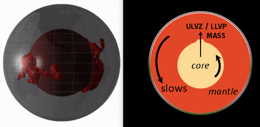

# Solar System

This document is dedicated to exploring parts of the solar system which may affect the ECDO.

## Contents

- `universe`: Information concerning the universe outside of Earth's solar system.

## 11-year Solar Cycle

The Sun has an 11-year cycle, during which it oscillates between solar maximum and minimum, and also goes through a pole flip. Over a period of 22 years, the Sun would go through two cycles, each with opposite magnetic polarities. [1]

When combined with the Gleissberg cycle, you would see the Sun transitioning from local solar maximum and minimum in between its transitions to the "global" solar maximum and minimum defined by the Gleissberg cycle.

## LLVP similar to sunspot butterfly diagram?

"Detailed observations of sunspots have been obtained by the Royal Greenwich Observatory since 1874. These observations include information on the sizes and positions of sunspots as well as their numbers. These data show that sunspots do not appear at random over the surface of the sun but are concentrated in two latitude bands on either side of the equator. A butterfly diagram (142 kb GIF image) (184 kb pdf-file) (updated monthly) showing the positions of the spots for each rotation of the sun since May 1874 shows that these bands first form at mid-latitudes, widen, and then move toward the equator as each cycle progresses." [2]

Does this happen for the same reason that the LLVPs seem to be centered around the equator?

## Citations

1. https://en.wikipedia.org/wiki/Solar_cycle#Patterns
2. https://solarscience.msfc.nasa.gov/SunspotCycle.shtml#ButterflyDiagram

# TODO

solar dynamo: https://solarscience.msfc.nasa.gov/dynamo.shtml

Long term sunspot cycle phase cohere with periodic phase disruptions: https://arxiv.org/pdf/1610.03553

gravitational null (when the gas giants are in line and their pull on Earth cancels each other out?)

also a good basic summary: https://landscheidt.info/?q=node/345
