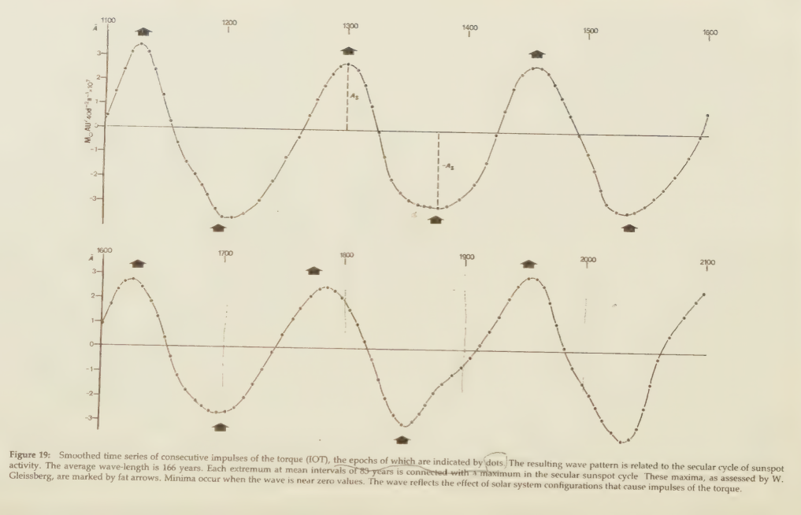

# Solar System

This document is dedicated to exploring parts of the solar system which may affect the ECDO.

## Contents

- `universe`: Information concerning the universe outside of Earth's solar system.

# Analysis

## Planetary effects on the Sun's activity

Landscheidt (see `LITERATURE-MEDIA/landscheidt`) proposes that the planets affect the Sun's activity. Particularly, the positions of the gas giants (Jupiter, Uranus, Neptune, Saturn), which are the planets with the most mass, determine the Sun's trajectory around the center of mass of the solar system:
- Jupiter: 100% (reference value)
- Saturn: ~30% of Jupiter's mass
- Uranus: ~5% of Jupiter's mass
- Neptune: ~5.4% of Jupiter's mass

Jupiter, being the heaviest one, plays the biggest role.

Specifically, Landscheidt says that the most important moments are when the Sun, the CM (centre of mass) of the solar system, and Jupiter are in line. When JUNS (Jupiter, Uranus, Neptune, and Saturn) are on the same side of the Sun, the Sun will be furthest from the CM. When Jupiter is opposite UNS, the Sun will be closest to the CM. Together, these gas giants produce IOT (impulses of torque) on the Sun.

## Gleissberg Cycle Basics (166 years)

When IOT are graphed over time, they are shown to form waves with a mean length of 166 years (Gleissberg cycle). At the top and bottom of these waves, where the IOT are strongest, occurring at a mean interval of 83 years (ranging from 47 to 118 years), there are maxima in the sunspot cycle, which Landscheidt proposes is caused by slower rotation of the Sun caused by the IOT. The points where the curve crosses the x-axis correspond to solar minima.

This chart actually contrasts Landscheidt's prediction of a supersecular sunspot minimum around 2030 (chart shows a sunspot maximum). However, I am chalking this up to an unclear explanation by Landscheidt, and the fact that this book was published in 1988. I cover his more up-to-date work from subsequent research papers in a following section.

## Aside: Gleissberg cycle math

In page 45 of "Sun Earth Man", Landscheidt explains the exact dimensions of the above graph. I will attempt to recreate his explanation here.

The torque T is defined as the first derivative of the angular momentum L of the Sun's orbital motion. So T gives the rate of change of L.

Impulses of the torque are defined as the time integral of T, which gives the total change in L (Based on the fundamental theorem of calculus and the fact that T is the derivative of L).

So the Gleissberg cycle graph is basically just showing the total change in angular momentum. The peaks and troughs in angular momentum change show the points where the torque, the rate of change of angular momentum, changes direction.

## Landscheidt "New Little Ice Age" Paper (2003)

See `LITERATURE-MEDIA/landscheidt` for a hard copy.

In this paper, Landscheidt explores the relation of the double derivative, or acceleration, of angular momentum, with the Gleissberg cycle.

He proposes that there is a definite correspondence, but the relationship has two possible states, and alternates between the states at phase reversals.

In this visual of the acceleration of angular momentum, the black triangles are Gleissberg maxima, and the empty triangles Gleissberg minima. You can see that at the phase reversal points, the relationship alternates between having the Gleissberg maxima at the extrema of the curve, and at the points where the extrema crosses the 0 value.

He also predicts the next secular minimum to be in 2030, as evidenced in the chart.

## Continuing Landscheidt's work - Carl Smith, Geoff Sharp

Carl Smith produced this graph of the angular momentum of the Sun around the SSB:

The green arrows denote AMPs (angular momentum perturbations) which are moments in which the Sun's angular momentum is unstable.

Geoff Sharp, investigating the AMPs in Carl's graph, found the following:

*"Further research established another correlation, I checked the planetary position at the point of disturbance and noticed a recurring pattern. Every time there is a disturbance on Carl's graph we have the same planetary position. This position is Neptune, Uranus and Jupiter together with Saturn opposing, this only happens on a cycle around 172 years average, which now laid the foundation for solar modulation planning."* [2]

*"In addition it also became obvious that Angular Momentum (AM) was responsible for the strength of the solar cycle, the AM curve very closely matches the sunspot curve... There is one fact that cannot be argued against, the position of the planets as just described radically changes the path of the Sun around the Solar System Barycenter (SSB), this also coincides with all solar slowdowns. Only this planetary position can cause this radical path change."* [2]

Here are other comments by Sharp on the planetary positions:

*"Fig.1 shows the 2 planetary positions that create the majority of angular momentum in our solar system. "A" corresponds with the bottom of the wave in Carl's graph and "B" with the top of wave. The resonance created from large strength in "B" and near zero strength in "A" as Jupiter & Saturn balance each other out."* [3]

*"Fig.2 shows the 2 planetary positions capable of creating Grand Minima. "A" robbing Saturn at bottom of wave and "B" robbing Jupiter/Saturn at top of wave. Both positions responsible for the recurring "camels humps" in Carl's graph"* [3]

## 4627-year gas giant grand cycle

I haven't found the original source for this yet, but there are many references to this cyle in Geoff Sharp's writings:

*"The 4 outer planets repeat their positions in relation to each other every 4627 years. A trace of the solar path of the Sun about the SSB is slightly different each orbit (outer and inner) over 4627 years."*

https://landscheidt.info/?q=node/344

## 11-year Solar Cycle

The Sun has an 11-year cycle, during which it oscillates between solar maximum and minimum, and also goes through a pole flip. Over a period of 22 years, the Sun would go through two cycles, each with opposite magnetic polarities. [1]

When combined with the Gleissberg cycle, you would see the Sun transitioning from local solar maximum and minimum in between its transitions to the "global" solar maximum and minimum defined by the Gleissberg cycle.

## Relation to human lifespan

A study of 63 million death records spanning 34 years revealed a clear relationship between average lifespan and sunspot numbers (SSN) at the time of birth. People born in months with sunspot numbers below 90 live, on average, 8-10 years (around 11%-15%) longer than those born in months with an SSN above 90.

"There is a statistically significant inverse relationship between exposure to solar energy at birth and average human lifespan. Solar energy by some mechanism alters the epigenome at birth, but the effect of higher solar energy becomes apparent after the age of natural selection."

https://www.sciencedirect.com/science/article/abs/pii/S1011134418305505

## Citations

1. https://en.wikipedia.org/wiki/Solar_cycle#Patterns
2. https://landscheidt.info/
3. https://landscheidt.wordpress.com/2008/11/06/are-neptune-and-uranus-the-major-players-in-solar-grand-minima/

# TODO

gravitational null (when the gas giants are in line and their pull on Earth cancels each other out?)

also a good basic summary: https://landscheidt.info/?q=node/345