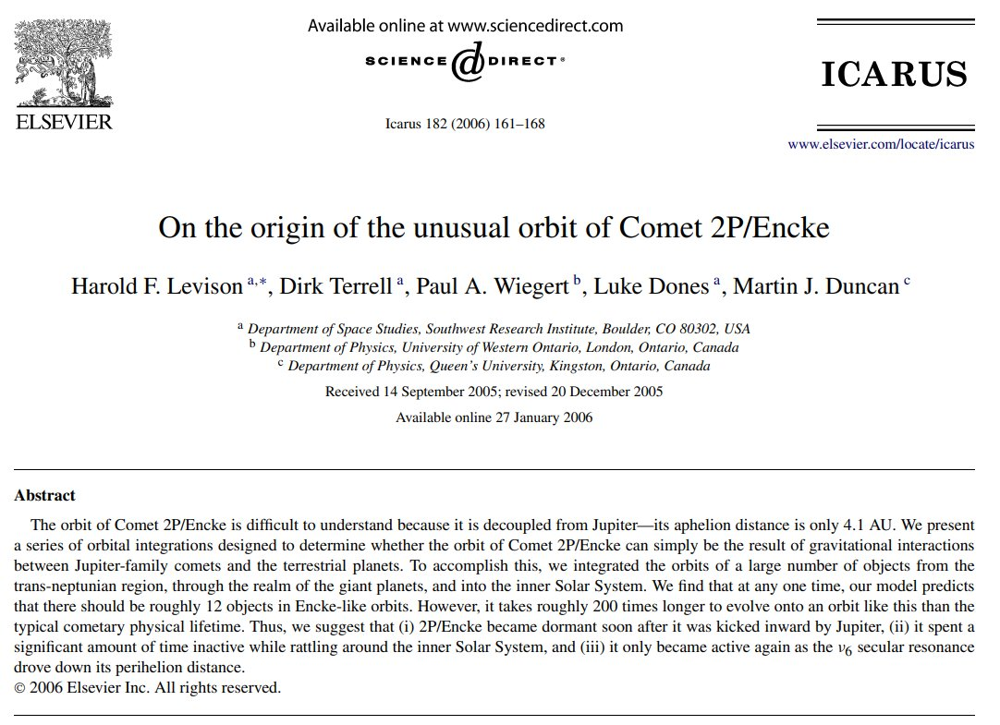
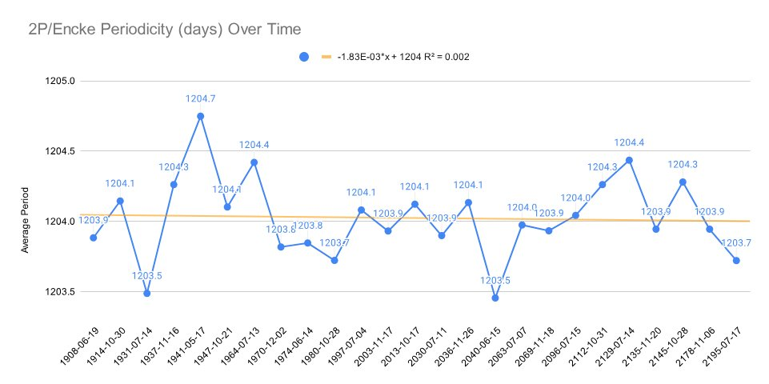

# Comets

## 2P/Encke and the Younger Dryas...

2P/Encke and the Younger Dryas appear once again, summarised from Our Cometary Environment (1996) by Napier &amp; Clube[1]: Whipple and Kresak hypothesized that 2P/Encke was originally a much larger object, which fragmented and supplied the material for the zodiacal cloud. Clube and… https://t.co/63KuGQRYkf

## "The periodic Comet 2P/Encke is...

"The periodic Comet 2P/Encke is one of the most mysterious and befuddling objects in the Solar System. 2P/Encke is a bright, low-inclination comet on an orbit with a surprisingly small aphelion distance (Q) of only 4.1 AU. As such, although similar to Jupiter-family comets (JFCs,… https://t.co/2lKVc802yA

