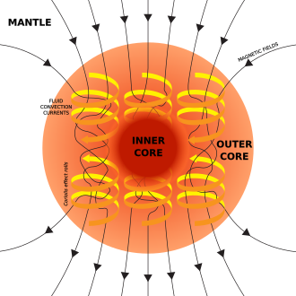
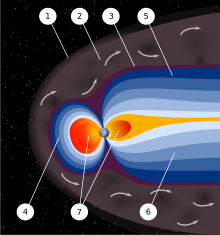

# Geomagnetism

## Geomagnetic Field

*"Earth's magnetic field, also known as the geomagnetic field, is the magnetic field that extends from Earth's interior out into space, where it interacts with the solar wind, a stream of charged particles emanating from the Sun. The magnetic field is generated by electric currents due to the motion of convection currents of a mixture of molten iron and nickel in Earth's outer core: these convection currents are caused by heat escaping from the core, a natural process called a geodynamo... A dynamo is thought to be the source of the Earth's magnetic field and the magnetic fields of Mercury and the Jovian planets."* [1,3]

*"Illustration of the dynamo mechanism that generates the Earth's magnetic field: convection currents of fluid metal in the Earth's outer core, driven by heat flow from the inner core, organized into rolls by the Coriolis force, generate circulating electric currents, which supports the magnetic field."* [3]

*"There are three requisites for a dynamo to operate:"*
- *"An electrically conductive fluid medium"*
- *"Kinetic energy provided by planetary rotation"*
- *"An internal energy source to drive convective motions within the fluid."*

### Dynamo

*"A dynamo is an electrical generator that creates direct current using a commutator."* [4]

*"A dynamo is essentially a generator that produces direct current (DC) electricity. The basic working principle relies on Faraday's Law of Electromagnetic Induction, which states that a changing magnetic field can induce an electromotive force (EMF) in a conductor."* [5]

### Faraday's Law, Electromagnetic induction

*"Faraday's law of induction (or simply Faraday's law) is a law of electromagnetism predicting how a magnetic field will interact with an electric circuit to produce an electromotive force (emf). This phenomenon, known as electromagnetic induction, is the fundamental operating principle of transformers, inductors, and many types of electric motors, generators and solenoids."* [6]

## Magnetosphere [2]

*"In astronomy and planetary science, a magnetosphere is a region of space surrounding an astronomical object in which charged particles are affected by that object's magnetic field.[1][2] It is created by a celestial body with an active interior dynamo."*

*"In the space environment close to a planetary body with a dipole magnetic field such as Earth, the field lines resemble a simple magnetic dipole. Farther out, field lines can be significantly distorted by the flow of electrically conducting plasma, as emitted from the Sun (i.e., the solar wind) or a nearby star."*

*"An artist's rendering of the structure of a magnetosphere. 1) Bow shock. 2) Magnetosheath. 3) Magnetopause. 4) Magnetosphere. 5) Northern tail lobe. 6) Southern tail lobe. 7) Plasmasphere."*

## Paleomagnetic Calculations

See section 2.1 for an explanation of inclination and declination: https://earthref.org/MagIC/books/Tauxe/Essentials/#x1-236000C

Inclination in paleomagnetic data refers to the angle between the Earth's magnetic field and the horizontal plane at a specific location.

Measurement: Inclination is measured in degrees, ranging from -90° to +90°. A positive inclination indicates that the magnetic field was directed downward into the Earth (like at the magnetic north pole), while a negative inclination indicates an upward direction (like at the magnetic south pole).

## Citations

1. https://en.wikipedia.org/wiki/Earth%27s_magnetic_field
2. https://en.wikipedia.org/wiki/Magnetosphere
3. https://en.wikipedia.org/wiki/Dynamo_theory
4. https://en.wikipedia.org/wiki/Dynamo
5. ChatGPT
6. https://en.wikipedia.org/wiki/Faraday%27s_law_of_induction

# TODO

- dynamo = commutator
- Schumann resonances
