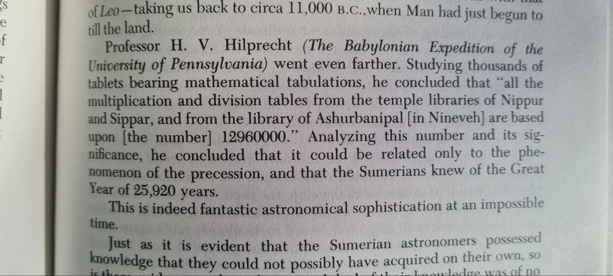

# Great Year

## The Great Year

The term Great Year has more than one major meaning. It is defined by scientific astronomy as "The period of one complete cycle of the equinoxes around the ecliptic, or about 25,800 years". [1]

## Great Year, Barnard's Star (hard copy here), Binary Year?

Our Sun’s Potential Binary Relationship with Barnard’s Star
https://binaryresearchinstitute.org/bri/5.9/wp-content/uploads/2023/11/Lost-Star-Found-11-11-23.pdf

Is this the cause of the Great Year, and if so then every 12,000y we come closer to our binary star. Does this relate to the flippenings.

They have a lot of interesting content on their website: https://binaryresearchinstitute.org/bri/

They reference this ted talk, which is a good one: https://binaryresearchinstitute.org/bri/articles/there-is-something-out-there-by-mike-brown/

### Related

Or related to Nibiru perhaps?

https://www.youtube.com/watch?v=I3ZDcj0kF_0 The great binary year

## Sitchen Quote

## 3700?

"Seven great continental cataclysms occur during the occupation of the earth by the human life-wave for one round period." [1] "Nature has furnished her students with the means of reaching her mysteries, in the dual form of intuition and intellect, and of measuring her mighty forces in the forms of time and space. The first index of time is the rotation of the Earth upon her axis, the second by her annual motion about the Sun. These are broadly converted into days, months and years. The third index is that of the motion of the Earth’s center (the Sun) through space, around a still greater center; this is broadly divided into two measures, viz.; first, through one sign of the Zodiac, a period of 2,160 years, and secondly, through the entire twelve signs, which complete his grand revolution, or great Solar Year, in 25,920 years [one round] of Earthly time. The third and last face of the triune index is our Earth’s Pole. This magnetic point is the great finger of Nature’s Cyclic Timepiece, which governs and registers all the great Cosmic cycles of our planet and its circuit." [2]
1. - The Secret Doctrine of the Rosicrucians, William Walker Atkinson (1918) https://nobulart.com/the-souls-progress/
2. The Light of Egypt, Volume I, Thomas H. Burgoyne (1889) https://nobulart.com/the-hermetic-key/ 

One round is one precession cycle of 25,920 years. One seventh of this is 3702.8 years; the V planetary harmonic.

Probably not coincidence. "The third and last face of the triune index is our Earth’s Pole. This magnetic point is the great finger of Nature’s Cyclic Timepiece, which governs and registers all the great Cosmic cycles of our planet and its circuit."

## Citations

1. https://en.wikipedia.org/wiki/Great_Year
