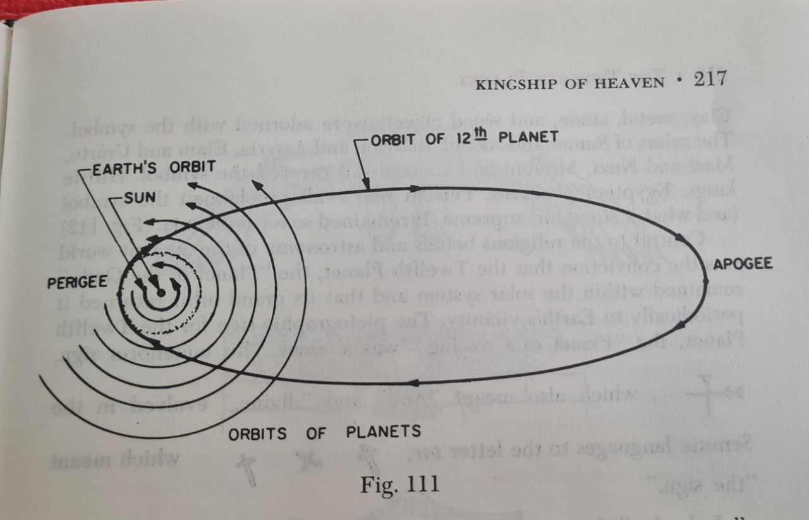

# Nibiru / Marduk

## Quote

I've scanned through this video again and feel the content is important but don't have the knowledge to work out why and its bothering me! I find the idea compelling that the Sun has its own orbit round a binary star and that this accounts for the precession of the equinoxes. Should this affect our thinking regards the catastrophe cycle and even the role of the air shafts? Was the shaft pointing North in S1 or S2 for observation or for channelling something other than air? A precession of 26,000 years is divisible by 3,700 years. Sitchen talked about Nibiru making a fly by every 3,600 years. Do we learn to live with this cycle through the Silver and Golden ages and are relearning again as we come out of Iron? Is our general development in ascendency and we learn to cope better with each Great Year better each time. I.E the pyramids were constructed at the height of the last golden age (c.11,500 years ago according to the air shaft star chart) and we will have even more incredible technology in the next golden age starting in about 6,500 years?

## Quote

Sitchen reckoned Marduk, "the 12th planet", orbits the sun every 3,600 years. This work seems to be written off the same script...

## Sources

Sitchen, The 12th Planet