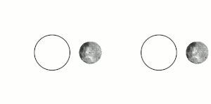

# Tidal Locking [1]

*"Tidal locking between a pair of co-orbiting astronomical bodies occurs when one of the objects reaches a state where there is no longer any net change in its rotation rate over the course of a complete orbit. In the case where a tidally locked body possesses synchronous rotation, the object takes just as long to rotate around its own axis as it does to revolve around its partner. For example, the same side of the Moon always faces Earth, although there is some variability because the Moon's orbit is not perfectly circular. Usually, only the satellite is tidally locked to the larger body.[1] However, if both the difference in mass between the two bodies and the distance between them are relatively small, each may be tidally locked to the other; this is the case for Pluto and Charon, as well as for Eris and Dysnomia. Alternative names for the tidal locking process are gravitational locking,[2] captured rotation, and spin–orbit locking."*

*"The effect arises between two bodies when their gravitational interaction slows a body's rotation until it becomes tidally locked. Over many millions of years, the interaction forces changes to their orbits and rotation rates as a result of energy exchange and heat dissipation. When one of the bodies reaches a state where there is no longer any net change in its rotation rate over the course of a complete orbit, it is said to be tidally locked.[3] The object tends to stay in this state because leaving it would require adding energy back into the system. The object's orbit may migrate over time so as to undo the tidal lock, for example, if a giant planet perturbs the object."*

## Earth-moon tidal locking occurs due... [2]

Earth-moon tidal locking occurs due to obliquity in both of their gravitational fields. Neither centers of gravity are coincident with their axes of rotation, with Earth's CoG shifting as mas redistribution on an in the planet is an ongoing process. https://t.co/fHhdwXzTfP

## Citations

1. https://en.wikipedia.org/wiki/Tidal_locking
2. Craig Stone