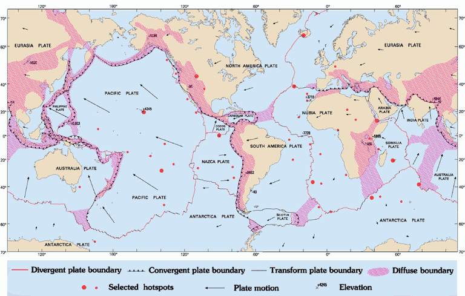
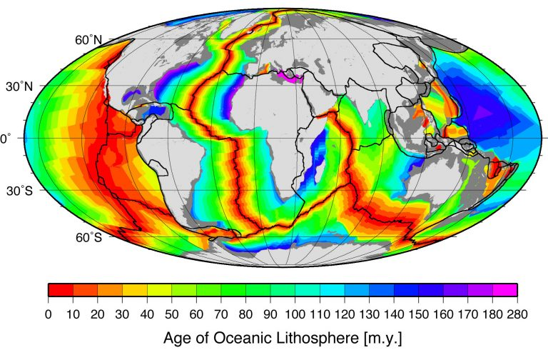

# Tectonic Plates

This speculative analysis was inspired by this comment from Ethical Skeptic (`LITERATURE-MEDIA/ethical-skeptic`): *"It is possible that some or even most of our continental drift occurs quickly as a facet of ECDO events. The gradualism approach is the result of a flawed assumption now taken as proven, when it is not."*

The tectonic plates of the Earth's crust fit together like puzzle pieces, running into each other in different ways (subduction, orogeny). [2] What if, as the mantle and inner layers of the Earth expand (and shrink) in response to the new equatorial bulge, we see significant tectonic plate movement in the crust, which lies directly on top of these layers?

## Crust creation

Crust creation primarly happens at divergent boundaries, [3] but can also happen due to volcanic activity.

This visual shows some areas which could potentially see new crust creation during the ECDO rotation:

The crust created at these boundaries could then cause movement of plates in other areas, pushing plates into, across, or beneath each other.

## Misc Knowledge

### Reading tectonic plate maps

For convergent plate boundaries, the triangles point away from the plate that is being subducted (pushed underneath the other).

### Types of faults

Transform faults are where plates slide past each other horizontally.

Continental rift is when the plate is undergoing stretching and thinning, leading to the formation of a rift valley. When this progresses, it can become an oceanic spreading ridge, which is a divergent boundary.

A convergent boundary typically results in subduction or orogeny.

## Citations

1. Tectonic plate diagram: http://geology.about.com/od/platetectonicmaps/ss/Plate-Boundaries-Map.htm
2. https://en.wikipedia.org/wiki/List_of_tectonic_plate_interactions
3. https://rwu.pressbooks.pub/webboceanography/chapter/4-5-divergent-plate-boundaries/

## TODO

Particularly interesting tectonic spot to look at: eastern pivot, Indonesia

Another one: Himalayas