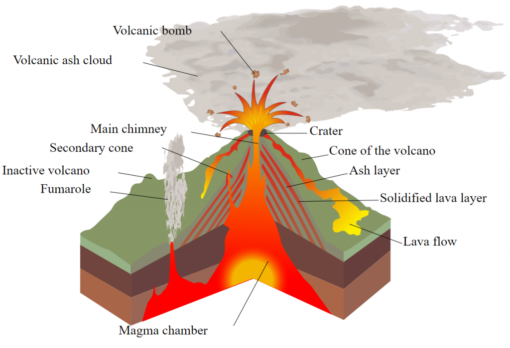

# Volcanoes

Volcanoes are locations on the Earth where the upper mantle reaches the surface of the Earth's crust.

Likely, all volcanoes will see some form of increased activity during the ECDO. But in particular, volcanic activity may be correlated with the equatorial bulge.

## Equatorial Bulge

After the ECDO rotation, it's possible that the inner layers of the Earth, along with the overlying crust, will immediately deform to accomodate the new position of the bulge.

If that happens, you would see the parts of the inner layers of the Earth moving closer to the equator expand, and the parts that move away from the equator shrinking. The same is true for volcanoes.

If the upper mantle underneath volcanoes expands, there will be immense pressure on the overlying crust. Volcanoes may act as a *pressure release valve* for this increasing upper mantle volume, creating exit points on the Earth's surface for the upper mantle.

No doubt, this would be accompanied by massive plumes of ash.

## Mount St. Helens 1990 Eruption

In 1980, Mount St. Helens, in the Pacific Northwest in Washington, erupted.

*"The eruption was preceded by a two-month series of earthquakes and steam-venting episodes caused by an injection of magma at shallow depth below the volcano that created a large bulge and a fracture system on the mountain's north slope."*

*"An eruption column rose 80,000 feet (24 km; 15 mi) into the atmosphere and deposited ash in 11 U.S. states[5] and various Canadian provinces."*

*"As the avalanche and initial pyroclastic flow were still advancing, a huge ash column grew to a height of 12 mi (19 km) above the expanding crater in less than 10 minutes and spread tephra into the stratosphere for 10 straight hours... Strong, high-altitude wind carried much of this material east-northeasterly from the volcano at an average speed around 60 miles per hour (100 km/h). By 9:45 am, it had reached Yakima, Washington, 90 mi (140 km) away, and by 11:45 am, it was over Spokane, Washington.[9] A total of 4 to 5 in (100 to 130 mm) of ash fell on Yakima, and areas as far east as Spokane were plunged into darkness by noon, where visibility was reduced to 10 ft (3 m) and 0.5 in (13 mm) of ash fell.[36] Continuing eastward,[42] St. Helens's ash fell in the western part of Yellowstone National Park by 10:15 pm, and was seen on the ground in Denver the next day.[36] In time, ash fall from this eruption was reported as far away as Minnesota and Oklahoma, and some of the ash drifted around the globe within about 2 weeks."* [1]

This eruption, which wasn't even happening during an ECDO, might give us an idea of the scale of volcanic activity and ash that could occur in many volcanoes during the ECDO.

There are videos online of the actual eruption and aftermath which are worth watching to get an idea of the side effects. The ash is very thick close to the volcano; like you're in the middle of a fire.

## Magma

"I expect volatile areas will remain unstable possibly for hundreds of years or more. I base my expectation of volcanic activity here on the composition of the bedrock here - it’s pretty much all of volcanic origin, albeit quite old." [2]

## Citations

1. https://en.wikipedia.org/wiki/1980_eruption_of_Mount_St._Helens
2. [Craig Stone](https://nobulart.com)