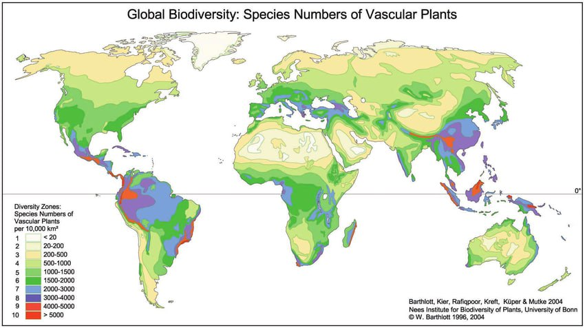

# Rotation Amount - Why 104 degrees on the 31 Meridian?

This folder is dedicated to understanding why the Earth rotates 104 degrees on the 31 Meridian.

## Khufu Pyramid

The main clue that TES uses to postulate that the ECDO rotation consists of a 104 degree rotation along the 31 Meridian is the Khufu Pyramid. This is a central point in his thesis.

The Khufu Pyramid is hypothesized to lie directly on the longitude line rotating to the pole, because this is the only way that the shafts in the pyramid would align with the poles in S1 and S2. This implies that it was intentionally built in that precise location.

If you rotate this pyramid in any direction other than the one Ethical Skeptic hypothesizes, the observation shafts will not work - this is a foundational aspect of the hypothesis.

More on the Khufu Pyramid in TES thesis [1] and `EVIDENCE/civilization-remnants/important-structures`.

## Dzhanibekov: Least dense LLVP centroid [1]

The centroid of the least dense LLVP centroid lies in South Africa. This is hypothesized to serve as the third principal axis along which Earth's rotational axis will lie following the ECDO rotation. See `FOUNDATION-THEORY/earth-inner-layers`.

## Paleomagnetic Data

We have evidence of a rotation of the continents from paleomagnetic data that is in the same directions as predicted during S1 -> S2; see `EVIDENCE/physical-material/paleomagnetic`.

## Mythical Evidence

Mythical accounts of Earth rotating in the same direction as predicted by the ECDO. See `EVIDENCE/cataclysm-chronology`.

### Egyptian Account

*"Thus in the period of eleven thousand three hundred and forty years they said that there had arisen no god in human form; nor even before that time or afterwards among the remaining kings who arose in Egypt, did they report that anything of that kind had come to pass. In this time they said that the sun had moved four times from his accustomed place of rising, and where he now sets he had thence twice had his rising, and in the place from whence he now rises he had twice had his setting;[127] and in the meantime nothing in Egypt had been changed from its usual state, neither that which comes from the earth nor that which comes to them from the river nor that which concerns diseases or deaths."*

- Herodotus (Greek Historian), An Account of Egypt, 440 BCE

### Chinese Account

We have a mythical Chinese account of China rotating in the same direction as would be predicted during S1 -> S2:

*"When the water god Gong Gong saw that he was losing, he smashed his head against Mount Buzhou, a pillar holding up the sky. The pillar collapsed and caused the sky to tilt towards the northwest and the earth to shift to the southeast."*

## Geological Evidence

We have evidence of:
- water flows into North Africa from the Mediterranean
- water flows into France from the Arctic
- Directional scouring of Severny Island and New Zealand along S1 -> S2 rotation path
- water flows into the Great Basin, San Francisco Bay from the Pacific
- water flows into south China from the Pacific
- water flows into the Himalayas, northern China, and Mongolia, presumably from the Pacific

These all match the predicted oceanic displacement direction during S1 -> S2.

## Biodiversity Evidence

Biodiversity hotspots do seem to have their hottest spots in the two pivot areas; see `EVIDENCE/biology/biodiversity-hotspots`.

## Indonesia Pivot Cave Art

We also have the oldest cave art found so far in Indonesia, at an elevation of ~350m. See `LOCATION-MAPPING/asia/indonesia`. Granted, there have also been very old such artifacts found in southwestern France and Germany.

## Citations

1. https://theethicalskeptic.com/2024/05/12/exothermic-core-mantle-decoupling-dzhanibekov-oscillation-ecdo-theory/

# TODO

Ethical Skeptic's third thesis has a very in-depth explanation on why the design of the Khufu pyramid would support the exact rotation amount and orientation he describes.

Other leads:
- inverted starmaps found side by side with regular maps in at least two structures in Egypt
- Distribution of mass as determined by our current gravitational data
- Centroid of South Africa LLVP precise calculations
