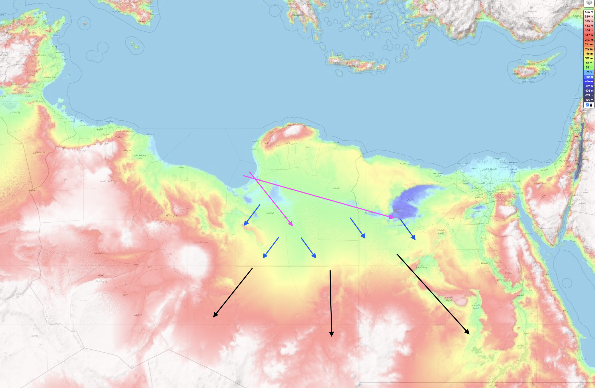

# Oceanic Displacement

This document is for predicting the height and extent of temporary oceanic displacement during the rotation. These factors will be key for evaluating safe locations.

In short, it is a very complex, large-scale fluid dynamics problem.

## Intro: Key forces at play

- Uniquely shaped landmass rotating at varying high speeds
- 3D physics of large bodies of water
	- water moves radially to the past of least resistance
	- gravity

It's not complicated when we describe it this way, but we need to develop a system for performing the analysis.

## A 3-part system for modeling ocean displacement

For me, currently, the key steps are:
1. *Terrain chokepoints*, from underwater to above-ground, where water will get trapped as it flows in, potentially leading it to flow *over* rather than *around*.
2. *Topography*, as water will be redirected to the lowest elevation areas after an initial upwards reaction
3. *Water surge volume*, which when combined with surface area, determines *water surge height*
4. *Water surge speed*, which when combined with *water surge height and volume*, can tell you how high of an obstacle the water surge could flow over

Evidences of past inundation will be extremely helpful in fine-tuning the analysis. Every location will be unique and must be evaluated on a case-by-case basis.

## Part 1: Chokepoints

Chokepoints are areas with concave terrain in which water will get trapped if it flows into, and will have to choose between going *around* or *over*. For example, most bays and basins form de facto chokepoints.

In contrast, terrain that forms a convex shape has more of a likelihood to streamline through the water, letting the water move around. However, this depends on the speed of the water. If you have ever stood in the tides of the ocean as they flow out to sea, you'll know that the water, even if it moves around, will first react to obstacles in an upward fashion, with strength proportional to the speed of the water, without exception.

The earliest chokepoints are all at or under the water. This includes all coastlines, since bodies of water form de facto basins. These underwater and water-level chokepoints will be the first to drive the water above sea level, from which the water will continue to move to other chokepoints. For example, note these massive underwater chokepoints to the east of Japan:

Determining the water inundation height at a chokepoint is dependent on how much water has to flow through the chokepoint at what speed. The water will rise until the cross sectional volume of the chokepoint flow channel is sufficient to allow the water to pass through the chokepoint at the given speed.

The speed is key here, because of gravity. Without sufficient *water inflow speed*, water will not be able to pass over obstacles.

Precisely mapping the inundation will be a question of determining the cumulative progression of water from chokepoint(s) to chokepoint(s), and making judicious use of contour/elevation maps.

## Part 2: Topography

Topography will play a major rule in how the water moves as after an initial upwards reaction, water will be redirected to the lowest elevation areas, and only rise higher if it has to accomodate more water surge volume.

The initial water reaction height will depend on the slope of the terrain. When combined with the speed, it will determine the total height that water travels up the slope until gravity forces it back down. When you consider that water could be traveling at supersonic speeds, this will definitely be a factor to consider.

After the initial reaction, water will be redirected by gravity to lower elevation areas, moving radially when it can.

As an example, see this diagram of predicted water flow starting from one coastal chokepoint in north Africa. It might not be gradual since north Africa rotates at the highest speed:

## Part 3: Total volume and height of water surge

The total volume of water surge at any location with significant flows is determined in a progressive manner through a cumulative series of chokepoints that lead to the location. Since water moves *radially*, the water that moves through any given chokepoint will often spread to multiple subsequenct chokepoints, splitting up the water flow.

Determining the total volume of water at any given chokepoint depends on the total volumetric input and output rate of water flows into the chokepoint.

The height of the water flow is directly proportional to the total volume and inversely proportional to the total surface area of the water surge.

## Part 4: Speed of water surge

This is the simplest part; the speed of water surge will be directly proportional to the speed of rotation. See `FULL-THESIS-BREAKDOWN/s1-to-s2/rotation-speed`.

## Best Examples of Location Oceanic Displacement Analysis

`LOCATION-MAPPING` is where all the location-specific flood analysis will go. Some good examples are:
- East Asia, chokepoints
- Turkey (Urgup Cones), 1025m above sea level
- North Africa, 1200m height 600m above sea level

## Factors that are difficult to predict

The exact amount of time it takes for the S1 -> S2 rotation will affect the ocean displacement. The shorter it takes, the faster water will rush onto the land, and the higher the obstacles it could go over.
