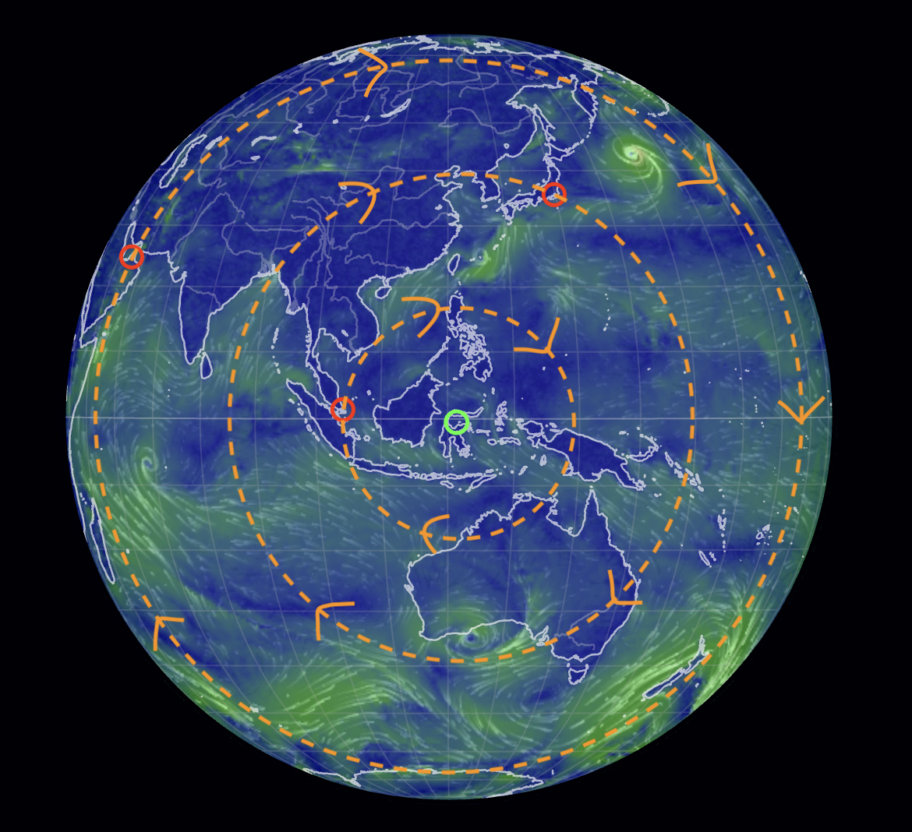

# Rotation Path and Speed

The purpose of this document is to understand and be able to calculate what direction and speed the rotation will be, at any point on the surface of the Earth, during S1 -> S2.

Of course, the answer depends on which point on the Earth's surface is in question, because the rotation direction and speed are not the same across all points on Earth.

## Calculating rotational direction

Calculating rotational direction is rather simple. Simply find the closest pivot (there are two pivots). The point will either rotate clockwise or counterclockwise around the pivot, when looking down at the pivot. Whether it rotates clockwise or counterclockwise depends on which pivot is being rotated around:
- The point will rotate counterclockwise if its around the western pivot
- Clockwise around the eastern pivot

It can be expected that the water displacement will run in the reverse direction of land rotation, with a proportional strength to the speed of rotation at that point.

## Calculating rotational speed

Calculating the speed of rotation depends on how far away said point is from the pivots. The closer the point is to either of the pivots, the less rotational speed it will endure, and the farther away from the pivots, the greater.

We can use basic trigonometry and some simplifing assumptions to calculate rotational speed.

If:
- theta is the angle between a point and the closest pivot
- r_earth is the radius of the Earth (~6371 km)
- t is the number of hours it takes to go from S1 -> S2

Then:
- Radius of rotation of the point (r) = `r_earth * sin(theta)`
- Average rotational speed = `rotational circumference * (104/360) / t` = `2 * pi * r * (104/360) / t`

## Alternate rotational speed formula

Alternatively, instead of the angle, if you know the distance from the pivot, you can use the formula `v = (1.814R) / T`, where:
- `R` is the radius (distance from pivot)
- `T` is the duration of the 104 degree rotation

This one is much simpler than using trig.

## Rotational speed example - Singapore

I'll calculate the rotational speed of Singapore as an example, using the trigonometry formula.

Asking ChatGPT, the angle between Singapore and the eastern pivot is about 17.3 degrees.

Then, the radius of rotation of Singapore is:
- `r_earth * sin(17.3)`
- = `6371 km * 0.297`
- = `1895 km`

Then, the average rotational speed, assuming S1 -> S2 takes 6 hours is:
- `2 * pi * r * (104/360) / t`
- = `2 * pi * 1895 km * (104/360) / 6 hr`
- = `573 km/h`

So during S1 -> S2, Singapore will be rotating clockwise around the eastern pivot in Indonesia at an average speed of 573 km/h.

## Drawing rotational vector field example - Singapore, Tokyo, Dubai

Finally we can map the direction and speed of rotation across many points in the map to get a rotational vector field. Here is a very simple example I did for Singapore, Tokyo, and Dubai, rotating around the eastern pivot in Indonesia.

Here is the predicted average rotational speed at each city assuming a 6 hour rotation:
- Singapore: 17.3 degrees from pivot, ~573 km/h
- Tokyo: 26.7 degrees from pivot, ~866 km/h
- Dubai: 43.2 degrees from pivot, ~1319 km/h
