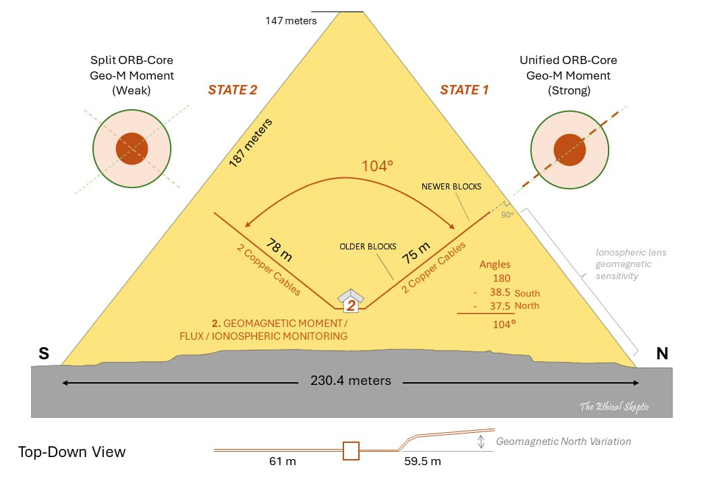
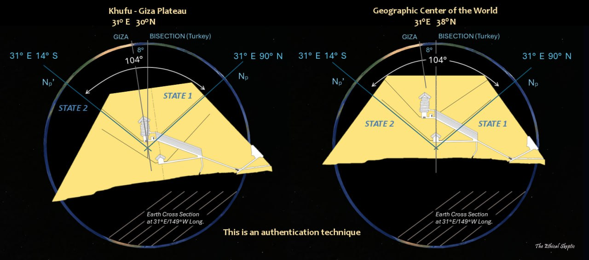

# Rotation Amount - Why 104?

This folder is dedicated to understanding not only why the Earth rotates 104 degrees, but also why the South Africa LLVP centroid will be rotating to the geographic north pole.

## Potential Justification

- Distribution of mass as determined by our current gravitational data
- Khafre Pyramid design
- inverted starmaps found side by side with regular maps in at least two structures in Egypt
- Centroid of South Africa LLVP was precisely calculated to be a special value that is important in Dzhanibekov rotation

## Khafre Pyramid

The Khafre Pyramid is hypothesized to lie directly on the longitude line rotating to the pole, because this is the only way that the shafts in the pyramid would align with the poles in S1 and S2. This implies that it was intentionally built in that precise location.

This diagram displays the lower shafts, which are hypothesized to be for measuring magnetic moment.

If you rotate this pyramid in any direction other than the one Ethical Skeptic hypothesizes, the observation shafts will not work - this is a foundational aspect of the hypothesis.

