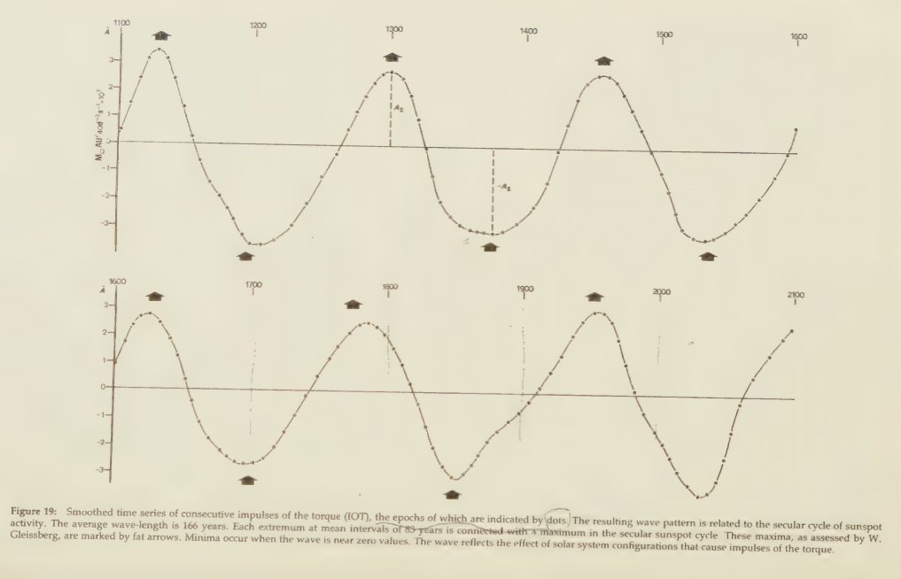

# Solar System

This document is dedicated to exploring parts of the solar system which may affect the ECDO.

## Planetary effects on the Sun's activity

Landscheidt (see `LITERATURE/landscheidt`) proposes that the planets affect the Sun's activity. Particularly, the position of the gas giants (Jupiter, Uranus, Neptune, Saturn), which are the planets with the most mass, determines the Sun's trajectory around the center of mass of the solar system.

Jupiter, being the heaviest one, with a mass roughly 2.51 times the combined mass of Uranus, Neptune, and Saturn, plays the biggest role.

Specifically, Landscheidt says that the most important moments are when the Sun, the CM (centre of mass) of the solar system, and Jupiter are in line. When JUNS (Jupiter, Uranus, Neptune, and Saturn) are on the same side of the Sun, the Sun will be furthest from the CM. When Jupiter is opposite UNS, the Sun will be closest to the CM.

When IOT (impulses of torque) are graphed over time, they are shown to form waves of approximately 166 years (Gleissberg cycle). At the top and bottom of these waves, where the IOT are strongest, occurring every ~83 years, there is a maximum in the sunspot cycle, which Landscheidt proposes is caused by slower rotation of the Sun. The points where the curve crosses the x-axis correspond to solar minima.

Landscheidt predicts that there will be a supersecular sunspot minimum around 2030. However, looking at his description in the above visual, there is a clear discrepancy, where 2030 is a local minimum, and should thus be a sunspot maximum. I have not yet resolved this discrepancy.

## Understanding the above graph (Gleissberg cycle)

In page 45 of "Sun Earth Man", Landscheidt explains the exact dimensions of the above graph. I will attempt to recreate his explanation here.

The torque T is defined as the first derivative of the angular momentum L of the Sun's orbital motion. So T gives the rate of change of L.

Impulses of the torque are defined as the time integral of T, which gives the total change in L (since T is the derivative of L).

So the Gleissberg cycle graph is basically just showing the total change in angular momentum. The peaks and troughs in angular momentum show the points where the torque, the rate of change of angular momentum, changes direction.

## 11-year Solar Cycle

The Sun has an 11-year cycle, during which it oscillates between solar maximum and minimum, and also goes through a pole flip. Over a period of 22 years, the Sun would go through two cycles, each with opposite magnetic polarities. [1]

When combined with the Gleissberg cycle, you would see the Sun transitioning from local solar maximum and minimum in between its transitions to the "global" solar maximum and minimum defined by the Gleissberg cycle.

## Citations

1. https://en.wikipedia.org/wiki/Solar_cycle#Patterns

## TODO

- landscheidt
- gas giant grand cycles (4627)
- sun grand minimum, maximum