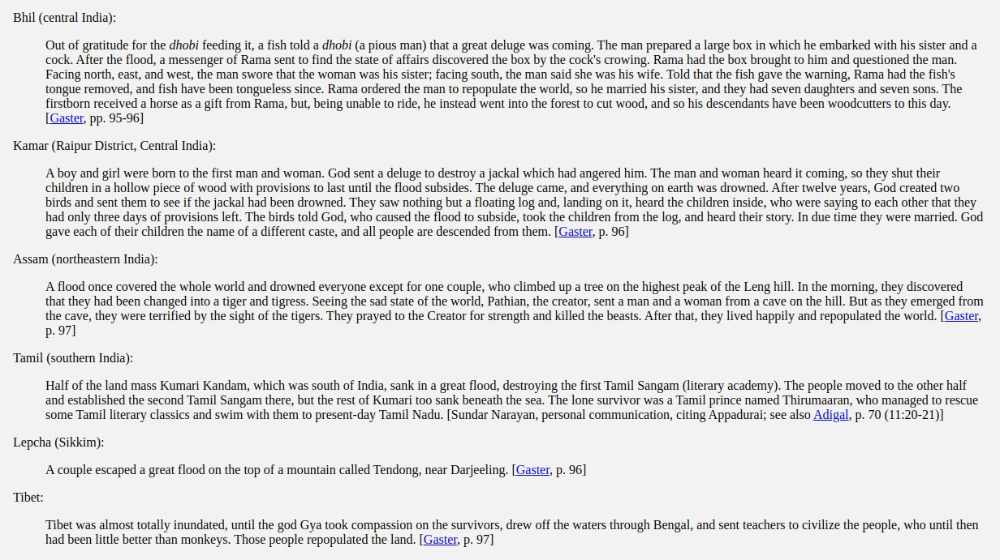
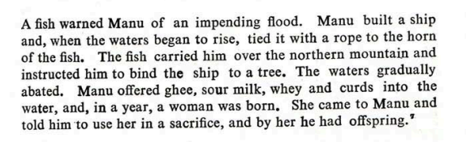

# Indian Flood Myths

There are several Indian flood myths.

Check `img/` for all records.

## Manu Deluge (2000 BC - 1900 BC)

During the Manu deluge the flood was probably super high. Only 1 mountain peak in Himalaya was visible called Navabandhana. Current highest peaks are around 8000m. I do suspect there might be changes in between of heights of Himalaya as this happened at the end of golden age.

In the Manu story they mention that the only highest peak of Himalayas was dry called Navabandhan. So, it seems Himalayas were present in previous deluge as well.

There is a research paper by BB Lal (presented at ICHR) which dates this flood to 2000 - 1900 BC using carbon dating. Paper in `hard-copies`:

*"It relates to the history the Sarasvatī, which is a river par excellence in the Ṛigveda. She has been eulogized as the best of mothers (ambitame), the best of rivers (nadītame) and the best of goddesses (devitame) [RV 2.41.16]. She originated in the mountains and went all the way down to the sea (yatī giribhya ā samudrāt) [RV 7.95.2]. She was so powerful that she shattered the mountain peaks with her fast and powerful waves (iyam śuṣmebhir bisakhā ivārujat sānu girīṇām taviṣebhirūrmibhiḥ) [RV 6.61.2]."*

## Sinking of Kandam Kumari (Multiple occurrences)

*"Half of the land mass Kumari Kandam, which was south of India, sank in a great flood, destroying the first Tamil Sangam (literary academy). The people moved to the other half and established the second Tamil Sangam there, but the rest of Kumari too sank beneath the sea. The lone survivor was a Tamil prince named Thirumaaran, who managed to rescue some Tamil literary classics and swim with them to present-day Tamil Nadu."* [1]

Seems to be describing two consecutive events - the sinking of the (now submerged) southern land (S1>S2), and then when they’ve just set up shop again the same thing happens again, submerging land further north (S2>S1).

Such might be the map of Kumari Kandam before sinking (mapped with violet boundary).

Those islands on the western part of sunken land suggests those were the older peaks (those islands can be older western ghats). Red curve line is the ECDO flood path.

*"Kumari Kandam as revealed through Bathymetric studies. Sea level at 130 meters lesser than current levels (-130 m) around 19500 BCE at LGM. Besides the sea level changes, the ocean surface elevation changes due to local tectonic activities to the south of Kanyakumari too is considered. The names of rivers and places mentioned in Tamil literature like Tenmaturai, Kapatapuram and the future city Maturai are indicated. The Devasura civilization mentioned in Sanskrit Vedic literature also is indicated. Kusasthali mentioned in Mahabharata and the Submerged city of Varuna mentioned in Bhagavata too are indicated. The locations are currently speculative, but should give impetus for future marine archaeological studies."*

*"Those who count seven stages of submergence place 1st submergence at 16,000 BCE, the 2nd one at 14000 BCE, the third at 9600 to 9500 BCE and the fourth at 5500 BCE to 5200 BCE. They count the fifth submergence as having occurred around 3100 BCE and a sixth at 1800 BCE. The 7th submergence is then dated at 1700 BCE to 700 BCE. Manavuur is a city to the north of Kapatapuram that got submerged in 3100 BCE or in 1800 BCE (most probably in 1800 BCE)."* [2]

## Sinking of Dwarka – 5525 BCE

Sinking of the city of Dwarka might have been due to great flood. 5525 BCE is pretty close to the Noahic event 5401 BCE. 

[Analysis by Nilesh Oak](https://nileshoak.wordpress.com/2014/01/06/flooding-destruction-of-dwarka-5525-bce)

*"Dwarka of Krishna, on the west coast of India, was destroyed by flood 36 years after the Mahabharata War. I defined time interval of 6500 years for the plausible year of Mahabharata War based on AV (Arundhati-Vasistha) observation of Mahabharata text. Further I could validate 18 day timeline and year of 5561 BCE, proposed by Dr. P V Vartak. I validated 5561 BCE as the year of Mahabharata War based on consistent interpretation of 200+ astronomy observations of Mahabharata text."*

*"This would lead us to the timing of flooding of Dwarka as follows: 5561 BCE + 36 years = 5525 BCE"*

*"Thus flooding and Destruction of Krishna’s Dwarka occurred in 5525 BCE."* [3]

## Citations

1. https://talkorigins.org/faqs/flood-myths.html#Tamil
2. http://ancientvoice.wikidot.com/article:kumari-kandam (Hard PDF copies in `hard-copies`)
3. https://nileshoak.wordpress.com/2014/01/06/flooding-destruction-of-dwarka-5525-bce

## TODO

Kritayuga, apparently the oldest flood deluge in Indian mythology. Said to have started the golden age.
