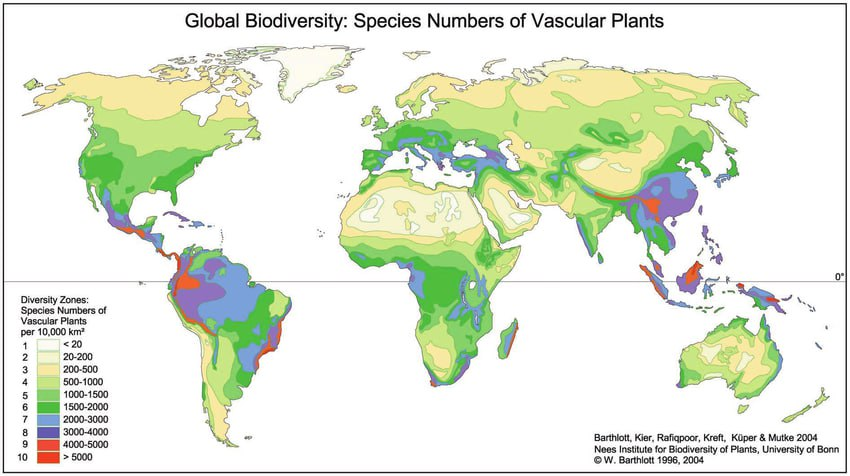
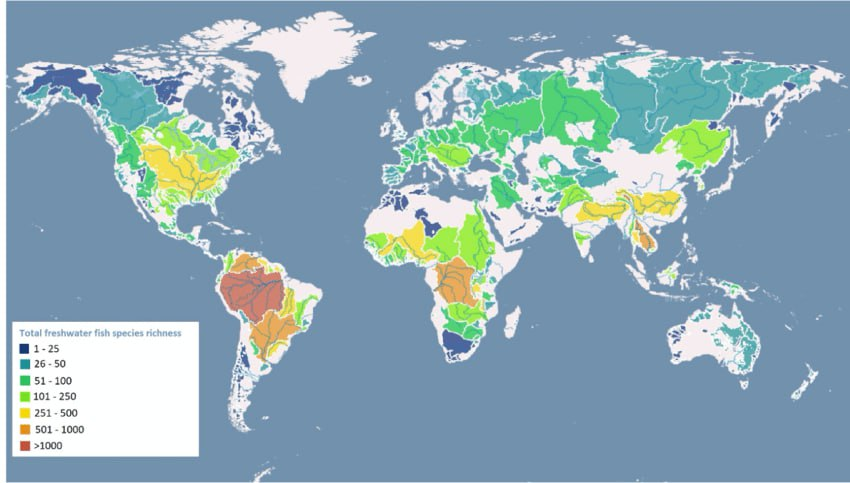
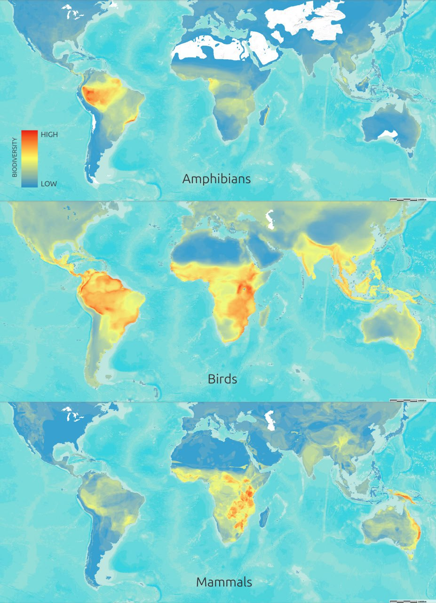

# Biodiversity

If you look at the map of biodiversity hotspots, there's a lot of overlap with high-elevation locations. It may be that this is another factor hinting at safe spots during the ECDO event.

## Old Biodiversity Data

## Citations

https://www.researchgate.net/figure/A-Species-density-map-for-4-967-freshwater-fish-species-Density-was-calculated-as_fig3_366847384