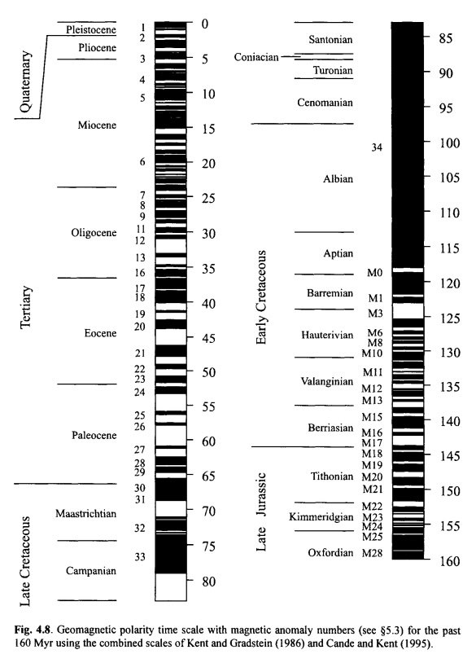
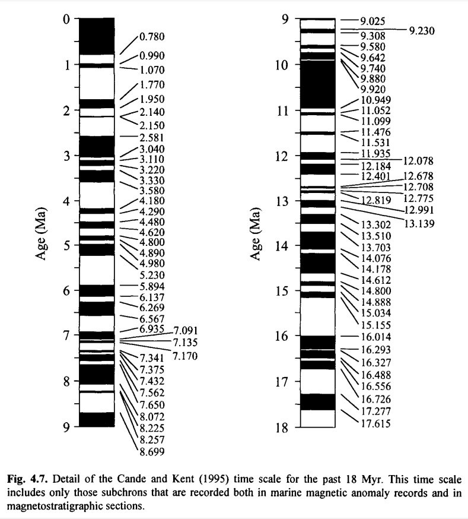
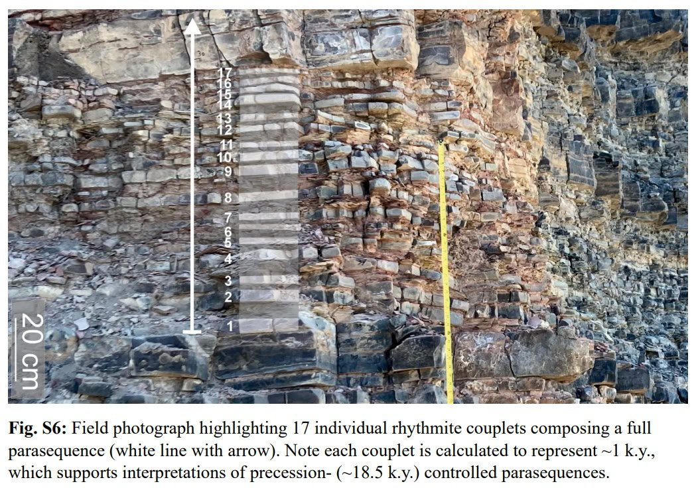

# Earth Geological State

Evidence pertaining to ECDO from the geological state of the Earth, such as weather.

## Hurricane Irma: 3700 year history

https://nhess.copernicus.org/articles/23/3761/2023/nhess-23-3761-2023.pdf

## El Nino 3700 year history

"The seasonal variation 3700 years ago was slightly lower than that suggested by modern instrumental data, and the transition between warm and cold seasons was rapid. Higher amplitudes of reconstructed r-monthly and r-annual SST anomalies imply an enhanced climate variability during this warm period. Investigation of the El Ninõ–Southern Oscillation (ENSO) variation (based on the reconstructed SST series) indicates reduced ENSO frequency but increased ENSO-related variability and extreme El Ninõ winter events 3700 years ago."

https://annas-archive.org/scidb/10.5194/cp-16-597-2020

## Peltier Effect

What could cause the the dramitic shift from bolling allerod to younger dryas where the warm and cooler hemispheres swapped places so rapidly, perhaps a poleshift?

Peltier Effect: https://en.wikipedia.org/wiki/Thermoelectric_effect

## Magnetic profiles

Quick glance at the long term magnetic reversal history. Black/White transitions are 180° flips.

This is recorded all over the earth in thousands of proxies. Uniformitarian geology ascribes them to magnetic field reversals rather than physical ones.

## Bolling-Allerod

Younger Dryas coincides with the start of this period?

https://en.wikipedia.org/wiki/B%C3%B8lling-Aller%C3%B8d_Interstadial

## Temperature

Any theories as to why the temperature fluctuations were much more severe prior to 8000BC?

Because the first event was the result of a collision or encounter with a comet or other body/bodies.

## 18.5k cycles?

An 18.5ky precessional supercycle which modulates long term climate.

Links:
- https://agu.confex.com/agu/fm23/meetingapp.cgi/Paper/1382125
- https://doi.org/10.1130/G52182.1

## Another 18.5k cycle

https://oceanrep.geomar.de/id/eprint/31064/1/Fl%C3%B6gel_Diss.pdf

## Maya Lake

"Climate and the Classic Maya Civilization. Data from the Lake Chichancanab core supports the following interpretation that begins at the base of the core. From 9200 to 7800 years BP, there was no lake at the coring site as indicated by the absence of aquatic microfossils and the presence of land snails. Beginning at about 7800 years BP, the lake began to fill but the salinity was much higher than today. The lake basin was filled by 7000 years BP, and relatively wet conditions prevailed from 7000 to 3000 years BP." - Noahic Deluge was ±7400BP. I think we can put this ne in the "hit" box.
[1] https://www1.ncdc.noaa.gov/pub/data/paleo/slidesets/maya/

See `LOCATION-MAPPING/north-america/mexico` for location analysis.