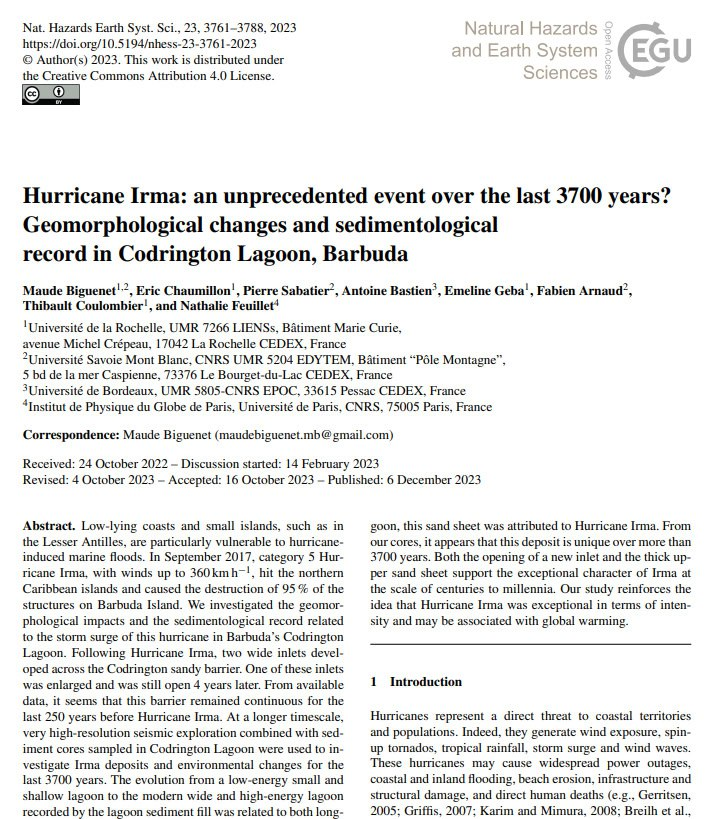
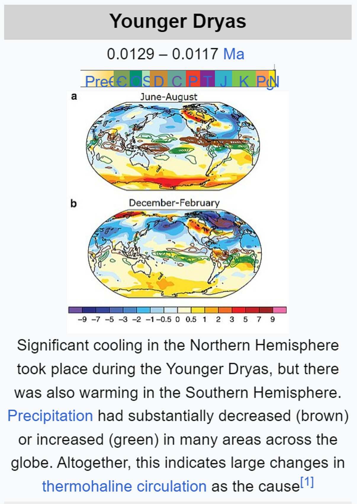
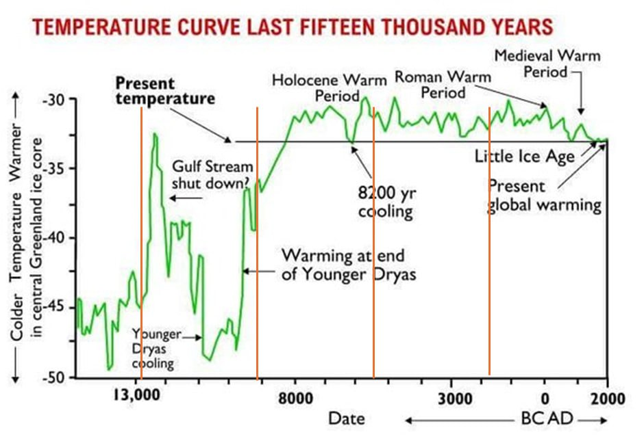
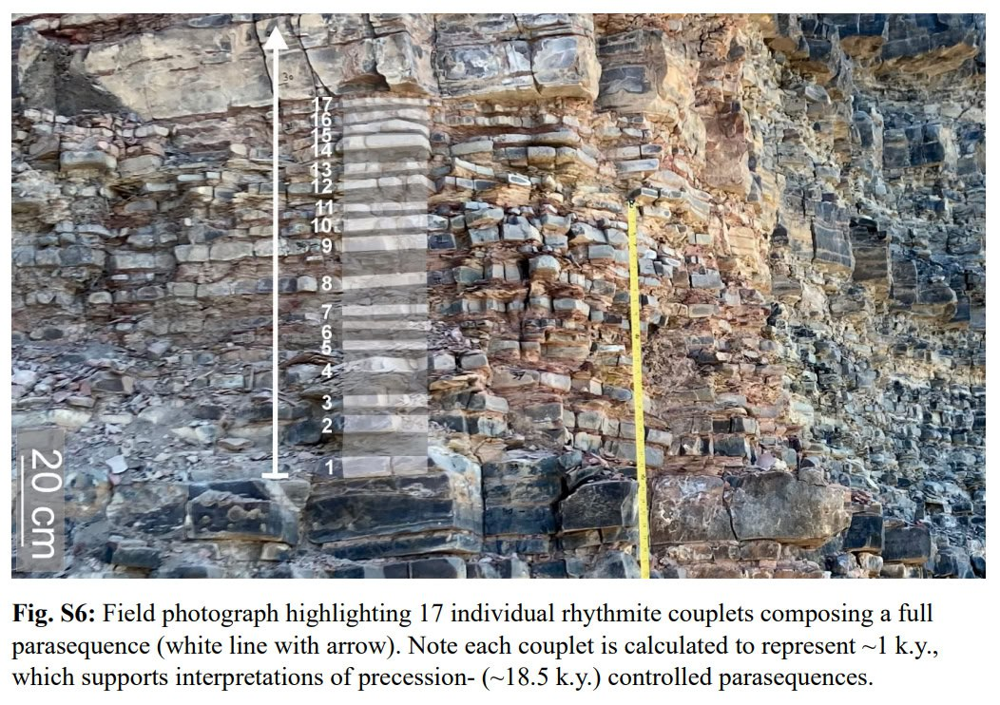

# Earth Geological State

Evidence pertaining to ECDO from the geological state of the Earth, such as weather.

## Recent climate change (Ethical Skeptic)

The [first part](https://theethicalskeptic.com/2020/02/16/the-climate-change-alternative-we-ignore-to-our-peril/) of Ethical Skeptic's three-part ECDO thesis is one of the best sources that the climate has been changing recently. I will take some quotes that summarize his points:
- *"Atmospheric CO2 levels follow temperature rises and are accelerating – Man’s carbon-producing activity is linear and of insufficient slope to drive this"*
- *"48% of global ocean sea surface temperature heat content rise from 1995 to 2023 arrived in a mere 3 to 4 weeks of 2023, far too fast for the atmosphere or man to serve as the cause. A record level Antarctic ice melt-off occurred simultaneously to this and during a record cold winter"*
- *"Abyssal and deep oceans at sea bottom are absorbing excessive novel heat content per cubic kilometer of ocean"*

The first four citations from his work may also be good leads:
- Penny Starr; Breitbart News: Politics: Study: Oceans Heating up Like ‘3.6 Billion Hiroshima Atom-Bomb Explosions’; 15 Jan 2020; https://www.breitbart.com/politics/2020/01/15/study-oceans-heating-up-like-3-6-billion-hiroshima-atom-bomb-explosions/
- Cheng, Abraham, et. al.; Record-Setting Ocean Warmth Continued in 2019; Advances In Atmospheric Sciences, Vol. 37, Feb 2020, 137–142 https://link.springer.com/content/pdf/10.1007%2Fs00376-020-9283-7.pdf
- Durack, Gleckler, et.al.; Ocean Warming: From the Surface to the Deep in Observations and Models; Oceanography; 9 Dec 2018; https://tos.org/oceanography/article/ocean-warming-from-the-surface-to-the-deep-in-observations-and-models
- Desbruyeres, D.G., S.G. Purkey, E.L. McDonagh, G.C. Johnson, and B.A. King. 2016. Deep and abyssal ocean warming from 35 years of repeat hydrography. Geophysical Research Letters 43(19):10,356–10,365, https://doi.org/​10.1002/2016GL070413.

## Hurricane Irma: 3700 year history

https://nhess.copernicus.org/articles/23/3761/2023/nhess-23-3761-2023.pdf

## El Nino 3700 year history

"The seasonal variation 3700 years ago was slightly lower than that suggested by modern instrumental data, and the transition between warm and cold seasons was rapid. Higher amplitudes of reconstructed r-monthly and r-annual SST anomalies imply an enhanced climate variability during this warm period. Investigation of the El Ninõ–Southern Oscillation (ENSO) variation (based on the reconstructed SST series) indicates reduced ENSO frequency but increased ENSO-related variability and extreme El Ninõ winter events 3700 years ago."

https://annas-archive.org/scidb/10.5194/cp-16-597-2020

## Peltier Effect

What could cause the the dramatic shift from bolling allerod to younger dryas where the warm and cooler hemispheres swapped places so rapidly, perhaps a poleshift?

Could this also be an instance of the Peltier Effect?: https://en.wikipedia.org/wiki/Thermoelectric_effect

## Bolling-Allerod

Younger Dryas coincides with the start of this period?

https://en.wikipedia.org/wiki/B%C3%B8lling-Aller%C3%B8d_Interstadial

## Temperature

Any theories as to why the temperature fluctuations were much more severe prior to 8000BC?

Because the first event was the result of a collision or encounter with a comet or other body/bodies.

## 18.5k year climate cycles?

An 18.5ky precessional supercycle which modulates long term climate.

Links:
- https://agu.confex.com/agu/fm23/meetingapp.cgi/Paper/1382125
- https://doi.org/10.1130/G52182.1
