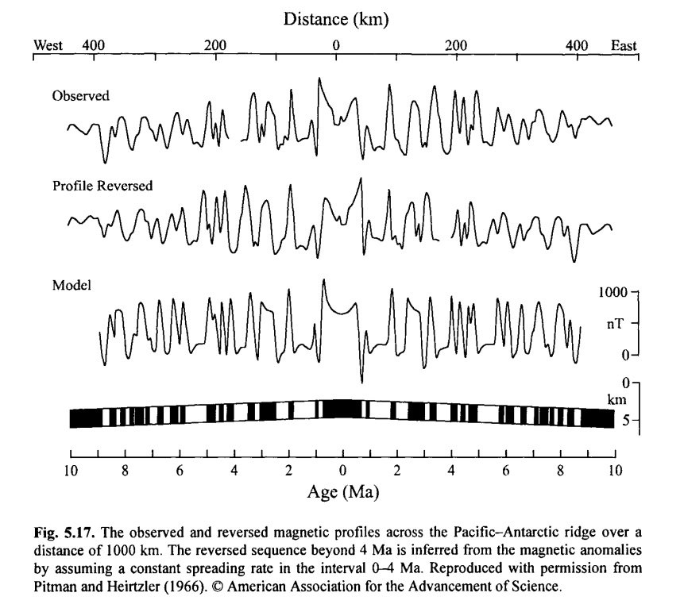
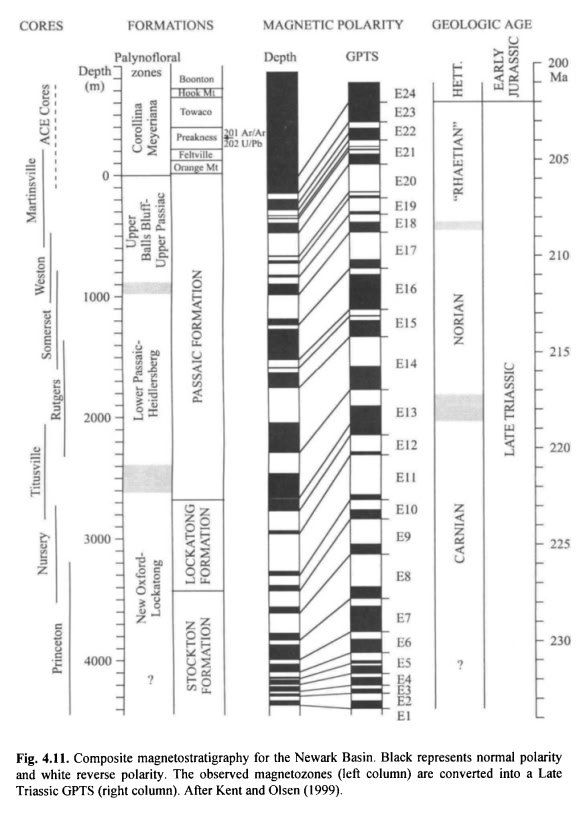
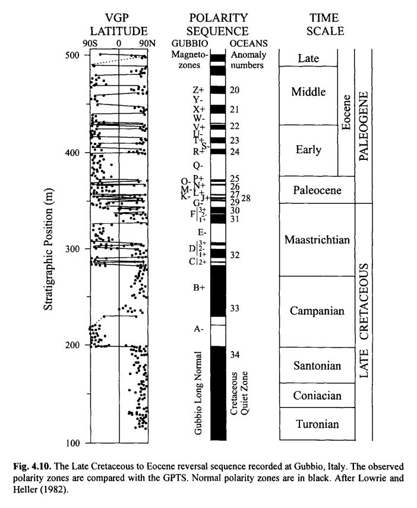
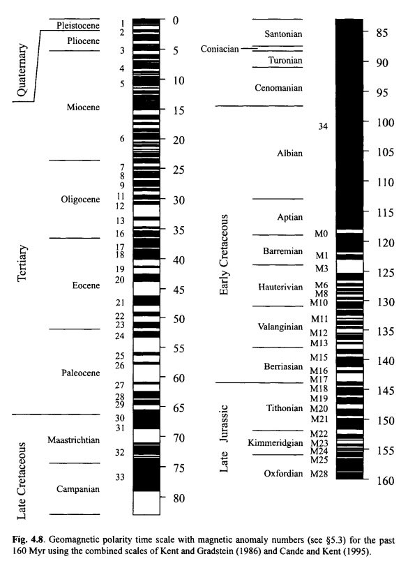
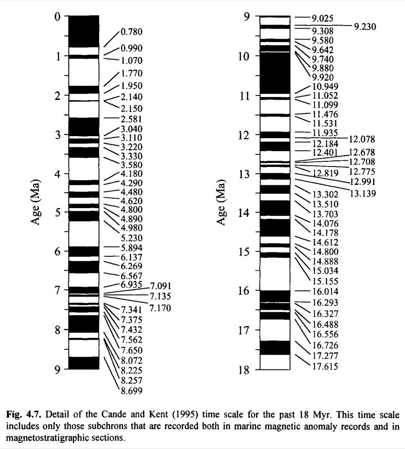
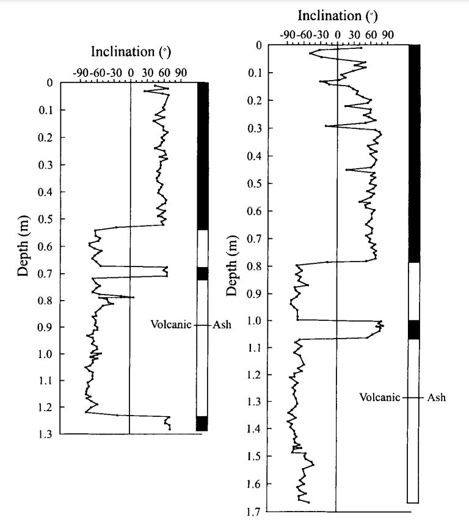
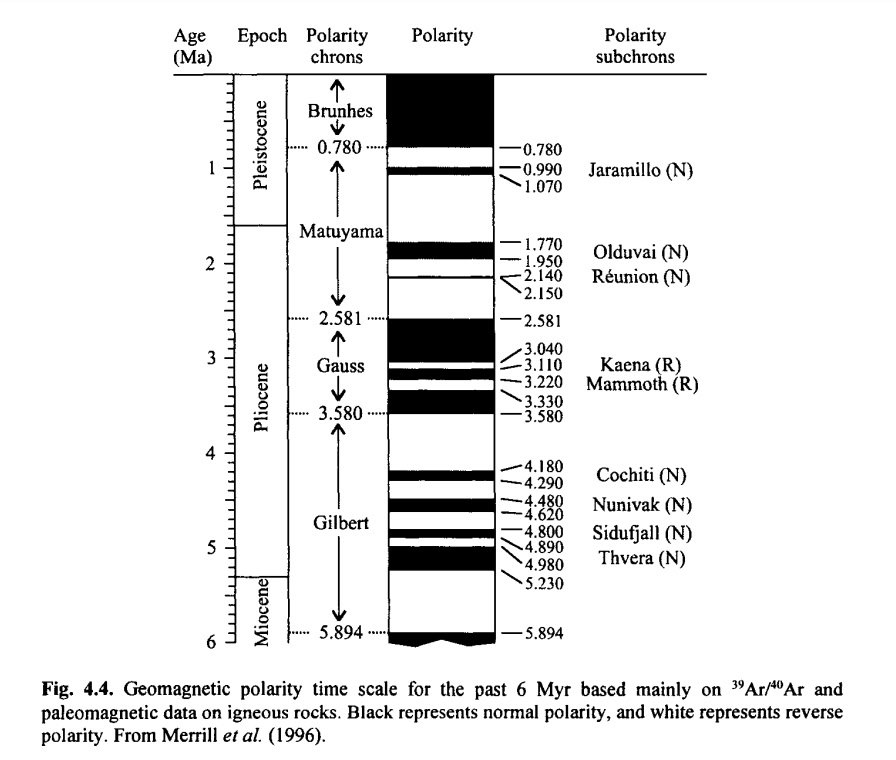

# Geomagnetic ECDO evidence

## Contents

- `north-pole-wander`: Tracking the wandering of the north magnetic pole.

## Magnetic profiles

Quick glance at the long term magnetic reversal history. Black/White transitions are 180° flips.

This is recorded all over the earth in thousands of proxies. Uniformitarian geology ascribes them to magnetic field reversals rather than physical ones.

## TODO

- Schumann banding
- weakening of the Earth's magnetic moment