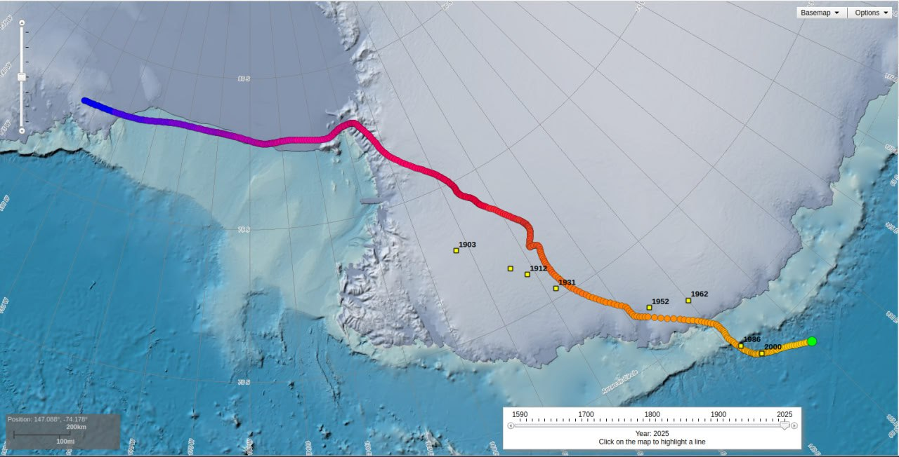

# North Pole Wander

Goal: Use the wandering of the North Pole to predict the progress of the ECDO event.

## NOAA Data

Courtesy of NOAA, showing that that the Np has traversed more in the past 25 years than it did in the 400 years before that. Sp is more consistent, but has similarly covered over 2000km headed in pretty much one direction.

https://www.ncei.noaa.gov/maps/historical_declination/

## 1840 - 2019 Magnetic North Pole Wander Video

Video at `img/npw.mp4`. It is an excellent visualization, compiled from historic observational and SWARM data. Note the apparent >270° deviation that occurred in the mid-1800's.

Source: https://www.esa.int/Applications/Observing_the_Earth/FutureEO/Swarm/Magnetic_north_and_the_elongating_blob

## NOAA December 2023 State of the Geomagnetic Field

The WMM (World Magnetic Model) gets updated once every 5 years, with the last time being in 2020. More up-to-date data is not easily found.

However, NOAA has [published a report in December 2023](https://www.ncei.noaa.gov/sites/g/files/anmtlf171/files/2023-12/WMM_Annual_Report_2023.pdf) called "State of the Geomagnetic Field" with some analysis on the current state of the geomagnetic field. Hard copy in `hard-copies`. Following is a quote from the paper:

*"This suggests that nonlinear changes in the Earth’s magnetic field have remained small over the past three years. Since 2020, the north magnetic dip pole has moved at an average speed of 41 km/yr, and the south magnetic dip pole at 9 km/yr. Neither underwent any noticeable change in direction."*