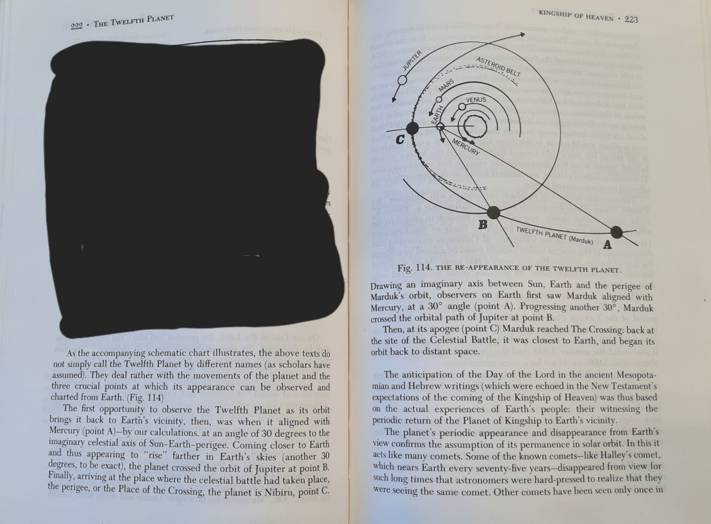
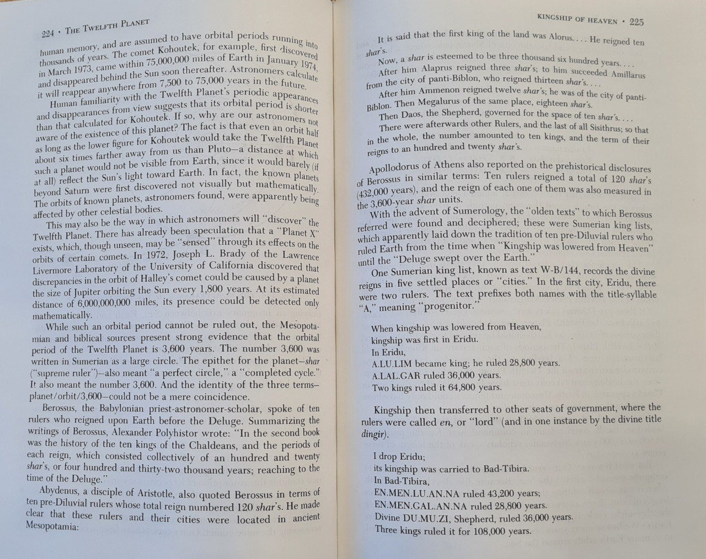
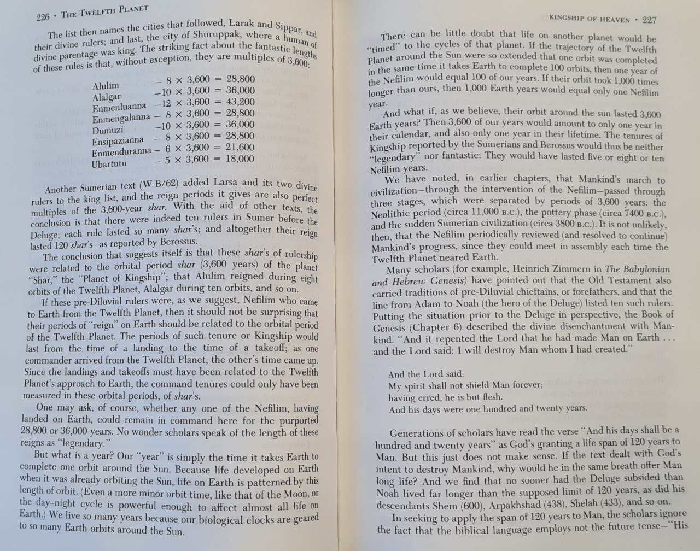
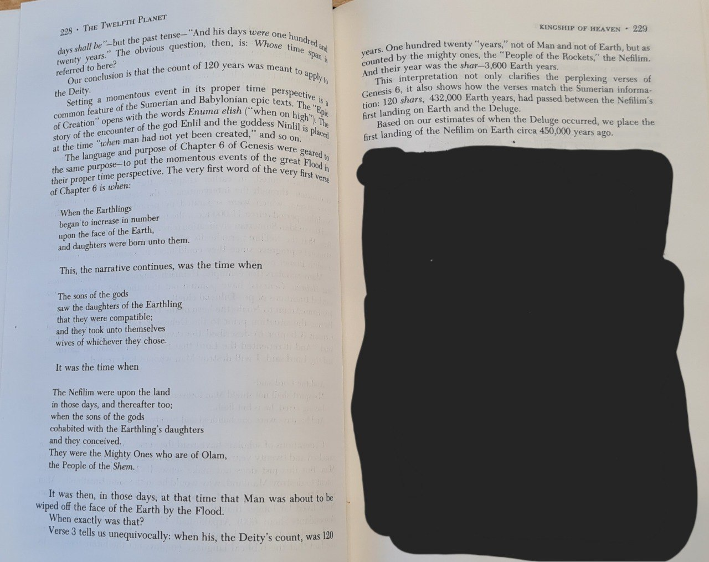

# Government Intervention

This folder is for government intervention related to the ECDO.

## Possibilities

- Chemtrails
- HAARP
- CERN
- Underground shelters
- Seedbanks
- NWO deadline 2030

## News

At one of the scientific meetings that Major White attended in the Pentagon in early 1948, the scientists discussed the advisability of alerting the public to the pending polar-flip phenomenon.

## Nobulart quote

Its a progressive, electromagnetically interfaced heating event [1]. What if we could somehow retard the process by intervening in the earth-solar coupling [2], and perhaps even the core-mantle coupling through the application of magnetohydrodynamics with the objective of influencing magma viscosity? [3][4][5]

[1] https://theethicalskeptic.com/2024/05/12/exothermic-core-mantle-decoupling-dzhanibekov-oscillation-ecdo-theory/
[2] https://x.com/nobulart/status/1802017097909760423
[3] https://x.com/nobulart/status/1802044626263498824
[4] https://home.cern/science/accelerators/future-circular-collider
[5] https://en.wikipedia.org/wiki/Future_Circular_Collider

Well, well, well... With the exception of the four colliders in India, the remainder of the 30+ colliders worldwide are all clustered near to the meridians of the ECDO pivots and the rotational meridian. Coincidence, or a tripolar phased array? [1] https://mit.edu/~wqm/Papers/Malik_TripolarAntenna.pdf

¨Global view Distribution of superconducting particle accelerators using SRF structures for electrons (orange), protons (purple) and heavy ions (pink). More than 30 SRF accelerators are in operation (circles), approximately 15 are presently under construction (triangles) and more than 10 future projects are under consideration (squares). Credit: CERN¨
[2] https://cerncourier.com/a/teslas-high-gradient-march/

## Nobulart quote 2

Neutrino Detectors.
[1] University of Wisconsin-Madison seal. Numen Lumen = Divine Light. Nice eye. [2][3] The Antarctic IceCube Neutron Observatory, commissioned in 2010. A joint UWM/CERN experiment. [4] Clustering of existing and planned neutrino detectors is near the ECDO pivot and 31E meridians. Neither IceCube nor it's predecessor (AMANDA) are mentioned anywhere in the 2023 paper Neutrino Geoscience: Review, Survey, Future Prospects by McDonough and Watanabe, from which the map is drawn, nor anywhere in the 275 page parent publication, Core-Mantle Co-Evolution An Interdisciplinary Approach (2023), which occurred to me as a little odd.
[1] https://en.wikipedia.org/wiki/University_of_Wisconsin%E2%80%93Madison
[2][3] https://en.wikipedia.org/wiki/IceCube_Neutrino_Observatory
[4] https://researchgate.net/publication/370773514_Core-Mantle_Co-Evolution_An_Interdisciplinary_Approach

The detectors are, I believe, what they're claimed to be, but could possibly fulfill other unknown functions. Within the context of an ECDO event, they are part of the early warning system, and could possibly be working in tandem with the similarly clustered colliders, as a core-mantle control (Colliders) and feedback monitoring system (Detectors). The entire system together is a modern day technological equivalent of the Great Pyramid.

## HAARP

https://x.com/RealDutchsinse/status/1818805390974263741

## Behind schedule? Nobulart quote

I think its already overdue and we've been holding it back. It wasn't expected to be prevented for as long as it has, thus Agenda 21 became Agenda 2030 and the script for the control narrative seems to have disintegrated into some B grade horror movie which was scrawled on the back of a napkin.

## Faraday Cage

Check `img/`.

## Elite symbolism

It's one of the things we know pretty much for sure, because they've been writing about it in hermetic texts for centuries. It's illustrated in most masonic art and symbolism.
- Curated examples of the occulted references: https://nobulart.com
- The two trains circling the globe in Snowpiercer could be seen as metaphoric representations of the Arctic and Antarctic following the equator from west to east at 1600km/h.

## Elite Symbolism - marduk

The book in question is Sitchen's The 12th Planet (Cue groans). I am a aware that he was a member of the illuminati and had an office in the Rockefeller Centre but maybe that should actually prompt us to look at his work more closely. He postulates the existence of terrestrial planet called Marduk (Niburu) which orbits the sun every 3,600 years and allows the nephilim access to Earth around it's perigee. Whether you believe the Marduk planet and Nephilim theory or not this cycle length fits with our 3,700 year catastrophe cycle theory and he bases all his work on an in depth knowledge of ancient Sumerian artifacts, even if his writings may be smoke and mirrors there may contain vital information for the initiated.

