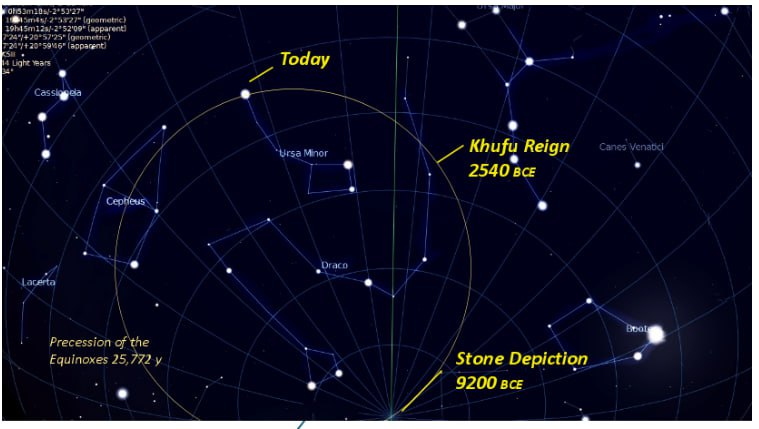
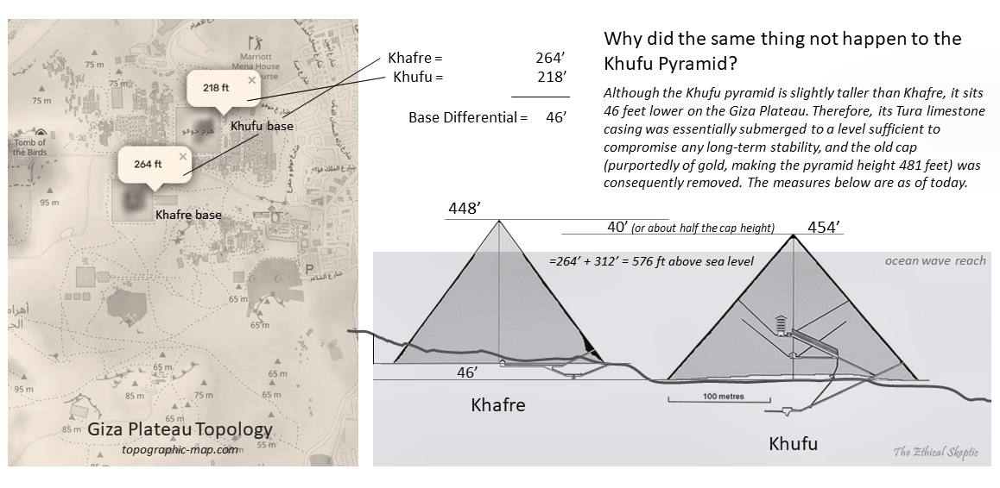
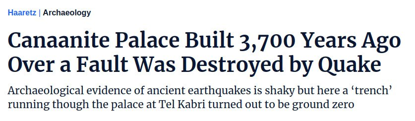
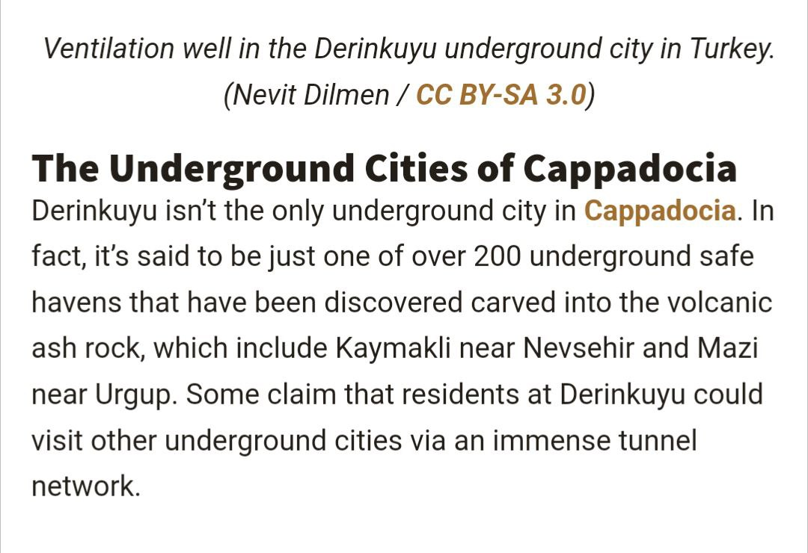
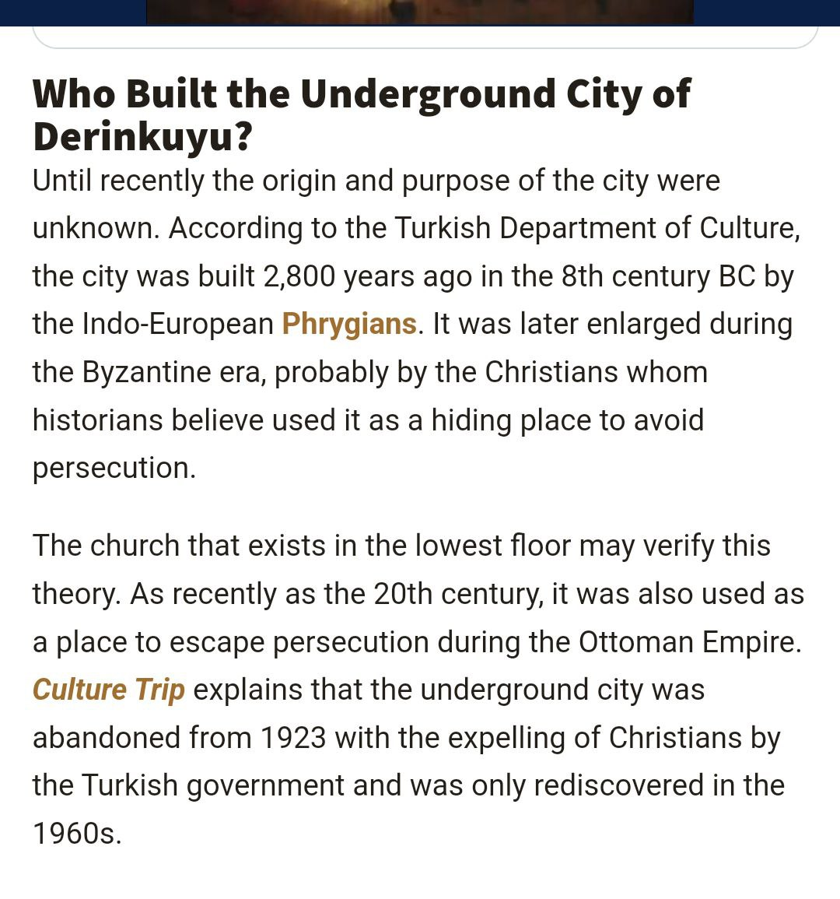
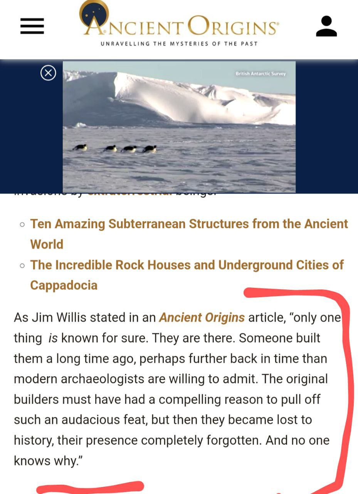
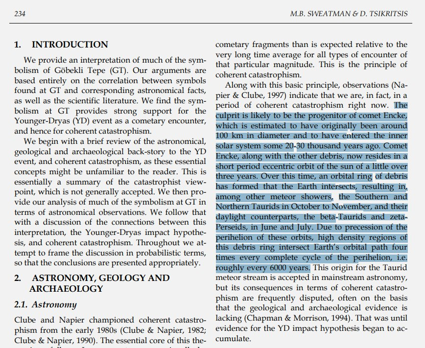

# Human Built ECDO-related Structures

This folder is for structures humans have built that are potentially related to ECDO events. A lot of this page is actually investigating the remains of cities that seem to have potentially been destroyed by ECDO events.

## Khafre

"I don't know how to make this clearer: Any story regarding the construction/dating of Khufu and Khafre must definitively address this karst erosion feature—otherwise, it is not a scientific hypothesis, rather narrative dogma." - Ethical Skeptic

Stone depiction in Khufu south air shaft was carved around 9,200 BC. This is very close to 3 x 3,700 years ago.

## Middle Eastern cities destroyed by fire circa 1700 BC, Late Bronze Age collapse (1200 BC)

ChatGPT list (need to investigate):
- Ugarit (Syria),  1200 BC
- Mycenaean Cities (Greece) 1200 BC
- Kadesh (Syria), 1300 BC
- Mari (Syria), 1800 BC
- Ebla (Syria), 1600 BC
- Canaanite Cities (Israel/Palestine), 1800 - 1700 BC
- Gordion (Turkey)
- Harappa (Pakistan) 1700 BC
- Mohenjo Daro (Pakistan) 1700 BC
- Dholavira (India)
- Chanhudaro (Pakistan) 1700 BC

ChatGPT list of extreme high temperature burning:
- Bab edh-Dhra, Jordan
- Nimrud/Kalhu, Iraq
- Troy
- Hattusa
- Ugarit
- Jericho, Palestine
- Thebes, Egypt
- Susa, Iran
- Bubastis, Egypt
- Tell Abu Hureya, Syria
- Canaanite cities

What's interesting is that (at least according to ChatGPT) these weren't wooden cities. The cities of this time in this area were built used baked brick and mudbrick construction. How can entire cities built from such material burn?

There is also a discrepancy between 1700 BC and the 1200 BC Late Bronze Age collapse. Assuming the dates are not intentionally fudged, these may have been separate events, although likely not unrelated.

### Kultepe/Khanesh (Turkey), 1750 BC

It seems the Hittites were the people who lived in Turkey from the early 2nd millenium BC, reaching their peak during the mid-14th century BC. Looking at what happened during 1700 BC: *"sometime in 1710–1705 BC, Kanesh was destroyed".*

https://en.wikipedia.org/wiki/Hittites

*"...was burned to the ground. evel Ib, 1798–1740 BC. After an abandoned period, the city was rebuilt over the ruins of the old and again became a prosperous trade center. The trade was under the control of Ishme-Dagan I, who was put in control of Assur when his father, Shamshi-Adad I, conquered Ekallatum and Assur. However, the colony was again destroyed by fire."*

https://en.wikipedia.org/wiki/K%C3%BCltepe

### Tall el-Hammam city melted ~3700 years ago

Evidence that a "cosmic impact" destroyed ancient city in the Jordan Valley:

*"But there is a 1.5-meter interval in the Middle Bronze Age II stratum that caught the interest of some researchers for its "highly unusual" materials. In addition to the debris one would expect from destruction via warfare and earthquakes, they found pottery shards with outer surfaces melted into glass, "bubbled" mudbrick and partially melted building material, all indications of an anomalously high-temperature event, much hotter than anything the technology of the time could produce."*"

*"We saw evidence for temperatures greater than 2,000 degrees Celsius," said Kennett, whose research group at the time happened to have been building the case for an older cosmic airburst about 12,800 years ago that triggered major widespread burning, climatic changes and animal extinctions. The charred and melted materials at Tall el-Hammam looked familiar, and a group of researchers including impact scientist Allen West and Kennett joined Trinity Southwest University biblical scholar Philip J. Silvia's research effort to determine what happened at this city 3,650 years ago."*

- https://phys.org/news/2021-09-evidence-cosmic-impact-ancient-city.html
- https://en.wikipedia.org/wiki/Tell_el-Hammam#Air_burst_claim

### Hattusa (Hittite Empire capital, Turkey), 1700 BC

*"A carbonized layer apparent in excavations attests to the burning and ruin of the city of Hattusa around 1700 BC."*

https://en.wikipedia.org/wiki/Hattusa

### Troy (1300 BC, 12000 BC)

*"Troy VI (1700 BC - 1300 BC) and Troy VIIa (1300 BC - 1180 BC) represent the peak phase of the prosperity of the city in the late Bronze Age... Both layers - VI and VIIa - were rapidly destroyed, for unknown reasons. This is evidenced by the fallen stone blocks and the traces of fire. The hypothesis put forward by Blegen says that these are the traces of an earthquake, but not all researchers agree with this theory."*

http://turkisharchaeonews.net/site/troy

*"Troy VI was destroyed around 1300 BC, corresponding with the sublayer known as Troy VIh. Damage in the Troy VIh layer includes extensive collapsed masonry and subsidence in the southeast of the citadel, indicative of an earthquake. Alternative hypotheses include an internal uprising as well as a foreign attack, though the city was not burned and no victims were found in the debris."*

*"The city was destroyed around 1180 BC, roughly contemporary with the Late Bronze Age collapse but subsequent to the destruction of the Mycenaean palaces. The destruction layer shows evidence of enemy attack, including scorch marks."*

https://en.wikipedia.org/wiki/Troy

*"After the city of Troy VI was destroyed by an earthquake around 1300 BC, a much different settlement developed at the site. Although Troy VII seems to have been rebuilt by the survivors of Troy VI, the new city lost much of its monumental character. A large portion of the population appears to have moved within the walls of the citadel creating a somewhat cramped environment."*

*"The large freestanding structures of the previous period are re-used, but now they are partitioned and subdivided into much smaller spaces. This was likely necessary to accomodate the increased population within Troy's walls. Large storage jars called pithoi were installed in many of the new houses. This indicates that the occupants of Troy VII were perhaps stockpiling supplies and may have been worried about their food supply. The fortification walls were quickly rebuilt and strengthened. Some of the gates that were open in Troy VI were sealed, while other gates were enhanced. This suggests that Troy's inhabitants were consciously restricting access to [the] city and were clearly concerned for their safety."*

https://www.archaeology.org/travel/interactivemap-troy/troy-7.html

## Canaanite palace from 3700 years ago

“It really looks like the earth simply opened up and everything on either side of it fell in,” Cline said. “It’s unlikely that the destruction was caused by violent human activity because there are no visible signs of fire, no weapons such as arrows that would indicate a battle, nor any unburied bodies related to combat.”

“You put everything together – no fire, quick collapse, no gradual disintegration of the roof – this is equal to a violent event that caused the collapse and that big crack cutting through the palace in the orientation of the fissure,” says Yasur-Landau. “You don’t need to be Sherlock in order to deduce that this was the result of a geological event."

https://www.haaretz.com/archaeology/2020-09-13/ty-article/.premium/canaanite-palace-built-on-a-fault-was-destroyed-by-quake-3-700-years-ago/0000017f-f0fd-df98-a5ff-f3fd07000000
- Mirror: https://archive.is/gy2xq

## Ebla

Ebla. Estimated destruction and final abandonment c.~1600BC. This date could well be erroneous, as it was arrived at by attributing the destruction to the Hittite conquests at that time, with no solid evidence linking the two. Pure speculation. This could easily have fallen around 1700BC.
- [1] https://books.google.co.za/books?id=E1aF0hq1GR8C&lpg=PA211&pg=PA211#v=onepage&q&f=false
- [2] https://en.wikipedia.org/wiki/Ebla

## Ankara break in history 1700 BC - 1000 BC

Due to destruction by an earthquake.

## India Extended Flood Evidence

There is a paper by BB Lal that dates ancient Indian cities that were flooded for an extended period, evidenced by excavating and investigating deposits in their remains, to ~1900 BC. See `ADHOC-EVIDENCE/ancient-myths/asia/india` for more.

The specific locations referenced in that paper are explored more in `LOCATION-MAPPING/asia/india`.

## Derinkuyu

https://www.ancient-origins.net/ancient-places-asia/derinkuyu-0073

## Babylon

*"The walls of the mighty Babylon and the eight-volved Tower of Babel or cloud-encompassed Bel were never constructed to resist any mortal foe. NO. Those city walls, which were 60 miles in circumference, 200 feet high, 578 feet thick, were not made to defy the strength of armies, but to resist the fearful forces of Nature, the floods that swept the plains of Shinar, from the mountains of Armenia, every spring during this Age of Horror. The tremendous embankments and river walls constructed by the Ancients are monuments of human skill and enterprise belonging to an epoch that antedates by thousands of years the Age of their supposed builders."* - Thomas H. Burgoyne, The Light of Egypt - Vol. I (1889)

*"This accounts for and fully explains the existence of fossil remains of the seal, walrus and polar bear in the burning plains of Africa and Hindustan, and of the tropical remains now being discovered in the Arctic regions."*

This would very likely have been expunged from recent records. His source would predate 1889.

https://nobulart.com/the-hermetic-key/

## Gobekli Tepe - Nobulart

Confirming TES' speculated built date in the period after the YDB. I'm thinking Gobleke Tepe was built during the previous stable period. So there was an event that triggered the constuction of GT as an observatory, which is starting to make it look as though the 'YDB Event' might more properly be called the BAI Event.

My thinking is that it was built to watch for whatever we encountered around 12,800 BC that upset the apple cart. It's possible that the focus on interpreting GT should be expanded to include consideration of the stars at that earlier time. It would have possibly been more likely to have been built during the warmer insterstadia than the cooler YD.

## Gobekli Tepe's relation to comets

An interesting paper, with a convincing argument that GT was astronomically linked to observing (predicting?) the progenitor of Encke and the taurids in much the same way as the pyramids were constructed to monitor the aftermath of the YDB event.

- https://web.archive.org/web/20230605190759/http://www.maajournal.com/Issues/2017/Vol17-1/Sweatman%20and%20Tsikritsis%2017(1).pdf
- https://www.tandfonline.com/doi/full/10.1080/1751696X.2024.2373876

## TODO Potential Leads

Curious on the difference between 1700 BC and 1300-1200 BC dating for some of these events.

- Khafre pyramid (as detailed in Ethical Skeptic's thesis)
- Derinkuyu underground city: https://en.wikipedia.org/wiki/Derinkuyu_underground_city
- Temple at Dendera
	- https://x.com/DGr8Awakening/status/1824267280303194435

"Ancient Superhighways: 12,000-Year-Old Massive Underground Tunnels Stretch From Scotland To Turkey": https://ancient-archaeology.com/2024/05/ancient-superhighways-12000-year-old-massive-underground-tunnels-stretch-from-scotland-to-turkey/

Search for (ancient) underground cities