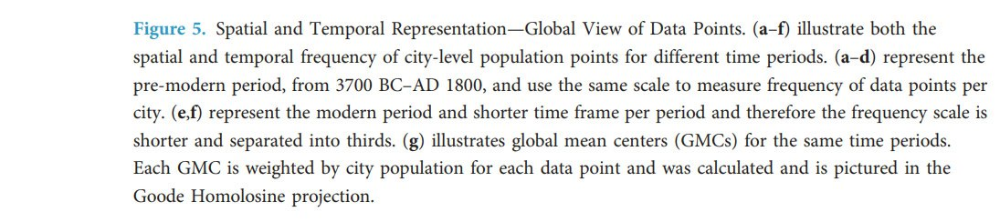

# History

What can history tell us about potential past ECDO events?

## Contents

- `human-built-structures`: Human-built structures that may be related to the ECDO.
- `oldest-cities`: Can the oldest present-day cities tell us anything about the ECDO?

# Analysis

## Greek Dark Ages

The Greek Dark Ages (c. 1200–800 BC) "At the beginning of the Postpalatial Bronze Age, the so-called Late Bronze Age collapse of civilisation in the Eastern Mediterranean world in c. 1200–1150 BC took place, as the great palaces and cities of the Mycenaeans were destroyed or abandoned. At around the same time, the Hittite civilization also suffered serious disruption, with cities from Troy to Gaza being destroyed. In Egypt, the New Kingdom fell into disarray, leading to the Third Intermediate Period of Egypt. Following the collapse, there were fewer, smaller settlements, suggesting widespread famine and depopulation." 

The maps illustrate population distributions over the past 6ky, spanning the Greek Dark Ages period. Clear correlation where populations appear to have emerged from the same regions as the longest continuously inhabited cities.[3]

[1] https://en.wikipedia.org/wiki/Greek_Dark_Ages
[2] https://annas-archive.org/scidb/10.1038/sdata.2016.34
[3] https://x.com/nobulart/status/1807050060376457676

## Europe Migration

Could this have been the aftermath of an ECDO event?

Dates that come up often when investigating the ECDO. Check `ADHOC-EVIDENCE/ancient-myths`.

## Gap in Chinese history

"If counting from the following Shang dynasty which has been universally recognized by historians, China has only about 3,700 years of recorded history, which is still a big gap from 5,000 years."

https://en.wikipedia.org/wiki/Five_thousand_years_of_Chinese_civilization

## Population Sample Data

Reset @ 3,700 YBP?

https://annas-archive.org/scidb/10.1038/sdata.2016.34

## Invasion in Turkey 3700 years ago

"A team of archaeologists has discovered the well-preserved brain and skin remnants of people who lived around 3,700 years ago in Turkey. The remains belong to two Bronze Age individuals who were found at the Tavşanlı Mound (or Tavşanlı Höyük) in Turkey's Kütahya province—located in the west of the Anatolian peninsula. The remnants belong to a young man aged 15-18 at the time of death, and another middle-aged man who was 40-45 years old when he died, the Anadolu Agency (AA) reported. Researchers believe these individuals died when their homes were set on fire and they were unable to flee during an attack around 3,700 years ago. Evidence suggests there was a large-scale attack on the city around 1700 B.C. that resulted in the entire settlement being burned to the ground."

https://www.newsweek.com/archaeologists-discover-brain-remnants-people-lived-3700-years-ago-1825076

## Asian bodies in the Mediterranean?

"Ancient Plaque Reveals Exotic Diets 3,700 Years Ago 

A study of ancient proteins in human plaque has revealed that oriental elements and cooking oils were a part of diets in the Mediterranean around 3,700 years ago, indicating the existence of long-distance trade involving exotic foods such as turmeric or bananas.

“Today’s Mediterranean cooking, including Valencian cooking, is characterized by having been created from cultural exchanges, and we now know it was also this way during the Bronze Age, after this study reveals that globalization affected Mediterranean cooking millennia ago,” said biomolecular archaeologist Domingo C. Salazar Garcia of the University of Valencia.

The study aimed to clarify whether the early globalization of commercial networks during the Bronze Era also affected eating habits. The researchers examined food remains in dental plaque and found evidence that the inhabitants of the Eastern Mediterranean coast already ate turmeric, bananas, and even soy during the Bronze Age and Iron Age."

https://www.dentistrytoday.com/ancient-plaque-reveals-exotic-diets-3-700-years-ago/

## Crete 3700 year old mugs

These intact beauties were buried on Crete 3700 years ago.
https://www.facebook.com/OhMyGreece/posts/these-mugs-are-3700-years-old-from-the-minoan-civilisation-heraklion-museum-cret/238641585966157/

## Haplogroup data

"It makes sense that lineages that have likely originated in the same or nearby region at around the same time may have experienced similar catastrophes or events / interactions that impact male line demographics and drive migrations to particular regions at particular times."

https://phylogeographer.com/20-haplogroup-heatmaps-from-various-regions-of-the-world/