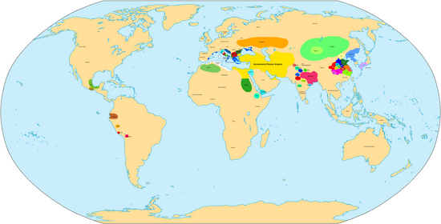

# Holocene Mega Timeline

Nobulart's planetary harmonic and cataclysm chronology timeline in `timeline.xls`.

## Overview

High-certainty ECDO-like geomagnetic-excursion cataclysms:
- 2200-1700 BC
- 3200-2800 BC
- Younger Dryas, ~9600 BC

Although it's clear civilizations can survive massive floods (China Xia dynasty) what we would really like to see is no continuity of history during major cataclysms.

Promising dates:
- 400 BC, alexander the great, paleomagnetic anomalies
- 6200 - 5500 BC, black/mediterranean sea refilling dating
- 7500 BC, Tollman impact hypothesis, Uriel's Machine reference

Speculative dates:
- 1200 AD
- 500 AD, tree ring anomalies (might genuinely be a comet debris event, see paper in `biology`)
- 1200 BC, Late Minoan 2, Egypt, paleoclimate anomalies

## Non-exact cataclysm accounts

- Ancient Egypt, Herodotus: 341 generations of men up till 1290 BC (10k-4.7k years) 4 Sun changes (2 flips?)
- Plato: "Many great deluges" since Athens and Atlantis, a significant "third great flood before Deucalion" that washed away most of Athens' fertile soil

## 1200 AD

- Yuan Empire downfall
- Antarctic tephra

## 540 AD

- tree ring anomalies
- Baillie comet impact hypothesis
- bond event

## 400 BC

Issue with this date is I would like to see more "civilizational collapse" to be sure. Or, perhaps people at this time were centered in safe locations in the near aftermath of the 2000 BC event? But, we see considerable societal disruption in the 2000 BC event which isn't long after the 3000 BC event. Wikipedia has a nice "world map" on this century [1]:

- 340 BC: Alexander the Great Turkey deluge myth
- 373 BC: Helike Greek city-state submerged by Tsunami in winter
- 400 BC: La venta, Veracruz, Mexico, abandoned
- east Asia lacks history from this time

Physical markers:
- 200 BC potential tree ring anomalies
- 300 BC ice core anomaly
- 300 BC Mayan Chichancanab lake filling
- paleomagnetic anomalies (North America, Levantine Iron Age, 500 BC Russia peat deposit)
- 500 BC Antarctic tephra

Historical continuity during this period:
- Roman Republic
- Scythians

## 1400 - 1200 BC

This period is far enough away from 2000 BC to warrant its own investigation as a potential cataclysm. There is evidence from many domains pointing to a possible cataclysm in this time.

- 1400 BC: Minoan Crete's third and final cataclysm
- Egyptian dark age (see Barbara Bell)
- Narrow Irish tree rings
- Antarctic tephra
- 1200 BC Mediterranean cooling event

## 2200 - 1700 BC event

This 500-year period is filled with extensive evidence from all domains, including history and physical markers. Along with accounts of mega-floods (Gun-Yu, Ogyges), we can almost be certain there was an ECDO-like event during this period. The wide spread of dates makes me wonder if there may be more than one cataclysm in this date range.

Cataclysm accounts:
- 1600-1400 BC: Biblical Exodus, Moses
	- Possibly a contemporary of Ogyges and Gun-Yu
- 1900-1460 BC: Deucalion
	- Usually placed some time after Ogyges
	- 1700-1650 BC: Minoan Crete, two catastrophes within a half century of each other
- 1900 BC - 1700 BC: Mohenjo-Daro abandonment
- ~1800 BC: Ancient Peru, invaders destroyed by fire, and some extended time later, 24 hours of Sun
- 2136-1800 BC: Ogyges
	- Said to be contemporary with Moses in Exodus, and possibly Gun-Yu
- 2300-2000 BC: Chinese Great Gun-Yu Flood
	- water over mountains, sun not setting for 10 days
	- Contemporary with Korea's Dangun myth
	- Possibly contemporary with Ogyges
	- Backed up by 1920 BC dated Yellow River flood remnants

Physical markers:
- 1650 BC Antarctic tephra
- bond (ice rafting) event
- 2200-2100 BC: climate aridification event

## 3200 - 2800 BC event

This 400-year period is also filled with extensive evidence that points to a global cataclysm. Multiple accounts of ECDO-like cataclysms (megafloods, Sun changing direction) from different places in the world gives us a high certainty there was an ECDO-like event during this period.

- China Nu Wa: 2810 BC
- Peruvian Timeline: 2900 BC Deluge
- Eridu Genesis (Middle East): 3000 BCE
- India, Sinking of Dwaraka: 3031 BC
- Biblical Noahic deluge: 3500 - 2500 BC

Physical markers:
- 3000 BC: Black Sea refilling
- 3200 BC: Compton's comet mega-compilation of physical markers
- 3200 BC: climate change event (Staubwasser, Weiss)
- bond event
- narrow Irish tree rings
- Antarctic tephra

## 6200-5500 BC event

- 5800 BC: Mayan Chichancanab lake filling
- 6200 BC: well documented cooling and aridification event
- 6400 BC: Black Sea refilling (William Ryan)
- Greenland, Kilimanjaro ice cores

## 7400 BC event

- 7100 BC: Black Sea refilling
- 7400 BC: Sinking of Dvaravati
- 7400 BC: bond event
- 7500 BC: Tollman bolide hypothesis
- Greenland ice cores

## 9600 BC event

A well-documented event, with an account of a continent "sinking in a day", and clear physical markers of widespread climate change, points to a high likelihood of an ECDO-like event.

- 9100 BC: bond event
- 9200 BC: Black Sea refilling
- 9200 BC: Manu flood
- 9600 BC: Atlantis
- 9700 BC: end of Younger Dryas, many physical markers

## Citations

1. https://en.wikipedia.org/wiki/4th_century_BC

# TODO Timeline of dateable myths

Greek flood (Deucalion, Dardanus): 1800 - 1528 BC

add water transgressions in here

add paleomagnetic data

add 6200 bc event
